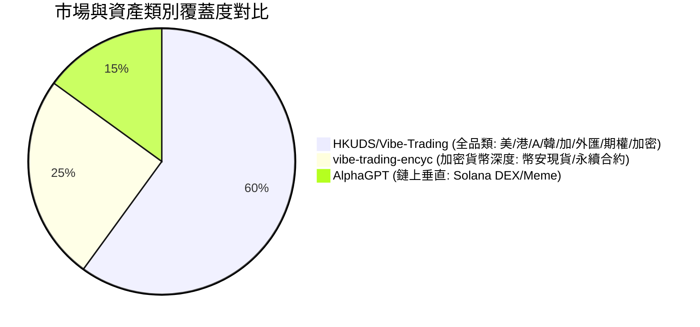

# 競品深度分析與對比報告：Vibe-Trading-Encyc vs. HKUDS/Vibe-Trading vs. AlphaGPT

> **文檔狀態**：正式分析報告  
> **更新日期**：2026-08-15  
> **評估對象**：
> 1. 主專案：`vibe-trading-encyc` (`dimx9173/vibe-trading-encyc`)
> 2. 競品一：`HKUDS/Vibe-Trading` (`HKUDS/Vibe-Trading`)
> 3. 競品二：`AlphaGPT` (`imbue-bit/AlphaGPT`)
>
> **事實核驗註記 (2026-08-15)**：本文所有宣稱已對照競品本地原始碼 (`~/project/vibe-trading-hkuds`, `~/project/AlphaGPT`) 逐項驗證。兩處修正：HKUDS `quantlib` 實測 204 個函數定義 (README 自稱 265, 本文原寫 249+ — 改為 204+); HKUDS MCP 工具實測 70 個 (原寫 64)。AlphaGPT 的 RL reward 實為 return+drawdown (無 Sharpe/IC), 且無 anti-MEV 私密交易 (見 §2.1/§4.3 註記)。

---

## 執行摘要（Executive Summary）

在當前的 AI 量化與智慧交易領域，大語言模型（LLM）與機器學習的應用正迅速從單純的「預測價格」向「多 Agent 協作決策」與「生成式因子挖掘」兩大方向分化。

本報告針對主專案與兩個具有代表性的開源量化競品進行全方位架構、技術實現、數據覆蓋、回測機制及生態維度的深入比較分析：

```mermaid
graph TD
    subgraph "主專案: vibe-trading-encyc"
        A[Binance WebSocket/REST] --> B[三線程架構<br>Macro / On-Bar / Event]
        B --> C[12-Agent 4階段決策流水線<br>分析師 -> 辯論 -> 風控 -> PM]
        C --> D[Point-in-Time Agent Replay<br>& Binance 合約/現貨實盤]
    end

    subgraph "競品一: HKUDS/Vibe-Trading"
        E[25+ 全市場數據載入器<br>美股/A股/港股/加密/外匯] --> F[Swarm Agent + 64個 MCP 工具]
        F --> G[src/quantlib 204+ 函數庫<br>& 估值三表聯動模型]
        G --> H[13+ 券商原生連接器<br>& 多市場高保真回測]
    end

    subgraph "競品二: AlphaGPT"
        I[DexScreener/Birdeye<br>Postgres/TimescaleDB] --> J[Transformer 公式生成器<br>LoRD 低秩衰減正則化]
        J --> K[StackVM 運算元虛擬機<br>因子評分與張量計算]
        K --> L[Solana RPC + Jupiter DEX<br>鏈上極速下單與止盈止損]
    end
```



### 三者核心定位一句話總結

| 專案 | 核心本質 | 決策核心 | 適用領域 |
| :--- | :--- | :--- | :--- |
| **主專案 (`vibe-trading-encyc`)** | **垂直深耕的 12-Agent 協作加密貨幣決策流水線** | LLM 角色認知分工 + 多輪看漲看跌辯論 + 嚴格歷史無未來函數 Replay | 加密貨幣合約/現貨中低頻智慧決策 |
| **競品一 (`HKUDS/Vibe-Trading`)** | **全資產機構級 AI 交易作業系統 & 研究工作台** | 混合式（LLM Agent + 204+ 確定性金融數學庫 QuantLib + 估值模型） | 美股/A股/港股/加密/外匯/期權全品類研究與實盤 |
| **競品二 (`AlphaGPT`)** | **神經符號因子挖掘機 + 鏈上高頻執行引擎** | Transformer 生成公式 Token + StackVM 位元組碼執行 + RL 獎勵回測 | Solana Meme / DEX 鏈上極速因子挖掘與交易 |

---

## 1. 專案概況與核心設計哲學

### 1.1 主專案：`vibe-trading-encyc`
* **設計哲學**：**「Agent-in-the-Loop」**。將量化交易從傳統固定技術指標規則，升級為模擬真實對沖基金投資委員會的 12-13 角色分工協作系統。
* **底層框架**：基於 `pi-py`（`pi-py-ai` 與 `pi-py-agent-core`），以雙循環訊息驅動引擎為核心。
* **核心組成**：
  * **4 階段決策流水線**：Phase 1 四大分析師（技術、基本面、新聞、情緒）$\rightarrow$ Phase 2 多輪 Bull/Bear 辯論與經理裁決 $\rightarrow$ Phase 3 三視角風控評估 $\rightarrow$ Phase 4 交易員計畫與投資組合經理（PM）最終裁定。
  * **三線程運行架構**：宏觀線程（1h 定時定調）、On-Bar 線程（K線驅動完整決策）、事件驅動線程（異常急停與優先級響應）。
  * **Agent Replay 系統**：具備嚴格 Point-in-Time 隔離的歷史逐 Bar 重放能力，搭配 LLM Cache 降低重複評估成本。
  * **互動與展示**：Telegram 雙向指令互動機器人與 Web 實時 Agent 決策大盤。

### 1.2 競品一：`HKUDS/Vibe-Trading`
* **設計哲學**：**「金融工程與 AI 協同作業系統」**。主打全市場覆蓋、嚴格數學確定性與生產級治理。
* **底層框架**：FastAPI 後端 + React 19 / Node 22 前端 + Electron 跨平台桌面端，原生支援 MCP (Model Context Protocol)。
* **核心組成**：
  * **確定性金融數學層 (`src/quantlib`)**：內建 **204+ 經測試函數**（實測 `def` 計數, 涵蓋期權定價、計量經濟學、VaR/CVaR/EVT、業績歸因、Purged CV；README 自稱 265），禁止大模型直接心算數值。
  * **全資產與多券商矩陣**：支援美股、港股、A股（Tushare/Akshare/BaoStock）、韓股（KRX）、加股、加密貨幣、外匯貴金屬（MT5/tickerall），接入 13+ 家券商 API。
  * **防價格幻覺 Grounding 閘門**：嚴格比對 OHLC 證據，拒絕任何未觀測的捏造價格；日誌採哈希鏈式 fsync 審計帳本。

### 1.3 競品二：`AlphaGPT`
* **設計哲學**：**「符號回歸 + 強化學習的因子生成器」**。不採用文字對話 Agent，而是將策略轉化為數學公式 Token 序列。
* **底層架構**：PyTorch 神經網路（配備 Newton-Schulz LoRD 正則化、QKNorm、SwiGLU、MTPHead）+ 自研 `StackVM` 虛擬機 + Solana RPC / Jupiter DEX 聚合器。
* **核心組成**：
  * **自動化寫因子**：模型輸出運算元（`ADD`, `GATE`, `JUMP`, `DECAY`, `MAX3` 等）與特徵（`pressure`, `fomo`, `dev`, `vol_cluster` 等）組成的 AST 公式。
  * **RL 獎勵循環**：以因子在歷史數據上的回測評分（Sharpe/IC/回撤）為 Reward，反向優化 Transformer 生成器權重。
  * **鏈上極速執行**：直接透過 Solana 私鑰簽名與 Jupiter API 進行鏈上 Meme 幣高頻掃描與撮合。

---

## 2. 深入架構與技術維度對比

### 2.1 決策與生成範式（Decision vs. Factor Generation）

| 維度 | 主專案 (`vibe-trading-encyc`) | 競品一 (`HKUDS/Vibe-Trading`) | 競品二 (`AlphaGPT`) |
| :--- | :--- | :--- | :--- |
| **決策生成機制** | **多角色 LLM 語意對話與結構化裁決** | **LLM 協同 + 確定性代碼/工具調用** | **Transformer 輸出符號 Token 序列** |
| **核心驅動引擎** | 12 個特化 Agent 協同流水線 | 模組化 Agent/Swarm + 70 個 MCP 工具 | Transformer + StackVM 運算元棧虛擬機 |
| **防幻覺機制** | Pydantic Schema 驗證 + 辯論交叉檢驗 | **Grounding 價格硬閘門** + 審計證據鏈 | **語法與維度檢查**（無效公式給予負獎勵） |
| **模型依賴度** | 高（依賴商用/開源大模型 API） | 中~高（可配置各類 LLM 端點） | **零外部 LLM**（純本地 PyTorch 神經網路） |

> **核驗註記 (2026-08-15)**：
> - AlphaGPT RL reward 實為 `cum_ret − 2×drawdown − activity penalty`（`model_core/backtest.py:9-29`）；**Sharpe 僅見於實驗性 `times.py`，IC 全文不存在** — 原「以 Sharpe/IC 為獎勵」宣稱不精確。
> - AlphaGPT 執行層為真實 Jupiter v6 quote/swap + Solana RPC（QuickNode），但**無 Jito 私密交易/anti-MEV**（`rpc_handler.py:20-21` 直接 `send_transaction(opts=None)`，僅設 auto priority fee）。
> - AlphaGPT DexScreener 部分 stub（`get_trending_tokens`/`get_token_history` 回傳空列表）且 `USE_DEXSCREENER=False` 預設停用；Birdeye 為實際主力數據源。
> - HKUDS 另有 30 個 Swarm preset（`agent/src/swarm/presets/`），實測確認。

### 2.2 多線程與併發架構

* **主專案 (`vibe-trading-encyc`)**：
  * 採用清晰的三線程架構：`MacroThread`（1h）、`OnBarThread`（K線到達）、`EventThread`（緊急事件優先級隊列）。
  * 支援多 Agent 並行呼叫（`asyncio.gather` + per-agent lock），並具備推理模型防死鎖保護。
* **競品一 (`HKUDS/Vibe-Trading`)**：
  * 採用時區感知排程器（支援 IANA 時區夏令時切換的 Cron 研究任務）與非同步背景 Worker。
  * 支援動態 Swarm Preset，按需啟動多個並行研究子 Agent。
* **競品二 (`AlphaGPT`)**：
  * 採用事件輪詢循環（`StrategyRunner` 搭配 15 分鐘定時數據同步 + 實時掃描下單）。

### 2.3 支援市場、資產與數據源



* **主專案 (`vibe-trading-encyc`)**：
  * 專注於 **Binance 加密貨幣**（現貨與永續合約）。
  * 數據涵蓋：K線行情、資金費率、多空比、持倉量（OI）、恐懼貪婪指數、加密新聞。
* **競品一 (`HKUDS/Vibe-Trading`)**：
  * **全市場全品類覆蓋**：美股、港股、A股、韓股、加股、加密（Binance/OKX/CCXT）、外匯/貴金屬（MT5/tickerall）、期權（Options Lab）。
  * 整合 25+ 數據源（SEC EDGAR、Tushare、AkShare、BaoStock、Yahoo、PyKRX 等）與 13+ 券商通道。
* **競品二 (`AlphaGPT`)**：
  * 專注於 **Solana 鏈上 DEX / Meme 幣**。
  * 整合 Birdeye API、DexScreener API 與 Solana RPC 節點。

### 2.4 回測、模擬與歷史重放機制

* **主專案 (`vibe-trading-encyc`) 的特色：Agent Replay**
  * **Point-in-Time 嚴格無未來函數保證**：回測歷史每個 Bar 時，隔離即時數據工具，僅載入截至該 Bar 的歷史數據。
  * **LLM Cache**：以 `(model, role, prompt_hash)` 持久化快取 Agent 回覆，重複 Replay 成本大幅降低。
  * **雙回測引擎**：快速規則回測（Rule Backtest，秒級完成）與完整 Agent Replay（深度情境重現）。
* **競品一 (`HKUDS/Vibe-Trading`) 的市場高保真回測**：
  * 各市場專屬撮合規則（A股/韓股漲跌停判定、T+1、印花稅、永續合約歷史資金費率扣除、逐倉/全倉強平結算）。
  * 輸出專業 Tearsheet（月度收益熱力圖、Alpha Bench 隨機對照組、幸存者偏差披露）。
* **競品二 (`AlphaGPT`) 的張量化極速回測**：
  * 基於 PyTorch Tensor 進行矩陣化向量回測（`MemeBacktest`），秒級完成數百個候選公式的評分。

### 2.5 風控與交易執行

| 功能模組 | 主專案 (`vibe-trading-encyc`) | 競品一 (`HKUDS/Vibe-Trading`) | 競品二 (`AlphaGPT`) |
| :--- | :--- | :--- | :--- |
| **倉位管理** | 凱利公式（Kelly）+ 波動率調整 + 4 層約束系統 | 投資組合優化器（可組合權重約束、再平衡） | 固定 SOL 額度 + 最大持倉數量上限 |
| **風控指標** | 歷史/參數 VaR, CVaR, 保證金安全線 | `src/quantlib` 模組（VaR, CVaR, EVT, 集中度 X-Ray） | 流動性/FDV 比例篩選、防貔貅合約過濾 |
| **多視角評估** | 激進、中立、保守 3 個獨立 Risk Agent 交叉審查 | 獨立 Risk X-Ray 分析工件 + 敞口透視 | 規則化止盈（如 +50%）、移動止損（Trailing Stop） |
| **執行路由** | Binance Paper/Live (支援 Dry-run 與 二次確認) | 13+ 主流券商 SDK 原生下單 + 授權審計帳本 | Solana RPC + Jupiter DEX Aggregator（支援私密交易） |

---

## 3. 多維度綜合評估矩陣

| 評估維度 | 主專案 (`vibe-trading-encyc`) | 競品一 (`HKUDS/Vibe-Trading`) | 競品二 (`AlphaGPT`) |
| :--- | :---: | :---: | :---: |
| **代碼成熟度與架構完整性** | ⭐⭐⭐⭐ (核心流水線清晰，專注加密) | ⭐⭐⭐⭐⭐ (機構級工程，測試與文檔極其完備) | ⭐⭐⭐ (研究型原型，工程完備度較低) |
| **資產與市場擴展性** | ⭐⭐⭐ (專注幣安與加密市場) | ⭐⭐⭐⭐⭐ (美/港/A/韓/加/外匯/期權/加密) | ⭐⭐ (限 Solana DEX) |
| **LLM 協作決策深度** | ⭐⭐⭐⭐⭐ (12 Agent, 4 階段辯論流水線) | ⭐⭐⭐⭐ (Prompt + 工具鏈 + 估值模型) | ⭐ (不使用 LLM 對話，純符號生成) |
| **數理金融與計量支撐** | ⭐⭐⭐ (基礎指標 + VaR + 凱利) | ⭐⭐⭐⭐⭐ (自研 204+ 函數 quantlib 庫) | ⭐⭐⭐ (12 個特化量化算子 + StackVM) |
| **執行效率與響應速度** | 中低頻（30m ~ 1h K線驅動） | 中低頻（日線、小時線、事件研究） | 中高頻（鏈上實時輪詢，秒級響應） |
| **回測保真度 (Fidelity)** | ⭐⭐⭐⭐⭐ (Agent Replay + 零未來函數) | ⭐⭐⭐⭐⭐ (全市場規則 + 撮合細節 + 資金費) | ⭐⭐⭐ (張量向量化快速回測) |
| **使用者介面與生態** | ⭐⭐⭐⭐ (Web UI + Telegram 機器人) | ⭐⭐⭐⭐⭐ (React 19 Web + Electron + MCP) | ⭐⭐ (簡易 Streamlit 看板) |
| **API 消耗與運行成本** | 中~高（多 Agent 辯論，但有快取優化） | 中（可自定義單 Agent 或 Swarm） | 極低（本地模型推理，零 Token 費用） |

---

## 4. SWOT / 優勢與劣勢深度剖析

```mermaid
quadrantChart
    title 專案競爭力定位矩陣
    x-axis 低市場覆蓋面 --> 高市場覆蓋面
    y-axis 簡單規則/符號 --> 深度 Agent 認知協作
    quadrant-1 綜合型平台 (HKUDS/Vibe-Trading)
    quadrant-2 深度垂直 Agent 決策 (vibe-trading-encyc)
    quadrant-3 鏈上符號因子挖掘 (AlphaGPT)
    quadrant-4 傳統量化多因子平台
    "vibe-trading-encyc": [0.35, 0.88]
    "HKUDS/Vibe-Trading": [0.90, 0.75]
    "AlphaGPT": [0.20, 0.25]
```

### 4.1 主專案：`vibe-trading-encyc`
* **優勢（Strengths）**：
  1. **深度認知對抗與多角色分工**：12-13 角色分層明確，看漲看跌辯論機制有效對沖單一模型的認知偏誤。
  2. **業界領先的 Agent Replay 架構**：建立了嚴格的點對點時間隔離（Tool Isolation）與無未來函數機制，搭配 LLM Cache 解決多 Agent 回測高昂成本的痛點。
  3. **實用直覺的即時互動體系**：Telegram 雙向長輪詢指令機器人與 Web 實時決策看板，非常適合作為個人 7x24 小時智慧交易操盤手。
* **劣勢（Weaknesses）**：
  1. **資產與市場單一**：目前高度綁定 Binance 加密貨幣，缺乏傳統股票、外匯與衍生品市場的廣度。
  2. **數理計算缺少獨立專屬庫**：部分量化指標計算分散在 Agent 工具的 prompt 或零散腳本中，缺乏如 HKUDS `quantlib` 的標準化金融數學底座。
  3. **API Token 消耗較大**：完整運行 12 Agent 與多輪辯論對外部 LLM 預算和網路響應延遲有一定要求。
  4. **Grounding 驗證模組未接入流水線（實測）**：`agents/grounded_validation.py`（126 行）已實作 `validate_grounded_output`，但全文搜尋無任何 caller — 屬於 dead code，未像 HKUDS 那樣在 Trader/PM 決策後執行價格幻覺檢查（對應 Roadmap Phase 1 待辦）。

### 4.2 競品一：`HKUDS/Vibe-Trading`
* **優勢（Strengths）**：
  1. **全資產與多券商生態龐大**：涵蓋全球主要股市、外匯與加密貨幣，13+ 券商直接下單，生態廣度極大。
  2. **將金融數學與 LLM 嚴格解耦 (`src/quantlib`)**：透過工具直接呼叫 204+ 經嚴密測試的量化函數，杜絕大模型心算錯誤。
  3. **生產級工程品質與安全審計**：擁有防價格幻覺的 Grounding 門禁、哈希鏈式審計帳本、Electron 安全憑據儲存。
  4. **完整的 MCP (Model Context Protocol) 支援**：提供 70 個 MCP 工具（實測 60 `@mcp.tool` + 10 mirrored），易於接入外部 AI 編輯器與生態。
* **劣勢（Weaknesses）**：
  1. **架構龐大、認知負擔高**：代碼量龐大、模組繁多，對專注單一策略交易者的維護成本較高。
  2. **缺乏專門針對單根 K 線的深度多輪 Agent 辯論體系**：決策更多依賴單一 Agent 透過工具呼叫或預設 Swarm，缺乏主專案精細的 4 階段認知對抗流程。

### 4.3 競品二：`AlphaGPT`
* **優勢（Strengths）**：
  1. **生成式因子的創新範式**：採用神經符號生成，擺脫文字對話形式，直接輸出可執行的因子公式與特徵運算元。
  2. **零 Token API 成本**：模型完全在本地 PyTorch GPU/CPU 上訓練與推理，無外部商用 API 費用。
  3. **鏈上原生與高頻支援**：直連 Solana RPC 與 Jupiter DEX 聚合器，對 DEX Meme 高波動市場具備天然適應力。
* **劣勢（Weaknesses）**：
  1. **缺乏宏觀認知與文字情報理解能力**：無法解讀新聞、推特情緒、聯準會降息等非結構化文字資訊。
  2. **容易過擬合（Overfitting）**：符號迴歸與 RL 挖掘在歷史資料上容易挖掘出虛假因子（Data Snooping）。
  3. **工程健壯性較弱**：缺乏完善的異常重試、多環境適配與完整的測試覆蓋。

---

## 5. 對主專案 (`vibe-trading-encyc`) 的戰略啟示與演進建議

```
┌────────────────────────────────────────────────────────────────────────┐
│               主專案 vibe-trading-encyc 未來演進路線圖                 │
├───────────────────────────────────┬────────────────────────────────────┤
│   吸收 HKUDS/Vibe-Trading 優點    │        吸收 AlphaGPT 優點          │
├───────────────────────────────────┼────────────────────────────────────┤
│ 1. 引入確定性金融數學庫 (QuantLib) │ 1. 引入「符號量化因子工具」        │
│    - 將 VaR/期權/計量公式模組化   │    - 讓分析師 Agent 能調用自定義   │
│    - 杜絕 LLM 自己心算複雜數值    │      公式運算元進行特徵計算        │
│ 2. 強化 Grounding 價格防幻覺閘門  │ 2. 探索「因子挖掘 Agent」          │
│    - Agent 回覆超出 OHLC 範圍拒絕 │    - 由 Agent 自行生成評分邏輯     │
│ 3. 擴展 MCP Server (工具標準化)   │    - 進行快速張量化回測驗證        │
└───────────────────────────────────┴────────────────────────────────────┘
```

### 建議一：建立確定性金融計算庫（QuantLib Layer）
* **現狀**：部分量化指標計算分散在 Agent 工具的 prompt 或零散函數中。
* **建議**：借鏡 HKUDS 的 `src/quantlib` 設計，為主專案建立專屬的金融計算工具包（如：更精確的 GARCH 波動率預測、極值理論 EVT、多因子歸因），並強制 Agent 透過 Tool 取得計算結果，杜絕 Prompt 內部計算錯誤。

### 建議二：增加 Grounding 防價格幻覺驗證閘門
* **現狀**：LLM 在撰寫交易計畫時，偶爾會給出偏離當前市場報價的幻覺數值。
* **建議**：在 Phase 4 Trader / Portfolio Manager 輸出決策後，增加一層確定性的 **Grounding Verification Gate**，自動比對決策中的進出場價格與當前 Bar 的最高/最低價、買賣盤口深度，若無事實依據直接駁回重試。

### 建議三：擴充運算元與公式化因子工具庫
* **現狀**：目前 Technical Analyst 的指標相對固定（SMA, RSI, MACD 等）。
* **建議**：將 AlphaGPT 中的高價值特徵（如 `pressure` 買賣失衡、`fomo` 成交量加速度、`vol_cluster` 波動率聚集、`close_pos` 區間位置）封裝成標準工具提供給 Phase 1 分析師，顯著提高分析維度。

### 建議四：開放 MCP 協議標準接口
* **建議**：將主專案的 23+ 交易工具、Agent Replay 引擎與 Binance 實時數據流封裝為標準 MCP Server，使外部工具（如 Antigravity, Cursor, Claude Desktop）能直接調用主專案的 Agent 決策能力。

---

## 結論

* **主專案 (`vibe-trading-encyc`)** 在 **多 Agent 協作鏈路設計、辯論制衡機制、以及無未來函數的 Agent Replay 體系** 上具備獨特的行業壁壘。
* **`HKUDS/Vibe-Trading`** 展現了 **全資產覆蓋度、確定性金融工程（QuantLib）與機構級審計防護** 的典範。
* **`AlphaGPT`** 則代表了 **輕量化神經符號生成與極致鏈上直連執行** 的另一條創新路徑。

透過本次對比，主專案可維持其清晰的 Agent Pipeline 核心定位，同時透過吸收競品在「數理工具獨立化」、「防幻覺檢查門」與「特徵運算元庫」上的工程成果，進一步鞏固系統的實盤獲利與抗風險能力。

> **採納評估**: 具體哪些競品功能「真的有用」、哪些不該抄 — 見 [feature-adoption-assessment.md](./feature-adoption-assessment.md) (2026-08-15 功能目錄級評估, Top-8 採納清單 + 明確不採納清單)。
