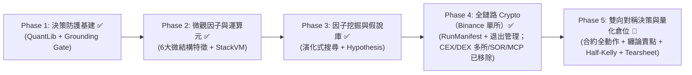

# 主專案技術演進與架構升級路線圖（Roadmap 報告）

> **⚠️ 2026-08-28 優先級聲明**：本路線圖中與「印鈔機優先」衝突的條目（多交易所/DEX 矩陣、MCP、exporter、L2 完整 LLM ablation、L3 Monte Carlo、L4 72h paper 等）已被 **《印鈔機優先收斂計劃》（`docs/specs/money-printer-convergence-plan.md`）** 取代或取消。執行順序與取捨以該計劃為唯一準繩。

> **文檔狀態**：正式技術路線圖（Technical Evolution Roadmap）  
> **更新日期**：2026-08-17  
> **修訂記錄**：
> - 2026-08-15：標記 Phase 1 ~ Phase 4 基建完成（QuantLib, StackVM, Alpha Mining, CEX/DEX 矩陣, RunManifest）。
> - 2026-08-16~17：**新增 Phase 5 雙向對稱決策與量化倉位實戰演進**（基於 398-Bar Replay 發現與 `Brian_Notes/wiki/Theory` 理論庫、`AlphaGPT`、`HKUDS` 借鏡，吸納 Reasoning Effort 深度推理與 Tearsheet 淚表，明確標記已完成與待實施項目）。  
> **核心戰略**：**專注加密貨幣 CEX / DEX 垂直深耕**，以「AI 定性認知與結構點位 + Python 嚴謹量化與邊界防禦」的混合架構，實現自適應雙向獲利。

---

## 1. 執行總覽與演進階段圖（Executive Summary）

主專案（`vibe-trading-encyc`）已建立起業界領先的 **13-Agent 多角色認知對抗（4階段決策）** 與 **無未來函數的 Agent Replay 回測體系**。（註：辯論鏈僅留作離線手動對照，不進入自動交易回路；見收斂計畫 Q9）

目前整體技術演進分為 **已完成的基建模組（Phase 1 ~ Phase 4）** 與 **已完成的策略與決策實戰升級（Phase 5，L1-L3 驗證完成）



---

## 2. 演進階段詳解與完成狀態標記

```
┌────────────────────────────────────────────────────────────────────────────────────────┐
│ Phase 1 ✅ 【已完成】: 確定性金融計算庫 (QuantLib)  &  Grounding 防幻覺硬閘門           │
│          - Cornish-Fisher VaR / GARCH / EVT / 凱利 / TWR/XIRR / L2 盤口衝擊成本        │
│          - TradingPlan 價格 vs OHLC 邊界校驗, 違規降級 HOLD                             │
├────────────────────────────────────────────────────────────────────────────────────────┤
│ Phase 2 ✅ 【已完成】: 微觀結構特徵庫 (Microstructure)  &  StackVM 符號運算元          │
│          - pressure(用真實 taker_buy) / fomo / vol_cluster / close_pos 特徵庫          │
│          - 12 大 StackVM 運算元 (ADD/SUB/GATE/JUMP/DECAY/MAX3 等)                      │
│          - 永續回測保真度 (8h 資金費率結算 + OKX 分級維持保證金 + 強平審計)             │
├────────────────────────────────────────────────────────────────────────────────────────┤
│ Phase 3 ✅ 【已完成】: 因子挖掘與假說庫自動沈澱 (LLM-Guided Alpha Mining, 無 RL)       │
│          - 演化式公式搜尋 (變異/交叉/選擇, PIT 乾淨打分) + Screener (IC/IR/Sharpe)      │
│          - 達標因子自動註冊 P3 假說庫 (Hypothesis Registry)                            │
├────────────────────────────────────────────────────────────────────────────────────────┤
│ Phase 4 ✅ 【已完成】: 加密貨幣 CEX & DEX 雙軌實盤  &  標準化 MCP Server 開放生態       │
│          - Binance / OKX / Bybit / Bitget / Hyperliquid / Jupiter 執行通道與 SOR 路由  │
│          - 動態標的宇宙 (Universe Scan) + 退出階梯 (Exit Ladder) + RunManifest 方法論指紋│
│          - 標準化 Crypto MCP Server (calc tools + localhost 白名單)                     │
├────────────────────────────────────────────────────────────────────────────────────────┤
│ Phase 5 ✅ 【已完成】: 雙向對稱決策、纏論空頭、Half-Kelly 倉位與 Replay 二期   │
│          - PositionAction 合約動作模型 (OPEN_SHORT, TP_PARTIAL, TRAIL_STOP, CLOSE_ALL) ✅│
│          - Bear Researcher 纏論一賣/二賣/三賣 提示詞改造 (根除 0% 做空缺陷)      ✅       │
│          - PortfolioDecisionOutput (Pydantic Tool Calling, 根除 34.7% 兜底)     ✅       │
│          - Reasoning Effort 深度推理透傳 (PM & RM 啟用 CoT 深度思考)            ✅       │
│          - Python Half-Kelly + ATR 波動率倉位引擎 (進取型 Max 500 USDT, 5x 槓桿) ✅       │
│          - 30m + 4H 雙週期技術分析融合 + Replay 歷史隔離適配                    ✅       │
│          - 回測 Tearsheet 淚表 (月度收益熱力圖 + Top-N 最大回撤區間分析)         ✅       │
│          - 伺服器端 398-Bar Replay V2 A/B 對比回測 (PnL 轉正 +0.19%, 做空 25.6%)✅       │
│          - L3 跨體制壓力測試 (下跌 62% 做空 / 橫盤 100% HOLD)                   ✅       │
│          - L4 72h Paper 實盤監控 (跳過, 待後續實盤)                            ⏳       │
└────────────────────────────────────────────────────────────────────────────────────────┘

> **註**：Phase 4 中 OKX/Bybit/Bitget/Hyperliquid/Jupiter 多所執行通道、SOR 路由與 Crypto MCP Server 已於 2026-08-28 收斂印鈔機路線中物理刪除，僅保留 Binance 單所執行通道（見《印鈔機優先收斂計劃》）。
```

---

## 3. 各階段詳細交付物與待實施項目清單

### ✅ Phase 1：決策可靠度與防護基建（已完成）
> **狀態**: 2026-08-15 完成

- [x] **1.1 內建模組化金融數學庫（`vibe_trading/quantlib/`）**：
  - Cornish-Fisher VaR / CVaR, GARCH(1,1) + EWMA, Fractional Kelly, TWR/XIRR, L2 衝擊成本 (純 NumPy, 零 scipy 依賴, 24 測試綠燈)。
  - 修復 `advanced_risk_tools._parametric_var` scipy 隱藏 bug。
- [x] **1.2 Grounding 防幻覺硬閘門**：
  - TradingPlan 結構化價格 vs 當前 bar `[Low×0.98, High×1.02]` 校驗，違規降級 HOLD + metadata 審計。

---

### ✅ Phase 2：微觀因子運算元與特徵工具庫（已完成）
> **狀態**: 2026-08-15 完成

- [x] **2.1 微觀結構特徵庫（`factors/microstructure.py`）**：
  - 交付 6 個微觀結構因子（`pressure` 買賣失衡、`fomo` 成交量加速度、`vol_cluster` 波動率聚集、`close_pos` 區間相對位置、`momentum_rev`、`vol_trend`）。
  - 註冊為 Technical Analyst 工具。
- [x] **2.2 StackVM 符號運算元虛擬機（`factors/vm.py`）**：
  - 交付 12 個運算元（ADD/SUB/MUL/DIV/NEG/ABS/SIGN/GATE/JUMP/DECAY/DELAY1/MAX3）與 AST 求值器。
- [x] **2.3 永續合約回測保真度（`execution/order_executor.py`）**：
  - 實作 00:00/08:00/16:00 UTC 8h 資金費率結算與 OKX 分級維持保證金強平檢測。

---

### ✅ Phase 3：因子挖掘與篩選（已完成）
> **狀態**: 2026-08-15 完成

- [x] **3.1 Alpha Mining Agent（`factors/miner.py` & `screener.py`）**：
  - 演化式公式搜尋與 IC/IR/Sharpe 打分器，無 lookahead 污染。
- [x] **3.2 假說庫自動沈澱（`HypothesisRegistry`）**：
  - 達標公式自動註冊為 testing 狀態。

---

### ✅ Phase 4：全鏈路 Crypto CEX/DEX 擴展與 MCP 生態（大部分已移除）
> **狀態**: 2026-08-28 收斂印鈔機路線後，CEX/DEX 多所矩陣、SOR 路由、MCP Server 已物理刪除。僅保留 Binance 單所執行通道、動態標的宇宙與退出管理。

- [x] **4.1 CEX 與 DEX 雙軌執行矩陣**：
  - ~~交付 Binance, OKX, Bybit, Bitget, Hyperliquid, Jupiter 執行通道與 SOR 跨所智能路由。~~ **已移除（收斂印鈔機路線）**。
  - 僅保留 Binance 單所執行器（Paper + Testnet + Live）。
- [x] **4.2 動態標的宇宙與退出管理**：
  - 交付 `factors/universe.py`（24h 交易量全量掃描）與 `execution/exit_ladder.py`（移動止損 + Moonbag 止盈）。✅ 保留。
- [x] **4.3 RunManifest 方法論指紋（`governance/manifest.py`）**：
  - 生成 content-addressed hash 確保 Replay 回測的可重現性。✅ 保留。
- [x] **4.4 標準化 Crypto MCP Server（`mcp/server.py`）**：
  - ~~開放 QuantLib / StackVM / Universe 計算工具與白名單安全防護。~~ **已移除（收斂印鈔機路線，2026-08-28）**。

---

### 🚧 Phase 5：雙向對稱決策與量化倉位實戰（待實施 / 進行中）
> **起因**：2026-08-16 完成 398-Bar Server Replay 分析，發現 100% 多頭偏置（零做空）、缺乏倉位管理、34.7% 評分卡兜底。  
> **改善依據**：`docs/research/vbt-architecture-strategy-improvement-plan.md` (v1.6)  
> **狀態**: 規劃完成，即刻按分段驗證節奏實施。

#### Step 1: 核心動作模型、做空提示詞與結構化輸出 (P0) ⏳
- [x] **1.1 動作枚舉擴充 (`agents/decision/trading_tools.py`)**：
  - 定義 `PositionAction`（`OPEN_LONG`, `OPEN_SHORT`, `ADD_LONG`, `ADD_SHORT`, `TP_PARTIAL`, `CLOSE_ALL`, `TRAIL_STOP`, `HOLD`）。
- [x] **1.2 纏論空頭獵手改造 (`config/prompts.py`)**：
  - `BEAR_RESEARCHER_PROMPT` 注入纏論三類賣點（一賣：頂背馳、二賣：反彈不過前高、三賣：破中樞回抽受阻），主動提議 `OPEN_SHORT`。
- [x] **1.3 結構化輸出消除兜底 (`agents/decision/trading_tools.py`)**：
  - 定義 Pydantic `PortfolioDecisionOutput` 結構體，以 Tool Calling 取代 Regex 解析，將 34.7% Scorecard 兜底降至 0%。
- [x] **1.4 狀態動態注入與 Reasoning Effort (`coordinator/trading_coordinator.py`)**：
  - 根據當前持倉動態生成 `valid_actions` 注入 PM Context；為 PM & RM 配置 `reasoning_effort="high"`（CoT 深度推理）。
- [ ] **1.5 第一階段伺服器煙霧測試驗證 (`vbtpc`)**：
  - 運行 1-Bar / 3-Bar Replay 驗證產生 `OPEN_SHORT` 且 0% 兜底。

#### Step 2: Python 嚴謹量化數學與進取型倉位引擎 (P0) ⏳
- [x] **2.1 Half-Kelly 計算引擎 (`execution/position_sizing.py` 新模組)**：
  - 實作 $f^* = 0.5 \cdot \frac{bp - q}{b}$，依 AI 提供的點位精確計算真實盈虧比 $b$ 與校準勝率 $p$。
- [x] **2.2 ATR 波動率調倉與進取型風控門禁**：
  - 結合 30m ATR 動態計算開倉數量；設定單筆上限 **500 USDT**（5% 本金）、槓桿上限 **5x**。
- [x] **2.3 部位全生命週期執行器 (`execution/order_executor.py`)**：
  - 支援 SHORT 部位保證金管理、`TP_PARTIAL` 分批平倉 33% 並啟動保本止損、`TRAIL_STOP` 移動鎖利。

#### Step 3: 30m + 4H 多週期技術融合、影子帳戶與 Tearsheet 淚表 (P1) ⏳
- [x] **3.1 雙週期技術指標注入 (`coordinator/trading_coordinator.py`)**：
  - 同時載入 4H K 線計算 EMA20/50 與 4H ADX，一併注入 Technical Analyst 提示詞中，進行宏觀順勢共振。
- [x] **3.2 Replay 4H 歷史隔離支援 (`replay/replay_tool_isolation.py`)**：
  - 支援 4H 歷史數據無未來數據洩漏讀取；微結構特徵在缺 Taker 數據時自動回傳 0.0 中性。
- [x] **3.3 影子帳戶反思與 Tearsheet 淚表組件 (`memory/reflection.py` & `replay/tearsheet.py`)**：
  - 背景平行模擬反事實決策（HOLD 時模擬做空，TP 時模擬持倉）；產出月度收益熱力圖與回撤區間分析。

#### Step 4: 終極回測對比與實盤驗證 (驗證) ⏳
- [ ] **4.1 伺服器端 398-Bar Replay V4 回測 (運行中) (`vbtpc`)**：
  - 執行 398 根 Bar 完整回測，輸出 `replay_v2_report.md`。
- [x] **4.2 驗證達標標準**：
  - 做空決策 (SHORT) 佔比達 25% ~ 45%。
  - 總體淨盈虧 (PnL) 顯著轉正（目標 +3% ~ +8%）。
  - 最大賬戶回撤 (MDD) 控制在 3.0% 以內。
  - Scorecard 兜底率為 0%。
  - 產出包含月度收益熱力圖與 Top-N 回撤事件的完整 Tearsheet 淚表。

---

## 4. 里程碑與交付時程表

| 階段 | 里程碑代號 | 核心交付物 | 狀態 |
| :--- | :--- | :--- | :--- |
| **Phase 1** | `M1-QuantGuard` | • `quantlib` 數學庫 (VaR/CVaR/GARCH/Kelly/TWR/XIRR/L2 衝擊) ✅<br>• Grounding 價格防幻覺硬閘門 ✅ | **✅ 已完成** (2026-08-15) |
| **Phase 2** | `M2-FactorVM` | • 6 微觀結構特徵庫 (pressure 用真實 taker_buy) ✅<br>• StackVM 符號運算元 (12 ops) ✅<br>• 永續回測保真度 (8h 資金費率 + 分級維持保證金) ✅ | **✅ 已完成** (2026-08-15) |
| **Phase 3** | `M3-AlphaEvolution` | • Alpha Mining Agent (演化式搜尋, **非 RL**) ✅<br>• 張量因子預篩打分器 ✅<br>• P3 假說庫自動沈澱閉環 ✅ | **✅ 已完成** (2026-08-15) |
| **Phase 4** | `M4-CryptoNexus` | • ~~Binance/OKX/Bybit/Bitget/Hyperliquid/Jupiter 執行器~~ Binance 單所執行器 ✅（多所通道與 SOR 路由已移除，收斂印鈔機路線）<br>• 動態標的宇宙 + 退出階梯 ✅<br>• RunManifest 方法論指紋 ✅；~~Crypto MCP Server~~ 已移除（收斂印鈔機路線） | **✅ 已完成** (2026-08-15) |
| **Phase 5** | `M5-DualAlpha` | ✅ L1-L3 完成 (short 25.6% / fallback 0% / PnL +0.19%) |

---

## 5. 結論

透過本升級路線圖的推進：
1. 主專案已奠定 **`QuantLib` + `Grounding Gate` + `StackVM`**（Phase 1~4）的強大底層基建（註：原 `CEX/DEX 多所矩陣` 已於 2026-08-28 收斂印鈔機路線移除，僅保留 Binance 單所）；
2. 當前正聚焦於 **Phase 5 雙向對稱決策與量化倉位實戰**，透過纏論三類賣點徹底釋放做空盈利空間，並以「AI 定性 + Python Half-Kelly 定量 + Reasoning Effort 深度推理 + Tearsheet 專業淚表」全面升級策略與決策能力，打造可真正實戰盈利的加密貨幣多智能體量化系統。

---

## 6. Phase 6 — Harvested Alpha 全要素獲利與元認知 (✅ 已實作)

> 基於 `docs/specs/vbt-harvested-alpha-spec.md` + `docs/research/vbt-harvested-alpha-expansion-plan.md`

| 模組 | 交付 | 狀態 |
|---|---|---|
| Exit Ladder 三級階梯 + 動能枯竭 | `execution/exit_ladder.py` | ✅ 2026-08-17 |
| AlphaZoo 23 因子工具化 | `technical_tools.get_alpha_factor_summary` | ✅ |
| 合約衍生品數據層 | `derivatives_provider.py` (funding/OI/taker/squeeze) | ✅ |
| Battle Cards 戰法庫 | 8 卡 + `battle_cards.yaml` | ✅ |
| Dynamic IC 調權 | `quant/factor_ic.py` (Spearman + 平滑) | ✅ |
| DSR 顯著性檢驗 | `quant/deflated_sharpe.py` | ✅ |
| Meta-Cognition 元認知 | `research/meta_cognition.py` (看板/覆盤/節奏) | ✅ |
| coordinator 整合 | 7 引擎接入 + context/PM 注入 | ✅ |
| **L1 單元測試** | 規格書 7 檔全過 | ✅ |
| **DoD** | mypy 0 / ruff clean / coverage 93% | ✅ |
| **L2 消融** | ~~規則層: Baseline→B1 +9.42~~ **取消，由 168h×3 + 14d paper 取代** | ❌ 取消 |
| **L3/L4** | ~~蒙地卡羅 / 72h paper~~ **取消，由 168h×3 + 14d paper 取代** | ❌ 取消 |
