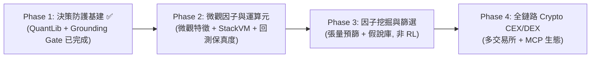

# 主專案技術演進與架構升級路線圖（Roadmap 報告）

> **文檔狀態**：正式技術路線圖（Technical Evolution Roadmap）  
> **制定日期**：2026-08-15  
> **修訂**：2026-08-15 — 基於競品功能全面採納評估 (`feature-adoption-assessment.md`) 修正方向: 標記 Phase 1 完成、移除哈希鏈帳本 (已判定 LOW)、移除 RL 因子挖掘 (lookahead 污染)、加入回測保真度/退出階梯/RunManifest。  
> **核心戰略**：**專注加密貨幣 CEX / DEX 垂直深耕**，全面吸納 `HKUDS/Vibe-Trading`（確定性金融工程與防幻覺治理）與 `AlphaGPT`（微觀因子與運算元，**取其工具棄其學習循環**）的核心優勢。

---

## 執行總覽（Executive Summary）

主專案（`vibe-trading-encyc`）在 **12-Agent 多角色認知對抗（4階段決策）** 與 **無未來函數的 Agent Replay 體系** 上具備堅實的架構壁壘。

本路線圖制定**四階段（Phase 1 ~ Phase 4）演進規劃**。**Phase 1 已完成**；Phase 2 起點為微觀因子包 + 永續回測保真度。



---

## 四階段演進規劃詳解

```
┌────────────────────────────────────────────────────────────────────────────────────────┐
│ Phase 1 ✅: 確定性金融計算庫 (QuantLib)  &  Grounding 防幻覺硬閘門                      │
│          - Cornish-Fisher VaR / GARCH / EVT / 凱利 / TWR/XIRR / L2 衝擊                │
│          - TradingPlan 價格 vs OHLC 邊界校驗, 違規降級 HOLD                             │
├────────────────────────────────────────────────────────────────────────────────────────┤
│ Phase 2: 微觀結構特徵庫 (Microstructure)  &  StackVM 運算元  &  永續回測保真度          │
│          - pressure(用真實 taker_buy) / fomo / vol_cluster / close_pos                │
│          - GATE / JUMP / DECAY / MAX3 運算元 (分析師可組合因子)                        │
│          - 8h 資金費率結算 + OKX 分級維持保證金 + 標記價強平                            │
├────────────────────────────────────────────────────────────────────────────────────────┤
│ Phase 3: 因子張量預篩  &  假說庫自動沈澱 (無 RL)                                        │
│          - 多標的 [tokens×time] 批量回測, 花 LLM 預算前預篩因子                        │
│          - 演化式/隨機公式搜尋 (非 RL policy gradient — 見修正註記)                    │
│          - P3 假說庫 (Hypothesis Registry) 自動沈澱 + EvidenceGate 跟蹤                │
├────────────────────────────────────────────────────────────────────────────────────────┤
│ Phase 4: 加密貨幣 CEX & DEX 雙軌實盤  &  標準化 MCP Server 開放生態                    │
│          - Binance / OKX / Hyperliquid / Jupiter 執行通道                              │
│          - 動態標的宇宙 + 退出階梯 (trailing/moonbag) + RunManifest 方法論指紋         │
└────────────────────────────────────────────────────────────────────────────────────────┘
```

---

### ✅ Phase 1：決策可靠度與防護基建（已完成）
> **借鑑來源**：`HKUDS/Vibe-Trading`（`src/quantlib` + Grounding Gates）  
> **狀態**: 2026-08-15 完成

#### 1.1 內建模組化金融數學庫（`vibe_trading/quantlib/`）✅
* **已交付**：歷史/參數/Cornish-Fisher/EVT VaR + CVaR, GARCH(1,1) + EWMA, Fractional Kelly, 最大回撤限制, TWR/XIRR, L2 盤口衝擊成本 (純 NumPy, 零 scipy 依賴, 24 測試)
* **已修復**：`advanced_risk_tools._parametric_var` scipy ImportError (隱藏 bug)
* **後續 (backlog)**：Markov regime, PBO/過擬合診斷, purged CV, Kupiec/Christoffersen VaR 回測 — 見採納評估 backlog

#### 1.2 Grounding 防幻覺硬閘門 ✅
* **已交付**：TradingPlan 結構化價格 vs 當前 bar `[Low×0.98, High×1.02]` 校驗 (stop/TP 放寬 ±10%), 違規降級 HOLD + metadata 記錄 + TG `/decision` 顯示
* **後續 (backlog)**：unsourced-symbol 檢查 + 有界唯讀恢復循環 (HKUDS GroundingLedger 模式, 採納評估 A6)
* **~~不可篡改審計帳本~~ → 已移除**：單 operator 無外部審計方, 防篡改無動機 (2026-08-15 判定 LOW)。**替代**: RunManifest 方法論指紋 (Phase 4 A7), 證明 replay 可重現性比防篡改更有價值

---

### ⚡ Phase 2：微觀因子運算元與特徵工具庫（Microstructure & StackVM）
> **借鑑來源**：`AlphaGPT`（微觀因子 + StackVM, **取工具層, 不取 RL 學習循環**）  
> **核心目標**：為分析師團隊配備高敏微觀結構指標與動態公式運算元

#### 2.1 微觀結構特徵庫（採納評估 A1, 6 個初版）
* `pressure`：買賣失衡 — **用我們真實 `taker_buy_base/volume` (每根 kline 已儲存)**, 比 AlphaGPT 蠟燭體代理 (`tanh(3(c-o)/(h-l))`) 更強
* `fomo`：成交量與主動買入資金流加速度 (5-bar 窗口)
* `vol_cluster`：滾動實現波動率聚集
* `close_pos`：bar 區間相對位置 `(c-l)/(h-l)`
* `momentum_rev`：5-bar 動量符號翻轉二值訊號
* `vol_trend`：1-bar 成交量變化
* **設計**：純 OHLCV 函數, NaN-aware 滾動窗口 (**不可複製 AlphaGPT 的 zero-padding 污染** — 違反 PIT 紀律), 註冊為 Technical Analyst tool
* **後續**：liq_score (CEX 需深度/24h 成交量代理, 非 DEX pool), 其餘 5 特徵視需要

#### 2.2 StackVM 符號運算元虛擬機（採納評估 A2）✅
* **已交付** (2026-08-15): `factors/vm.py` — 12 運算元 (ADD/SUB/MUL/DIV/NEG/ABS/SIGN/GATE/JUMP/DECAY/DELAY1/MAX3) + 巢狀 AST 求值器 (arity-checked, NaN-safe) + `compose_factor` agent tool (technical analyst 可組合自定義因子)
* **設計**：純函式, 無效公式回 None 不 raise (與競品一致); 序列標量展開對齊長度
* **明確不取**：AlphaGPT 的 LoopedTransformer + RL 循環 (見 Phase 3 修正註記)

#### 2.3 永續合約回測保真度（採納評估 A3）✅
* **已交付** (2026-08-15): `PaperOrderExecutor.settle_funding` — 00:00/08:00/16:00 UTC 三結算點, per-symbol 小時去重, `fee = size × mark × rate × direction` (short 收費); `check_liquidation` — OKX 分級維持保證金表 `[(100k,0.4%),(500k,0.6%),(1M,1%),(5M,2%),(10M,5%),(∞,10%)]`, `margin + unrealized ≤ notional × tier_rate` 強平; agent replay 每 bar 接入 settle_funding
* **接入**：replay 迴圈 `executor.settle_funding(...)`; 強平事件記錄 `_liquidation_events` (可審計)
* **留後續**：嚴格模式 (per-exchange bracket artifacts, cross/isolated 帳戶清算) — 需 loader 供 funding_rate/brackets 欄位

---

### 🧠 Phase 3：因子挖掘與篩選（LLM-Guided Alpha Mining, 無 RL）
> **融合**：AlphaGPT 符號挖掘概念 (去 RL) + HKUDS 假說庫 (Research Backbone)  
> **核心目標**：系統可自主提出因子假說, 張量預篩, 自動沈澱至假說庫

#### 3.1 Alpha Mining Agent（因子挖掘師）✅
* **已交付** (2026-08-15): `factors/miner.py` — 演化式公式搜尋 (變異/交叉/選擇, 深度控制, 確定性 seed); `factors/screener.py` — IC (Spearman via 純 NumPy rankdata)/IR/Sharpe 評分, forward return 用下一 bar 開盤 (無 lookahead); `vibe-trade research alpha-mine` CLI
* **張量評分**: 候選公式批量評估, 達標 (|IC| ≥ 0.05 且 Sharpe > 0) 自動註冊假說庫
* **Binance 場景**: 單標的 forward returns (多標的橫截面 IC 留 v2)

#### 3.2 策略自進化閉環 ✅
* **已交付** (2026-08-15): 達標公式 → `HypothesisRegistry.create` (testing 狀態) — 閉環到假說庫
* **留後續**: EvidenceGate 14 天自動 paper 跟蹤 (需排程器); 每週自動挖掘 (cron)

#### 3.3 修正註記: 為何不採納 AlphaGPT RL 循環
* AlphaGPT `engine.py` 標籤用 `torch.roll(open, -2)` — **未來數據 (lookahead 污染)**, 違反我們 PIT replay 紀律
* 獎勵只有 return+drawdown, **無 IC/Sharpe** (先前宣稱不實)
* 架構綁定 LoopedTransformer/MTPHead — 無法獨立複用
* **替代**: 演化式/隨機公式搜尋 (對 StackVM AST 做變異/交叉, 用乾淨 PIT 評分) — 達成自進化目的, 無 lookahead 風險

---

### 🌐 Phase 4：全鏈路 Crypto CEX/DEX 擴展與 MCP 生態（Crypto-Native CEX/DEX & MCP）
> **戰略定位**：**專注加密貨幣 CEX / DEX 縱深**，建立全鏈路加密執行矩陣與標準化開放生態。

#### 4.1 CEX 與 DEX 雙軌執行矩陣（Tier-1 CEX + Tier-1 DEX）
* **中心化交易所（CEX）**：
  * **Binance**（現有）→ 擴展 Coin-M 幣本位合約
  * **OKX / Bybit / Bitget**：永續合約接入
  * **戰略賦能**：跨交易所資金費率套利 (Delta-Neutral)、智能訂單路由 (SOR)
* **去中心化協議（DEX）**：
  * **Hyperliquid**：鏈上訂單簿永續合約
  * **Solana Jupiter DEX 聚合器**：Meme 幣極速 Swap
  * **EVM DEX (Uniswap v3)**: 以太坊 / Arbitrum / BSC

#### 4.2 動態標的宇宙與退出管理（採納評估 A4 + A5）✅
* **已交付** (2026-08-15): `factors/universe.py` — Binance 永續 24h tickers 全量排名 (quote volume), 過濾穩定幣/槓桿代幣/低流動性; `vibe-trade research universe-scan` CLI; `execution/exit_ladder.py` — trailing stop (+5% 啟動, 峰值回撤 3% 全出) + moonbag TP (+10% 賣 50%), 接入 PaperOrderExecutor
* **留後續**：自動輪換交易對進 onbar thread (需重啟機制); 跨所標的 (4.1 完成後)

#### 4.3 RunManifest 方法論指紋（採納評估 A7）✅
* **已交付** (2026-08-15): `governance/manifest.py` — content-addressed hash (prompts hash + tools 清單 + 套件版本 + replay config, **排除 run_id/timestamp**); replay run 結束寫 `manifest.json`; `vibe-trade research manifest-diff` 偵測方法論漂移
* **定位**: 哈希鏈審計帳本的有用替代 (單 operator 無審計方, 可重現性證明更有價值)

#### 4.4 標準化 Crypto MCP Server ✅
* **已交付** (2026-08-15): `mcp/calc_tools.py` + `mcp/server.py` 擴充 — 3 計算工具 (`quantlib_var_calc`/`alpha_stackvm_eval`/`crypto_universe_scan`, 鏡像 Phase 1.1/2.2/4.2 確定性層) + Host/Origin guard (DNS-rebinding 防護, localhost 白名單)
* 既有 26 agent tools 保留 (`crypto_get_kline`/`execution_place_order` 等鏡像); 計算工具不需 tool_context
* 安全: `check_origin` 僅允許 localhost/127.0.0.1/*.local Host + Origin 白名單

---

## 📅 里程碑與交付時程表

| 階段 | 里程碑代號 | 核心交付物 | 狀態 |
| :--- | :--- | :--- | :--- |
| **Phase 1** | `M1-QuantGuard` | • `quantlib` 數學庫 (VaR/CVaR/GARCH/Kelly/TWR/XIRR/L2 衝擊) ✅<br>• Grounding 價格防幻覺硬閘門 ✅<br>• ~~哈希鏈帳本~~ → 移除 (LOW) | **✅ 完成** (2026-08-15) |
| **Phase 2** | `M2-FactorVM` | • 6 微觀結構特徵庫 (pressure 用真實 taker_buy)<br>• StackVM 符號運算元 (12 ops)<br>• 永續回測保真度 (8h 資金費率 + 分級維持保證金)<br>• Technical Analyst 工具擴展 | 下一個 |
| **Phase 3** | `M3-AlphaEvolution` | • Alpha Mining Agent (演化式搜尋, **非 RL**)<br>• 張量因子預篩打分器<br>• P3 假說庫自動沈澱閉環 | 待 Phase 2 |
| **Phase 4** | `M4-CryptoNexus` | • Binance/OKX/Bybit/Bitget 執行器<br>• Hyperliquid & Jupiter DEX 通道<br>• 動態標的宇宙 + 退出階梯<br>• RunManifest 方法論指紋<br>• Crypto MCP Server | 待 Phase 3 |

---

## 結論

透過本 Roadmap 的實施，主專案（`vibe-trading-encyc`）將在保有**多 Agent 深度協作認知**與**無未來函數 Replay 回測**的核心優勢下：
1. 以 **`QuantLib` + `Grounding Gate`**（已完成）解決 LLM「心算不準」與「價格幻覺」；
2. 以 **`微觀因子 + StackVM`**（Phase 2）賦予系統微觀結構洞察 — **取競品工具層, 棄其 RL 學習循環**；
3. 以 **`張量預篩 + 假說庫`**（Phase 3）實現無 lookahead 污染的策略自演化；
4. 以 **`CEX/DEX 雙軌 + 動態標的 + RunManifest + MCP`**（Phase 4）打造可證明可重現的加密 AI 量化作業系統。
