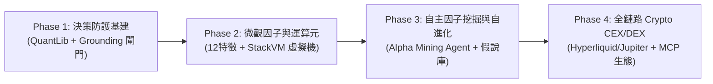
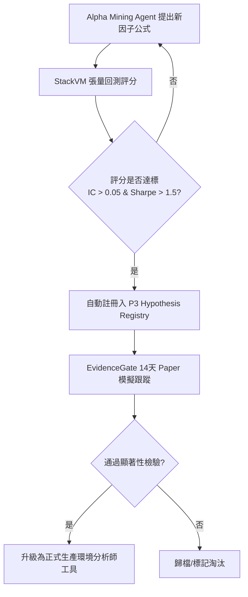

# 主專案技術演進與架構升級路線圖（Roadmap 報告）

> **文檔狀態**：正式技術路線圖（Technical Evolution Roadmap）  
> **制定日期**：2026-08-15  
> **核心戰略**：**專注加密貨幣 CEX / DEX 垂直深耕**，全面吸納 `HKUDS/Vibe-Trading`（確定性金融工程與防幻覺治理）與 `AlphaGPT`（神經符號因子與微觀運算元）的核心優勢。

---

## 執行總覽（Executive Summary）

主專案（`vibe-trading-encyc`）在 **12-Agent 多角色認知對抗（4階段決策）** 與 **無未來函數的 Agent Replay 體系** 上具備堅實的架構壁壘。

為進一步提升實盤獲利能力、杜絕大模型價格幻覺、並擴展鏈上/鏈下交易場景，本路線圖制定了**四階段（Phase 1 ~ Phase 4）演進規劃**，確立主專案在加密貨幣智能量化交易領域的領先地位：



---

## 四階段演進規劃詳解

```
┌────────────────────────────────────────────────────────────────────────────────────────┐
│                   vibe-trading-encyc 技術演進全景架構 (四階段)                         │
├────────────────────────────────────────────────────────────────────────────────────────┤
│ Phase 1: 確定性金融計算庫 (QuantLib)  &  Phase 4 交易計畫 Grounding 防幻覺硬閘門       │
│          - GARCH 波動率 / EVT / 凱利公式   - 嚴格 OHLC / 盤口邊界比對拒絕機制          │
├────────────────────────────────────────────────────────────────────────────────────────┤
│ Phase 2: 微觀結構特徵庫 (Microstructure)  &  StackVM 符號運算元虛擬機                  │
│          - pressure / fomo / vol_cluster   - GATE / JUMP / DECAY / MAX3 運算元         │
├────────────────────────────────────────────────────────────────────────────────────────┤
│ Phase 3: LLM 引導的 Alpha Mining Agent  &  策略自進化 (Self-Evolution Loop)           │
│          - 啟發式因子生成 / 張量極速回測打分 - 自動沈澱至 P3 假說庫 (Hypothesis Registry)│
├────────────────────────────────────────────────────────────────────────────────────────┤
│ Phase 4: 加密貨幣 CEX & DEX 雙軌實盤  &  標準化 MCP Server 開放生態                    │
│          - Binance / OKX / Hyperliquid / Solana Jupiter - 40+ 加密量化 MCP 工具集成     │
└────────────────────────────────────────────────────────────────────────────────────────┘
```

---

### 🚀 Phase 1：決策可靠度與防護基建（Reliability & Risk Guardrails）
> **借鑑來源**：`HKUDS/Vibe-Trading`（`src/quantlib` + Grounding Gates + 審計帳本）  
> **核心目標**：將數學計算與 LLM 嚴格解耦，杜絕大模型在 Prompt 內「心算」與「捏造價格」。

#### 1.1 內建模組化金融數學庫（`vibe_trading/quantlib/`）
* **波動率與風險計量模組**：
  * 歷史與參數 VaR / CVaR（含 Cornish-Fisher 修正）
  * 極值理論（EVT - Peaks Over Threshold / GPD 擬合）
  * GARCH(1,1) / EWMA 動態條件波動率預測
* **資金管理與執行計量**：
  * 動態半凱利（Fractional Kelly）與最大回撤限制器
  * 盤口流動性衝擊成本估算（Orderbook L2 Depth Impact Model）
  * 不規則現金流分析（TWR / XIRR）
* **設計原則**：所有量化公式均為純 Python/NumPy/SciPy 實作，單元測試覆蓋率 100%，Agent 必須透過 Tool 取得確定性數值。

#### 1.2 Phase 4 交易計畫 Grounding 防幻覺硬閘門
* **價格合理性校驗**：
  * 交易員（Trader）與投資組合經理（PM）輸出下單計畫時，自動攔截並核對目標入場價、止損價、止盈價。
  * 若價格超出當前 Bar 實測區間 $[Low \times 0.98, High \times 1.02]$ 或盤口價差，系統直接判定為「Grounding 違規」並強制駁回重試。
* **不可篡改審計帳本（Audit Ledger）**：
  * 對每根 Bar 的原始輸入、Agent 對話歷史、工具調用 Trace、最終決策與真實成交進行哈希鏈式（Hash-Chained）持久化存檔。

---

### ⚡ Phase 2：微觀因子運算元與特徵工具庫（Microstructure & StackVM）
> **借鑑來源**：`AlphaGPT`（`FeatureEngineer` + `StackVM` 運算元引擎）  
> **核心目標**：為 Phase 1 分析師團隊配備高敏微觀結構指標與動態公式運算元。

#### 2.1 封裝 12 種加密微觀結構特徵庫（Microstructure Factors）
* `pressure`：買賣盤口掛單深度不平衡度（Orderbook Imbalance）
* `fomo`：成交量與主動買入資金流加速度（Volume Surge & Inflow Acceleration）
* `vol_cluster`：短期與長期波動率聚集比（Volatility Clustering）
* `close_pos`：當前價格在特定窗口高低價區間的相對分位數（Range Relative Position）
* `liq_score`：流動性深度與持倉量（OI）健康度評分
* `momentum_rev` / `rel_strength` / `hl_range` / `vol_trend`：動量反轉、相對強弱與趨勢強度

#### 2.2 輕量級 StackVM 運算元虛擬機（`vibe_trading/factors/vm.py`）
* **內建 12 種量化運算元**：
  * 基礎運算：`ADD`, `SUB`, `MUL`, `DIV`, `NEG`, `ABS`, `SIGN`
  * 條件門控：`GATE(cond, x, y)`（條件成立選 x，否則 y）
  * 極值跳變：`JUMP(x)`（Z-score > 3 異常檢測）
  * 時間序列：`DECAY(x, alpha)`（指數衰減疊加）、`DELAY1(x)`（一階滯後）、`MAX3(x)`（當前與前兩期極值）
* **分析師能力賦能**：Technical Analyst 可直接輸出公式 AST 字串，StackVM 在毫秒級內完成向量化特徵求值並返回給決策流。

---

### 🧠 Phase 3：自主因子挖掘與策略自進化（LLM-Guided Alpha Mining & Self-Evolution）
> **融合創新**：結合 `AlphaGPT` 的符號挖掘反饋機制與 `HKUDS` 的 Research Backbone（P3 假說庫）  
> **核心目標**：讓系統具備自主提出策略假說、張量化回測評分、自動沈澱升級為生產工具的能力。

#### 3.1 構建 Alpha Mining Agent（因子挖掘師）
* **運作機制**：在宏觀線程（Macro Thread）或後台異步運行，結合 LLM 領域知識（如「當前處於高波動橫盤，需要構建均值回歸+成交量背離因子」）進行啟發式搜尋，輸出新型公式 Token。
* **極速張量回測打分器（`FastFactorBacktest`）**：
  * 利用 StackVM 在過去 90 天歷史 K 線矩陣上並行計算候選因子的 IC（資訊係數）、IR（資訊比率）、多空年化 Sharpe 與最大回撤。
  * 實行無效因子懲罰機制（過低方差、高相關性因子給予負分）。

#### 3.2 策略自進化閉環（Self-Evolution Loop）


---

### 🌐 Phase 4：全鏈路 Crypto CEX/DEX 擴展與 MCP 生態（Crypto-Native CEX/DEX & MCP）
> **戰略定位**：**專注加密貨幣 CEX / DEX 縱深**，建立全鏈路加密執行矩陣與標準化開放生態。

#### 4.1 CEX 與 DEX 雙軌執行矩陣（Tier-1 CEX + Tier-1 DEX）
* **中心化交易所（CEX）深度覆蓋**：
  * **Binance**：現貨、USD-M 永續合約、Coin-M 幣本位合約（最大流動性樞紐）
  * **OKX**：現貨、永續合約、交割與期權（統一帳戶保證金、低借貸利率）
  * **Bybit**：永續合約、反向合約（衍生品流動性強、資金費率彈性大）
  * **Bitget**：現貨、永續合約（散戶動能指標、新幣捕捉）
  * **戰略賦能**：支援**跨交易所資金費率套利（Delta-Neutral Funding Arbitrage）**、**智能訂單路由（Smart Order Routing, SOR）** 與 **多盤口微觀失衡交叉驗證**。
* **去中心化協議（DEX）原生接入**：
  * **Hyperliquid**：鏈上訂單簿永續合約（高流動性、低延遲、無許可 API）
  * **Solana Jupiter DEX 聚合器**：鏈上 Meme 幣與主流幣極速 Swap（支援私密交易防 MEV 夾子）
  * **EVM DEX (Uniswap v3 / PancakeSwap)**：以太坊 / Arbitrum / BSC 鏈上多路由撮合

#### 4.2 標準化 Crypto MCP Server（Model Context Protocol）
* 將系統核心能力封裝為 **40+ 標準 MCP 工具**：
  * `crypto_get_kline` / `crypto_orderbook_depth` / `crypto_funding_rate`
  * `quantlib_var_calc` / `quantlib_volatility_forecast`
  * `alpha_stackvm_eval` / `alpha_mine_hypotheses`
  * `agent_replay_run` / `execution_place_order`
* **賦能外部生態**：外部 AI 工具（Cursor、Claude Desktop、Antigravity）可一鍵掛載主專案，調用強大的多 Agent 協同決策大腦。

---

## 📅 里程碑與交付時程表

| 階段 | 里程碑代號 | 核心交付物 | 預計驗收指標 |
| :--- | :--- | :--- | :--- |
| **Phase 1** | `M1-QuantGuard` | • `quantlib` 數學庫（VaR/GARCH/凱利）<br>• Grounding 價格防幻覺硬閘門<br>• 哈希鏈式不可篡改審計帳本 | 100% 單元測試覆蓋，0 價格幻覺事故 |
| **Phase 2** | `M2-FactorVM` | • 12 種微觀結構特徵庫<br>• StackVM 符號運算元虛擬機<br>• Technical Analyst 工具擴展 | 特徵計算延遲 $< 5\text{ms}$，AST 解析 100% 容錯 |
| **Phase 3** | `M3-AlphaEvolution` | • Alpha Mining Agent 挖掘師<br>• 張量極速回測打分器<br>• P3 假說庫自動沈澱閉環 | 每週自動產出 3~5 個高 IC 候選因子並進入 EvidenceGate |
| **Phase 4** | `M4-CryptoNexus` | • Binance/OKX/Bybit/Bitget 四大 CEX 執行器<br>• Hyperliquid & Jupiter DEX 鏈上通道<br>• 40+ 工具 Crypto MCP Server<br>• 跨所資金費率套利與 SOR 智能路由器 | 支援鏈上/鏈下毫秒級路由，資金費率套利閉環運作，MCP 外部工具無縫接入 |

---

## 結論

透過本 Roadmap 的實施，主專案（`vibe-trading-encyc`）將在保有**多 Agent 深度協作認知**與**無未來函數 Replay 回測**的核心優勢下：
1. 以 **`QuantLib` + `Grounding Gate`** 徹底解決 LLM「心算不準」與「價格幻覺」的致命弱點；
2. 以 **`StackVM` + `Alpha Mining`** 賦予系統神經符號生成與策略自演化能力；
3. 以 **`CEX/DEX 雙軌矩陣` + `MCP Server`** 打造專屬於加密貨幣市場的頂級 AI 量化交易作業系統。
