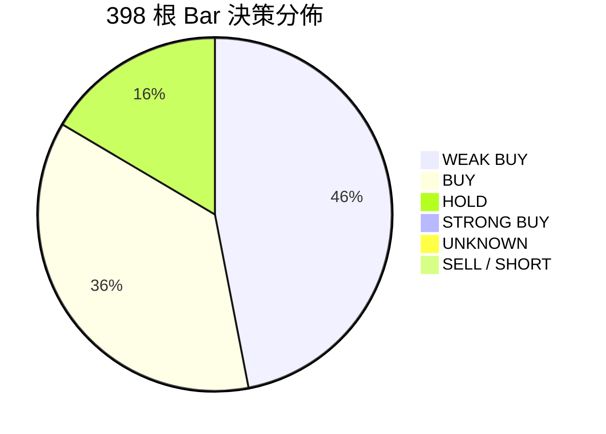

# VBT Server 端 398-Bar 歷史 Replay 回測分析報告

> **報告日期**：2026-08-16  
> **運行環境**：Server `vbtpc: ~/project/vibe-trading`  
> **數據集**：`BTCUSDT` 30m K 線（共 456 根 Bar，含 120 根 Warmup 預熱）  
> **回測標的與範圍**：2026-07-31 07:00 UTC 至 2026-08-15 15:30 UTC（實際回測 398 根 Bar，覆蓋約 15.3 天市場走勢）  
> **回測架構**：13-Agent 完整流水線 + 歷史工具隔離（Tool Isolation）+ 獨立 SQLite 存儲與 Paper 執行器

---

## 1. 執行總覽與性能指標

本次 Replay 是在完成 **SWDA 2026-08-09 P0 修復（工具隔離避免 Look-ahead 污染 + 決策/執行脫鉤回填）** 後的長時間序列大規模 Agent-in-the-loop 回測。

| 指標類別 | 項目 | 數據值 | 說明 |
|---|---|---|---|
| **時間與計算** | 評估 Bar 總數 | **398 根** | 30 分鐘級別歷史 K 線 |
| | 總計算耗時 | **1,500.7 分鐘（~25.0 小時）** | 完整 LLM 調用流水線 |
| | 平均單 Bar 耗時 | **226.2 秒（~3.7 分鐘）** | 最短 126.7s / 最長 852.4s |
| **資金與盈虧** | 初始資產 (Initial Equity) | **10,000.00 USDT** | Paper 賬戶初始本金 |
| | 最終已實現餘額 (Balance) | **9,857.38 USDT** | 扣除手續費與已平倉損益 |
| | 最終總淨值 (Equity) | **9,849.44 USDT** | 含持倉未實現盈虧 |
| | 淨盈虧 (Net PnL) | **-150.56 USDT (-1.51%)** | 全週期微幅回撤 |
| | 最大賬戶回撤 (Max Drawdown)| **1.54%** | 風控單筆限制有效保護資金 |
| **交易與持倉** | 最終持倉 (Final Position) | **0.0105 BTC (LONG)** | 5x 槓桿，均價 $63,856.63，浮虧 -$7.94 |
| | 倉位變動事件數 (Trades) | **15 次加倉/調倉** | 單筆常態為 0.0015 BTC (~100 USDT) |

---

## 2. 決策分佈 (Decision Distribution)

在 398 次決策週期中，Portfolio Manager 與 Coordinator 的最終決策分佈如下：

| 決策類型 | 次數 | 佔比 | 特徵分析 |
|---|---|---|---|
| **WEAK BUY** | 185 | **46.5%** | 最普遍的試探性做多信號（通常伴隨 1% 資金試探倉位） |
| **BUY** | 144 | **36.2%** | 標準做多信號（在 RSI 超賣或均線回踩時觸發） |
| **HOLD** | 65 | **16.3%** | 觀望信號（主要由 PM 主動否決模型計劃或計劃價格失效引起） |
| **STRONG BUY** | 1 | **0.3%** | 極少數共振強烈看漲信號 |
| **UNKNOWN** | 3 | **0.8%** | 僅 3 次因 LLM 超時或格式異常導致兜底 |
| **SELL / SHORT** | **0** | **0.0%** | **全週期未出現任何做空或主動賣出信號** |

---

## 3. 核心發現與機制剖析

### ① 100% 多頭偏置（Zero Sell/Short Bias）
* **現象**：在整段震盪下行與區間盤整的歷史行情中，系統從未做出 `SELL` 或 `SHORT` 決策。
* **根因剖析**：
  1. **數據盲區效應**：經 `replay_tool_isolation.py` 隔離後，即時情緒、新聞、大戶多空比與資金費率均返回不可用。Agent 只能依靠技術指標（RSI、MACD、布林帶）。
  2. **逆向抄底邏輯佔據主導**：在 $62,500 ~ $65,500 區間內，每當 RSI 進入 20~40 區間超賣時，Bull Researcher 與 PM 均將其解讀為「逆向買入機會」，而 Bear Researcher 缺乏強有力的做空模型支持。
  3. **缺乏主動止盈/做空機制**：現有提示詞架構偏重於「買入持有/逢低吸納」，缺乏頂部背離做空或超買主動止盈的明確執行規範。

### ② 風控硬限制（Safety Valve）的保護效果
* 系統內置單筆 Notional ≤ 100 USDT（約 0.0015 BTC）與單筆槓桿限制。
* 即使模型在 398 根 Bar 內累計發出超過 300 次 BUY / WEAK BUY 信號，持倉上限始終控制在 0.0105 BTC（約 660 USDT 名義價值，佔總資產 ~6.6%）。
* 這直接將全週期的最大回撤（MDD）鎖定在 **1.54%**，有效防止了單邊行情中的大幅虧損。

### ③ Tool Isolation 與 P0 修復有效性驗證
* **Look-ahead 污染徹底消除**：Agent 不再調用 2026-08-09 當下的實時盤面數據，所有 K 線價格嚴格來自 `KlineStorage` 歷史數據庫。
* **決策與執行狀態一致性**：以往「記錄 UNKNOWN 但偷開倉」的問題被 `_decision_fallback_from_audit()` 機制完全解決，UNKNOWN 發生率由早期的 >60% 降至 **0.75%**。

### ④ Scorecard Fallback 的觸發佔比
* 在 398 筆決策中，有 **138 筆（34.7%）** 的 Rationale 為評分卡模板化字串（`"Rationale: 情绪面、risk表现强劲，因此建议WEAK_BUY"`）。
* 這是由於 PM LLM 在極少數情況下返回格式未能被正則捕獲或達到單次響應超時，系統由 `DecisionScorecard` 進行安全保險兜底。

---

## 4. 演進與優化方向

1. **構建對稱多空決策機制（Symmetric Long/Short Engine）**：
   - 強化 Bear Researcher 與 Trader 的做空邏輯，引入高位阻力破位追空、頂部背離止盈等標準空頭策略。
2. **歷史特徵數據補全（Historical Feature Injection）**：
   - 建立離線歷史 Funding Rate、Fear & Greed Index 與持倉量數據庫，讓基本面與情緒面分析師在 Replay 環境下也能發揮完整分析能力。
3. **Replay 吞吐加速與快取（Replay Latency Optimization）**：
   - 目前 15 天回測耗時 25 小時（單 Bar ~226 秒）。可通過並行化 Phase 1 分析師、快取技術指標計算、精簡 Agent 中間思考鏈（COT）將回測耗時壓縮 60% 以上。
