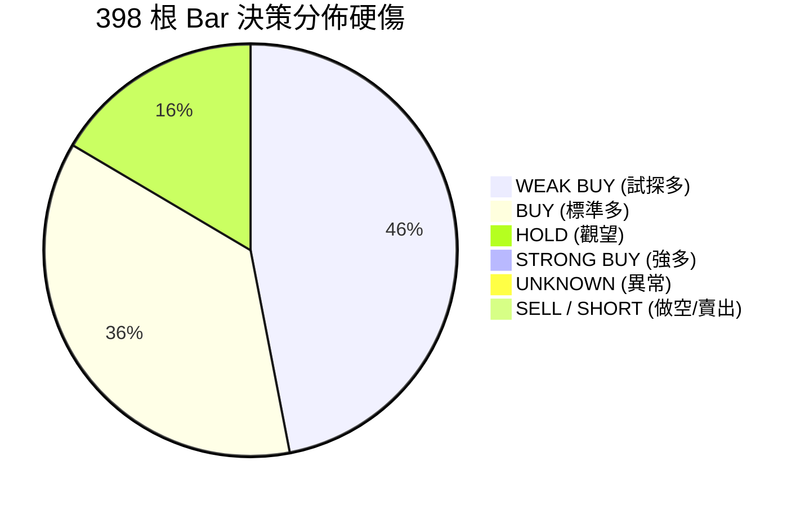
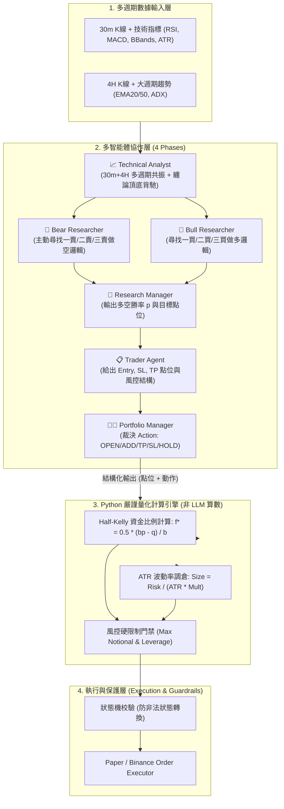

# VBT 交易架構與策略改善計劃書 (Architecture & Strategy Improvement Plan)

> **版本**：v1.0  
> **建立日期**：2026-08-16  
> **關聯專案**：`vibe-trading` / `vibe-trading-encyc`  
> **理論基礎庫**：`Brian_Notes/wiki/Theory`（凱利公式、倉位管理、纏論動力學、市場體制、風險地圖）  
> **回測依據**：398-Bar（2026-07-31 至 2026-08-15）BTCUSDT 30m Server Replay 分析

---

## 1. 執行摘要與問題診斷

在對伺服器端完成的 398 根 Bar（約 15.3 天）歷史 Replay 進行深度審查後，系統暴露出以下五大結構性瓶頸：



1. **100% 多頭偏置（零做空）**：全週期 398 根 Bar 出現 **0 次 SELL / SHORT**，在震盪與下跌行情中不斷抄底，失去雙向獲利與套保能力。
2. **缺乏主動倉位生命週期管理**：決策語義只有現貨思維的 `BUY / HOLD`，缺乏合約專屬的「部分止盈（TP）」、「移動止損（Trailing Stop）」與「平倉離場（Close）」，導致浮盈大幅回吐。
3. **34.7% 的評分卡兜底率**：在 398 筆決策中有 138 筆因格式解析或單次響應邊界觸發靜態規則兜底，削弱了多 Agent 實質思考鏈。
4. **衍生品特徵數據盲區**：Replay 工具隔離使資金費率、持倉量（OI）與清算地圖返回 `N/A`，Agent 僅依賴 30m 單一週期指標，陷入「局部超賣逆勢接飛刀」的失效模式。
5. **每 Bar 耗時過長（~226 秒）**：13-Agent 全流水線逐 Bar 呼叫，導致 15 天回測需耗費 25 小時。

---

## 2. 理論指導體系 (Theoretical Foundation)

本改善計劃深度整合 `Brian_Notes/wiki/Theory` 的量化理論：

| 理論模組 | 核心公式 / 概念 | 對應 VBT 改造模組 |
|---|---|---|
| **凱利公式與倉位管理**<br/>(`Theory/01_Kelly_Criterion.md`<br/>`Theory/02_Position_Sizing.md`) | $$f^* = \frac{bp - q}{b}, \quad f_{\text{half}} = 0.5 \cdot f^*$$<br/>$$\text{Size } (N) = \frac{\text{Risk Capital}}{\text{ATR} \times \text{Multiplier}}$$ | **Trader & Risk 模組**：<br/>由 Python 數學引擎根據 AI 點位精確計算 Half-Kelly 與 ATR 波動率倉位，取代固定 100 USDT 呆板下單。 |
| **東方纏論技術體系**<br/>(`Theory/Chan_Theory/`) | 頂底分型、MACD 面積背馳、<br/>**一賣（轉折空）、二賣（確認空）、三賣（破位空）** | **Bear Researcher & Technical Analyst**：<br/>注入頂部結構與背馳做空邏輯，徹底解決 0% 做空缺陷。 |
| **多週期體制偵測**<br/>(`Theory/03_Technical_Indicators.md`) | ADX / ATR / 均線排列<br/>趨勢市 (Trend) vs 震盪市 (Mean-Reversion) | **Technical Analyst 多週期輸入**：<br/>在 30m Prompt 中同時載入 4H 技術指標，進行大週期趨勢共振過濾。 |
| **風險地圖與失效模式**<br/>(`Theory/04_Risk_Map.md`) | Failure Mode: "Accumulated small losses in trend"<br/>逆勢均值回歸小損累積 | **風險熔斷與動態止損**：<br/>設定逆勢虧損連續累積熔斷與移動鎖利保護。 |

---

## 3. 核心改善架構與工程落地設計



---

### 模組 1：決策語義與動作模型重構（Position Action Model）

#### ① 擴充合約專屬動作枚舉
將原有現貨式的 `BUY / SELL / HOLD` 重構為合約全生命週期動作集：
```python
from enum import Enum

class PositionAction(str, Enum):
    OPEN_LONG = "OPEN_LONG"        # 新開多單
    ADD_LONG = "ADD_LONG"          # 順勢加多
    OPEN_SHORT = "OPEN_SHORT"      # 新開空單 (解決零做空)
    ADD_SHORT = "ADD_SHORT"        # 順勢加空
    TP_PARTIAL = "TP_PARTIAL"      # 主動部分止盈 (如平倉 50%)
    CLOSE_ALL = "CLOSE_ALL"        # 全平離場
    TRAIL_STOP = "TRAIL_STOP"      # 移動止損 (鎖定利潤)
    HOLD = "HOLD"                  # 觀望維持現狀
```

#### ② AI 能否正確處理的工程防護架構
針對 AI 是否能穩定執行多動作的疑慮，設計三層防護：
1. **狀態動態注入（State Injection）**：在 PM 的 Prompt 中顯式注入當前持倉狀態與「當前合法可選動作」：
   * *無持倉時*：合法可選動作僅為 `[OPEN_LONG, OPEN_SHORT, HOLD]`。
   * *持有多單時*：合法可選動作僅為 `[ADD_LONG, TP_PARTIAL, CLOSE_ALL, TRAIL_STOP, HOLD]`。
2. **結構化輸出（Pydantic Structured Outputs）**：直接透過 Tool Calling 或 JSON Schema 定義輸出，不再使用 Markdown 正則抓取。
3. **執行層防禦（Defensive Guardrails）**：若 LLM 輸出與持倉狀態衝突（如無持倉卻輸出 `TP_PARTIAL`），執行層自動 Fall-open 退化為 `HOLD` 並記錄警告日誌。

---

### 模組 2：AI 定性決策與 Python 定量計算分離

為杜絕 LLM 數學計算幻覺，採取**「AI 負責定性與結構點位，Python 引擎負責定量算式」**的解耦架構：

```
┌─────────────────────────────────────────────────────────────┐
│ 1. AI Agent 專長 (定性 & 價格結構)                          │
│    • 判定交易動作: OPEN_LONG / OPEN_SHORT                   │
│    • 尋找關鍵點位: Entry Price, Stop Loss (SL), Take Profit (TP) │
│    • 評估信號質量: Confidence (0.0 ~ 1.0)                   │
└──────────────────────────────┬──────────────────────────────┘
                               │
                               ▼
┌─────────────────────────────────────────────────────────────┐
│ 2. Python 量化數學引擎 (嚴謹執行，零幻覺)                   │
│    • 計算真實盈虧比: b = |TP - Entry| / |Entry - SL|         │
│    • 估算勝率: p = 校準係數 * Confidence                    │
│    • 執行分數凱利: f* = 0.5 * (bp - q) / b (Half-Kelly)      │
│    • 結合 30m ATR: Position_Size = (Total_Equity * f*) / ATR │
│    • 強制套用風控硬門禁: min(Position_Size, Max_Single_Cap)   │
└─────────────────────────────────────────────────────────────┘
```

---

### 模組 3：多週期融合技術分析（30m + 4H 雙週期）

遵循用戶確認的方案：**不增加剛性大週期門禁，由 Technical Analyst 在單一 30m Prompt 中同時載入 4H 技術指標**。

* **Prompt 數據注入結構**：
  ```markdown
  ## 📊 當前市場多週期數據 (BTCUSDT)
  
  ### 1. 執行週期 (30m Timeframe)
  - 價格：$63,500 | 30m RSI: 32.5 (超賣區間) | MACD: -45.2 (柱狀收斂)
  - 布林帶: [63,100, 64,200] | 30m ATR: $280
  
  ### 2. 趨勢大週期 (4H Timeframe)
  - 4H 均線結構: EMA20 ($64,100) < EMA50 ($64,800) -> [空頭排列 / 處於下行趨勢]
  - 4H ADX: 28.6 (趨勢動能偏強)
  - 4H 關鍵支撐/阻力: 支撐 $62,500 / 阻力 $64,200
  
  ### ⚠️ 多週期共振指引
  - 若 4H 為空頭排列，30m 超賣僅能視為「短線超跌反彈」，禁止重倉做多；
  - 優先尋找 30m 反彈受阻於 4H EMA20 阻力位的「順大勢開空（一賣/二賣）」機會。
  ```

---

### 模組 4：注入纏論頂底背馳與三類賣點（Bear Researcher 改造）

在 `backend/src/vibe_trading/config/prompts.py` 中，將 `BEAR_RESEARCHER_PROMPT` 由原本被動的「風險質疑者」升級為**「主動空頭獵手」**：

1. **第一類賣點（一賣 - 趨勢背馳點）**：
   * 價格向上突破新高，但 30m MACD 紅柱面積縮小且黃白線未創新高 $\rightarrow$ 觸發頂背馳小倉試探開空。
2. **第二類賣點（二賣 - 次級確認點）**：
   * 頂背馳後快速回落，隨後次級別反彈未能突破前高，形成頂部分型 $\rightarrow$ 觸發標準順勢開空。
3. **第三類賣點（三賣 - 中樞破位點）**：
   * 跌破 30m 盤整中樞下軌，反抽未能重回中樞內部 $\rightarrow$ 觸發主跌浪突破加空。

---

### 模組 5：結構化輸出與零兜底（Structured Outputs Engine）

* **改造目標**：將 `DecisionScorecard` 兜底率從 **34.7% 降至 0%**。
* **做法**：
  * 使用 Pydantic 嚴格定義 `PortfolioDecisionOutput` 結構體。
  * 呼叫 LLM 時使用 `json_object` 或 `tools/call` 原生輸出，徹底移除 Regex 字符匹配。

```python
class PortfolioDecisionOutput(BaseModel):
    action: PositionAction
    confidence: float = Field(ge=0.0, le=1.0)
    target_entry_price: float
    stop_loss_price: float
    take_profit_price: float
    rationale_summary: str
    risk_assessment_notes: str
```

---

### 模組 6：歷史衍生品特徵管線規劃（Future Data Pipeline）

針對目前資料庫缺乏歷史資金費率與持倉量（OI）的現狀，規劃兩階段數據升級：
* **階段 A（當前）**：以 30m + 4H 雙週期 K 線、ATR、MACD、布林帶與纏論結構為核心，快速驗證雙向交易與 Kelly 倉位成效。
* **階段 B（進階）**：開發 Binance 歷史衍生品爬蟲，回填歷史 8h Funding Rate 與 30m Open Interest 至 SQLite，解除 Fundamental/Sentiment 分析師的數據盲區。

---

## 4. 實施階段與驗證路線圖 (Implementation Roadmap)

| 階段 | 任務項目 | 預期交付成果 | 驗證標準 |
|---|---|---|---|
| **Phase 1<br/>(P0 核心)** | 1. 動作枚舉擴充 (`PositionAction`)<br/>2. Bear Researcher & Tech Analyst Prompt 改造（纏論賣點）<br/>3. PM Structured Output 結構化輸出 | `prompts.py`<br/>`trading_tools.py`<br/>`trading_coordinator.py` | 1-bar Replay 能正常產出 `OPEN_SHORT` 決策，Scorecard 兜底率降至 0%。 |
| **Phase 2<br/>(P0 倉位)** | 1. 實作 Python Half-Kelly 與 ATR 調倉公式<br/>2. 結合浮盈主動部分止盈（`TP_PARTIAL`）與保本移動止損（`TRAIL_STOP`） | `position_sizing.py`<br/>`order_executor.py` | 模擬不同波動率與勝率，下單數量自適應縮放，獲利單可動態鎖利。 |
| **Phase 3<br/>(P1 多週期)**| 1. Technical Analyst 注入 4H 大週期指標數據<br/>2. 雙週期 Prompt 模板整合 | `technical_analyst.py`<br/>`kline_storage.py` | 4H 空頭排列時，30m 能精準識別反彈阻力位發起做空。 |
| **Phase 4<br/>(驗證與對比)**| 1. 在 Server 執行 398-Bar 完整二期 Replay 回測<br/>2. 與一期回測數據（-1.51% PnL, 0% Short）進行橫向 A/B 評估 | `replay_v2_report.md` | 1. 做空決策佔比達到 25%~45%<br/>2. 總體 PnL 轉正且最大回撤控制在 3% 以內。 |

---

## 5. 檔案存放與知識庫索引

* **計劃書本體**：`docs/research/vbt-architecture-strategy-improvement-plan.md`
* **VitePress 導航**：已整合至「研究與競品分析」專欄。
