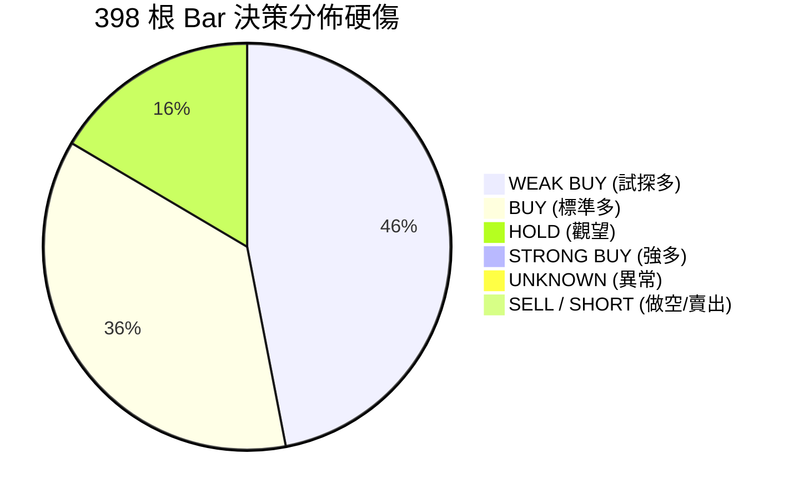
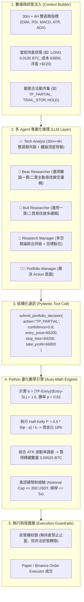

# VBT 交易架構與策略改善計劃書 (Architecture & Strategy Improvement Plan)

> **版本**：v1.1  
> **更新日期**：2026-08-16  
> **關聯專案**：`vibe-trading` / `vibe-trading-encyc`  
> **理論基礎庫**：`Brian_Notes/wiki/Theory`（凱利公式、倉位管理、纏論動力學、市場體制、風險地圖）  
> **回測依據**：398-Bar（2026-07-31 至 2026-08-15）BTCUSDT 30m Server Replay 分析

---

## 1. 執行摘要與問題診斷

在對伺服器端完成的 398 根 Bar（約 15.3 天）歷史 Replay 進行深度審查後，系統暴露出以下五大結構性瓶頸：



1. **100% 多頭偏置（零做空）**：全週期 398 根 Bar 出現 **0 次 SELL / SHORT**，在震盪與下跌行情中不斷抄底，失去雙向獲利與套保能力。
2. **缺乏主動倉位生命週期管理**：決策語義只有現貨思維的 `BUY / HOLD`，缺乏合約專屬的「部分止盈（TP）」、「移動止損（Trailing Stop）」與「平倉離場（Close）」，導致浮盈大幅回吐。
3. **34.7% 的評分卡兜底率**：在 398 筆決策中有 138 筆因格式解析或單次響應邊界觸發靜態規則兜底，削弱了多 Agent 實質思考鏈。
4. **衍生品特徵數據盲區**：Replay 工具隔離使資金費率、持倉量（OI）與清算地圖返回 `N/A`，Agent 僅依賴 30m 單一週期指標，陷入「局部超賣逆勢接飛刀」的失效模式。
5. **每 Bar 耗時過長（~226 秒）**：13-Agent 全流水線逐 Bar 呼叫，導致 15 天回測需耗費 25 小時。

---

## 2. 理論指導體系 (Theoretical Foundation)

本改善計劃深度整合 `Brian_Notes/wiki/Theory` 的量化理論：

| 理論模組 | 核心公式 / 概念 | 對應 VBT 改造模組 |
|---|---|---|
| **凱利公式與倉位管理**<br/>(`Theory/01_Kelly_Criterion.md`<br/>`Theory/02_Position_Sizing.md`) | $$f^* = \frac{bp - q}{b}, \quad f_{\text{half}} = 0.5 \cdot f^*$$<br/>$$\text{Size } (N) = \frac{\text{Risk Capital}}{\text{ATR} \times \text{Multiplier}}$$ | **Trader & Risk 模組**：<br/>由 Python 數學引擎根據 AI 點位精確計算 Half-Kelly 與 ATR 波動率倉位，取代固定 100 USDT 呆板下單。 |
| **東方纏論技術體系**<br/>(`Theory/Chan_Theory/`) | 頂底分型、MACD 面積背馳、<br/>**一賣（轉折空）、二賣（確認空）、三賣（破位空）** | **Bear Researcher & Technical Analyst**：<br/>注入頂部結構與背馳做空邏輯，徹底解決 0% 做空缺陷。 |
| **多週期體制偵測**<br/>(`Theory/03_Technical_Indicators.md`) | ADX / ATR / 均線排列<br/>趨勢市 (Trend) vs 震盪市 (Mean-Reversion) | **Technical Analyst 多週期輸入**：<br/>在 30m Prompt 中同時載入 4H 技術指標，進行大週期趨勢共振過濾。 |
| **風險地圖與失效模式**<br/>(`Theory/04_Risk_Map.md`) | Failure Mode: "Accumulated small losses in trend"<br/>逆勢均值回歸小損累積 | **風險熔斷與動態止損**：<br/>設定逆勢虧損連續累積熔斷與移動鎖利保護。 |

---

## 3. AI Agent 混合協同架構 (Hybrid AI + Quantitative Engine)

系統並非單純讓 AI 盲目全包，亦非退化為純代碼規則，而是採用**「AI 定性認知與結構點位 + Python 嚴謹量化與邊界防禦」**的混合架構：



---

## 4. 具體代碼修改方向與檔案變更指南 (File-by-File Blueprint)

以下為工程實施的六大核心檔案修改方向與具體改動點：

### ① `backend/src/vibe_trading/config/prompts.py`
* **修改方向**：提示詞專業化改造，注入纏論賣點與雙週期視角。
* **改動細節**：
  1. **`BEAR_RESEARCHER_PROMPT`**：
     * 將角色由被動的「風險質疑者」升級為「主動空頭獵手」。
     * 注入纏論三類賣點判斷準則（一賣：頂背馳；二賣：反彈不過前高；三賣：跌破中樞回抽受阻）。
  2. **`TECHNICAL_ANALYST_PROMPT`**：
     * 增加 30m 執行週期與 4H 趨勢週期的多週期共振分析指南。
     * 要求標記 MACD 面積背馳（紅柱面積縮小）與 RSI 頂底背馳。
  3. **`PORTFOLIO_MANAGER_PROMPT`**：
     * 定義全生命週期動作意圖（`OPEN_LONG`, `OPEN_SHORT`, `ADD_LONG`, `ADD_SHORT`, `TP_PARTIAL`, `CLOSE_ALL`, `TRAIL_STOP`, `HOLD`）。
     * 增加「持倉狀態感知」規範：依據 Context 中的持倉盈虧做出止盈或平倉決定。

---

### ② `backend/src/vibe_trading/agents/decision/trading_tools.py`
* **修改方向**：引入 Pydantic 結構化 Schema，淘汰脆弱的 Regex 文本解析。
* **改動細節**：
  1. 定義 `PositionAction` 枚舉：
     ```python
     class PositionAction(str, Enum):
         OPEN_LONG = "OPEN_LONG"
         ADD_LONG = "ADD_LONG"
         OPEN_SHORT = "OPEN_SHORT"
         ADD_SHORT = "ADD_SHORT"
         TP_PARTIAL = "TP_PARTIAL"
         CLOSE_ALL = "CLOSE_ALL"
         TRAIL_STOP = "TRAIL_STOP"
         HOLD = "HOLD"
     ```
  2. 定義結構化輸出 Model：
     ```python
     class PortfolioDecisionOutput(BaseModel):
         action: PositionAction = Field(description="交易動作意圖")
         confidence: float = Field(ge=0.0, le=1.0, description="決策信心分數")
         suggested_entry_price: float = Field(description="建議進場或基準價格")
         suggested_stop_loss: float = Field(description="結構止損價")
         suggested_take_profit: float = Field(description="第一止盈目標價")
         core_rationale: str = Field(description="核心邏輯摘要")
     ```
  3. 新增 Tool：`submit_portfolio_decision` 供 PM 在決策階段直接以 Tool Calling 調用。

---

### ③ `backend/src/vibe_trading/execution/position_sizing.py`（全新模組）
* **修改方向**：建立純 Python 嚴謹量化數學引擎（無 LLM 算數）。
* **改動細節**：
  1. **Half-Kelly 計算器**：
     ```python
     def calculate_half_kelly(win_rate: float, reward_risk_ratio: float, fraction: float = 0.5) -> float:
         if reward_risk_ratio <= 0:
             return 0.0
         q = 1.0 - win_rate
         f_star = (reward_risk_ratio * win_rate - q) / reward_risk_ratio
         return max(0.0, f_star * fraction)
     ```
  2. **ATR 波動率倉位計算器**：
     ```python
     def calculate_atr_position_size(
         equity: float,
         kelly_fraction: float,
         atr: float,
         entry_price: float,
         risk_multiplier: float = 1.5,
         max_notional: float = 300.0,
     ) -> float:
         if atr <= 0 or entry_price <= 0:
             return 0.0
         dollar_risk = equity * kelly_fraction
         qty = dollar_risk / (atr * risk_multiplier)
         # 風控硬限制截斷
         max_qty = max_notional / entry_price
         return min(qty, max_qty)
     ```

---

### ④ `backend/src/vibe_trading/coordinator/trading_coordinator.py`
* **修改方向**：狀態動態注入、4H 數據加載、量化計算銜接與狀態機防禦。
* **改動細節**：
  1. **多週期數據載入**：在 `_prepare_context()` 中透過 `storage.query_klines(symbol, "4h", limit=50)` 計算 4H EMA20/50 與 4H ADX，一併打包給 Technical Analyst。
  2. **持倉狀態注入**：動態根據當前帳戶持倉生成 `valid_actions` 提示字串，注入 PM 的 Context。
  3. **PM 決策執行對接**：
     * 解析 `PortfolioDecisionOutput`。
     * 調用 `position_sizing.py` 自動計算精確下單數量 `final_qty`。
     * 呼叫 `order_executor` 執行開倉、加倉、分批止盈（50% 平倉）或更新移動止損。

---

### ⑤ `backend/src/vibe_trading/execution/order_executor.py`
* **修改方向**：擴充 Paper / Live Executor 對合約全動作的支援。
* **改動細節**：
  1. **做空支援**：`OPEN_SHORT` 建立 `position_side="SHORT"` 部位，扣除保證金，以空頭方式計算未實現損益（$P_{\text{entry}} - P_{\text{mark}}$）。
  2. **分批止盈（`TP_PARTIAL`）**：按比例（如 50%）減少 `position_amount`，按市價結算對應比例的 `realized_pnl` 並釋放保證金。
  3. **全平離場（`CLOSE_ALL`）**：清空該方向所有持倉，結算全額已實現盈虧。
  4. **移動止損（`TRAIL_STOP`）**：在 Position 模型中更新 `trailing_stop_price`，於行情反向觸及時由 Executor 自動平倉。

---

### ⑥ `replay/replay_leg_a.py` & `replay/replay_tool_isolation.py`
* **修改方向**：適配新架構與 4H 多週期數據隔離。
* **改動細節**：
  1. **4H 歷史隔離支援**：在 `replay_tool_isolation.py` 讓 `_replay_get_kline_data` 支援 4H 週期，從 Replay Storage 計算 4H 歷史數據，保證無未來數據洩漏。
  2. **決策日誌豐富化**：在 `leg_a_decisions.jsonl` 中新增記錄 `action`（如 `OPEN_SHORT`, `TP_PARTIAL`）、`kelly_f`（凱利比率）、`b_ratio`（盈虧比），便於後續精確回測分析。

---

## 5. 實施路線圖與驗證計劃 (Implementation & Verification)

```
[Phase 1 (P0)] 核心動作與空頭邏輯改造
  ├── 1. prompts.py: 注入纏論三類賣點 (Bear) 與雙週期分析 (Tech)
  ├── 2. trading_tools.py: 定義 PositionAction 枚舉與 Pydantic Output Schema
  └── 3. trading_coordinator.py: 狀態注入 + Structured Output 對接
  └── 驗證：跑 1-bar Replay，確認能產出 OPEN_SHORT 且 0% Scorecard 兜底。

[Phase 2 (P0)] 量化數學與倉位引擎
  ├── 1. position_sizing.py: 實作 Half-Kelly 與 ATR 調倉
  ├── 2. order_executor.py: 支援 SHORT 部位、TP_PARTIAL 部分止盈、TRAIL_STOP
  └── 驗證：單元測試不同勝率/波動率下的下單規模縮放，驗證浮盈單能主動平倉 50%。

[Phase 3 (P1)] 4H 多週期技術分析整合
  ├── 1. trading_coordinator.py: 注入 4H EMA/ADX 數據
  ├── 2. replay_tool_isolation.py: 支援 4H Replay 歷史查詢
  └── 驗證：在 4H 下行趨勢中，30m 超賣不再開多，反彈阻力位精準開空。

[Phase 4 (驗證)] 398-Bar 二期完整 Replay 回測對比
  ├── 運行環境: Server vbtpc 執行 398 根 Bar 回測
  └── 驗證指標:
      • 做空決策 (SHORT) 佔比達 25% ~ 45%
      • 淨盈虧 (PnL) 顯著轉正 (目標 +3% ~ +8%)
      • 最大回撤 (MDD) 控制在 3.0% 以內
      • Scorecard 兜底率降至 0%
```

---

## 6. 檔案存放與知識庫索引

* **計劃書本體**：`docs/research/vbt-architecture-strategy-improvement-plan.md`
* **知識庫索引**：已整合至 VitePress「研究與競品分析」專欄目錄。
