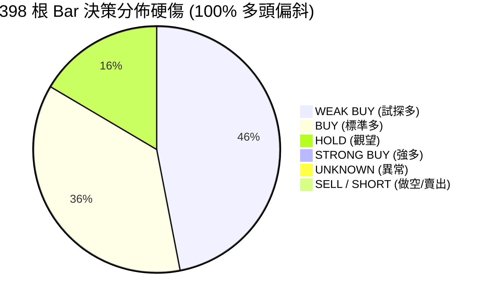
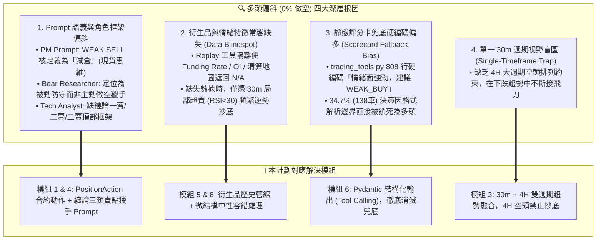
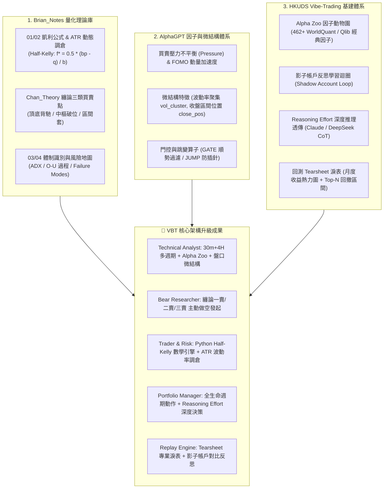
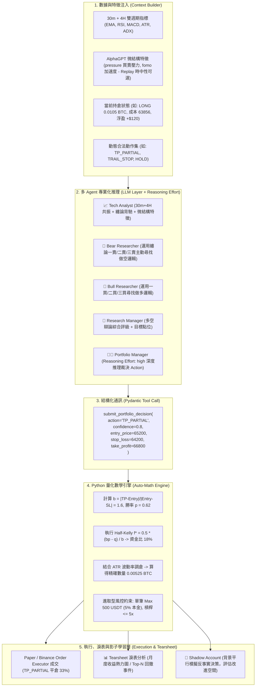
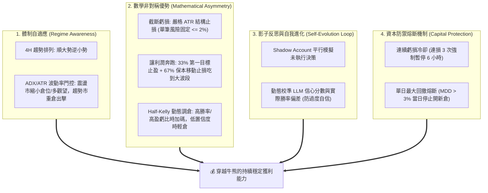
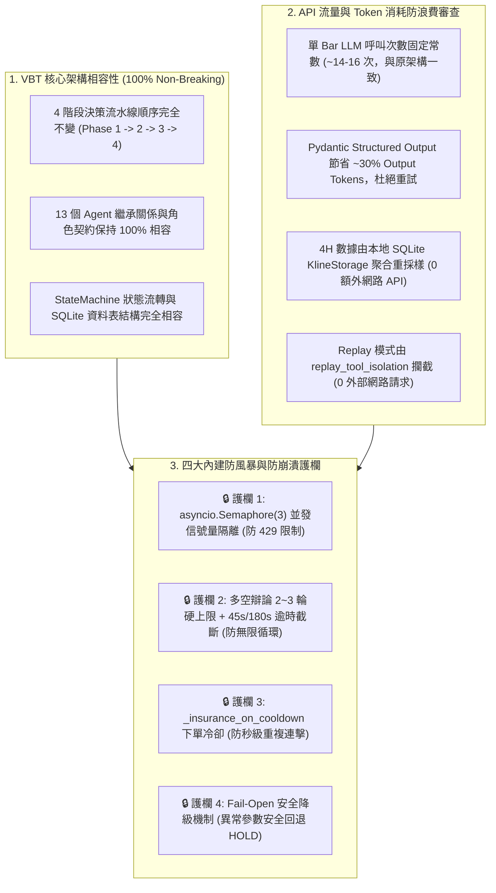

# VBT 交易架構與策略改善計劃書 (Architecture & Strategy Improvement Plan)

> **版本**：v1.7 (持續獲利機制、防過度複雜化剪枝與四階驗證定案版)  
> **更新日期**：2026-08-17  
> **關聯專案**：`vibe-trading` / `vibe-trading-encyc`  
> **理論與借鏡庫**：
> - `Brian_Notes/wiki/Theory`（凱利公式、倉位管理、纏論動力學、市場體制、風險地圖）
> - `AlphaGPT`（微結構因子挖掘、買賣壓力不平衡 `pressure`、FOMO 加速度、StackVM 算子）
> - `HKUDS/Vibe-Trading`（Alpha Zoo 462+ 經典因子庫、影子帳戶 Shadow Account、Reasoning Effort 透傳、Tearsheet 淚表）
> **回測依據**：398-Bar（2026-07-31 至 2026-08-15）BTCUSDT 30m Server Replay 分析

---

## 1. 執行摘要與多頭偏斜四大深層根因剖析

在對伺服器端完成的 398 根 Bar（約 15.3 天）歷史 Replay 進行深度審查後，系統暴露出 **0 次做空（100% 多頭偏置）** 與 **34.7% 評分卡兜底** 的嚴重問題：



經過全鏈路代碼審查，我們確認**多頭偏斜（Long Bias）是由以下四大深層根因共同作用的結果**，本改善計劃已全數精準覆蓋：



---

## 2. 理論指導與跨專案借鏡體系 (Theoretical & Cross-Repo Foundation)

本改善計劃深度整合三大知識與工程體系：



---

## 3. AI Agent 混合協同架構 (Hybrid Neuro-Symbolic Engine)

系統採取**「AI 負責定性認知與結構點位 + Python 負責嚴謹量化與邊界防禦」**的解耦架構：



---

## 4. 八大核心模組詳細設計 (Core Architectural Modules)

### 模組 1：合約全生命週期動作模型（Position Action Model）
解決原本現貨式單向思維與 PM Prompt 誤將 `WEAK SELL` 標記為減倉的缺陷：
```python
from enum import Enum

class PositionAction(str, Enum):
    OPEN_LONG = "OPEN_LONG"        # 新開多單
    ADD_LONG = "ADD_LONG"          # 順勢加多
    OPEN_SHORT = "OPEN_SHORT"      # 新開空單 (解決 0% 做空)
    ADD_SHORT = "ADD_SHORT"        # 順勢加空
    TP_PARTIAL = "TP_PARTIAL"      # 主動部分止盈 (分批平倉 33%)
    CLOSE_ALL = "CLOSE_ALL"        # 全平離場
    TRAIL_STOP = "TRAIL_STOP"      # 移動止損 (鎖定利潤)
    HOLD = "HOLD"                  # 觀望維持現狀
```

---

### 模組 2：AI 定性決策與 Python 定量計算分離（Kelly & ATR Engine）
* **AI Agent 職責**：給出結構點位（Entry, SL, TP）與信心度（Confidence 0.0~1.0）。
* **Python 引擎職責（進取型風控參數定案）**：
  ```python
  # 1. 嚴謹計算盈虧比
  b = abs(take_profit - entry_price) / max(abs(entry_price - stop_loss), 1e-5)
  # 2. 勝率校準與 Half-Kelly
  p = 0.5 + (confidence - 0.5) * 0.4
  kelly_fraction = max(0.0, (b * p - (1.0 - p)) / b) * 0.5
  # 3. ATR 波動率調倉
  dollar_risk = account_equity * kelly_fraction
  position_size = dollar_risk / max(atr * 1.5, 1.0)
  # 4. 風控硬限制截斷 (進取型: 單筆上限 500 USDT，佔 10,000 USDT 本金之 5%)
  max_single_notional = 500.0
  final_qty = min(position_size, max_single_notional / entry_price)
  ```

---

### 模組 3：30m + 4H 雙週期技術融合（解決根因 4：單一週期盲區）
在單一 30m Prompt 中同時載入 4H 大週期趨勢數據，提供宏觀視野（不設剛性硬門禁）：
```markdown
## 📊 市場多週期數據
### 1. 執行週期 (30m Timeframe)
- 價格: $63,500 | RSI: 32.5 (超賣) | MACD: -45.2 | ATR: $280
### 2. 趨勢週期 (4H Timeframe)
- 均線結構: EMA20 ($64,100) < EMA50 ($64,800) -> [下行趨勢 / 空頭排列]
- 4H ADX: 28.6 (趨勢動能強勁)
### ⚠️ 交易指引: 4H 為空頭排列時，30m 超賣嚴禁重倉抄底，優先尋找反彈阻力位開空。
```

---

### 模組 4：纏論三類賣點注入（解決根因 1：Prompt 缺空頭框架）
將 `BEAR_RESEARCHER_PROMPT` 由原本被動防禦升級為**主動空頭獵手**：
1. **一賣（頂背馳）**：價格創新高但 30m MACD 紅柱面積縮小 $\rightarrow$ 試探開空。
2. **二賣（次級確認）**：頂背馳後反彈不破前高，形成頂部分型 $\rightarrow$ 標準開空。
3. **三賣（中樞破位）**：跌破 30m 盤整中樞回抽不進中樞 $\rightarrow$ 主跌浪突破追空。

---

### 模組 5：AlphaGPT 盤口微結構特徵（解決根因 2：數據缺失中性容錯）
在 `market_data_tools.py` 實作微結構特徵計算，提供即時盤口 Alpha：
* **Replay 容錯處理**：Replay 歷史數據缺少 Taker 成交量時自動回傳 0.0（中性可選），不誤判為多頭信號；Live 模式無縫啟用真實計算。
```python
def calculate_microstructure_features(klines_df):
    if 'taker_buy_base' not in klines_df.columns or klines_df['taker_buy_base'].sum() == 0:
        return {"pressure": 0.0, "fomo": 0.0, "close_pos": 0.5}
    pressure = (klines_df['taker_buy_base'] - (klines_df['volume'] - klines_df['taker_buy_base'])) / klines_df['volume']
    fomo = klines_df['volume'].diff() / klines_df['volume'].rolling(5).mean()
    close_pos = (klines_df['close'] - klines_df['low']) / (klines_df['high'] - klines_df['low'] + 1e-5)
    return {"pressure": pressure.iloc[-1], "fomo": fomo.iloc[-1], "close_pos": close_pos.iloc[-1]}
```

---

### 模組 6：結構化輸出與 Reasoning Effort 深度推理（解決根因 3：消滅兜底）
* 徹底移除正則表達式，採用 Tool Calling 原生輸出；
* 為 `PortfolioManager` 與 `ResearchManager` 配置 `reasoning_effort="high"`（或 Thinking 模式），提升長鏈決策質量：
```python
class PortfolioDecisionOutput(BaseModel):
    action: PositionAction
    confidence: float = Field(ge=0.0, le=1.0)
    suggested_entry_price: float
    suggested_stop_loss: float
    suggested_take_profit: float
    core_rationale: str
```

---

### 模組 7：HKUDS 影子帳戶與專業 Tearsheet 淚表分析
1. **影子帳戶（Shadow Account）**：
   * 背景平行模擬反事實決策（HOLD 時模擬做空，TP 時模擬持倉），生成 24h 對比矩陣。
2. **回測 Tearsheet 淚表**：
   * 產出月度收益熱力圖（Monthly Returns Heatmap）。
   * 剖析 Top-N 最大回撤事件（Drawdown Episodes），包含起止時間、峰谷落差與恢復週期。

---

### 模組 8：歷史衍生品特徵管線規劃（Future Data Pipeline）
* **階段 A（當前）**：以 30m+4H 雙週期 K 線、ATR、MACD、布林帶與微結構特徵（Pressure/FOMO）為核心。
* **階段 B（進階）**：開發 Binance 歷史衍生品爬蟲，回填歷史 8h Funding Rate 與 30m Open Interest 至 SQLite。

---

## 5. 持續獲利機制與防過度複雜化剪枝原則 (Sustainable Profitability & Anti-Over-Engineering)



### 5.1 維持持續獲利的四大支柱
1. **體制自適應（Regime Adaptation）**：4H 趨勢市（ADX > 25）順勢重倉，4H 震盪市（ADX < 20）縮小倉位或高拋低吸。
2. **非對稱盈虧比（Mathematical Edge）**：不盲目追求 80% 高勝率，只要維持勝率 45%~55% 搭配盈虧比 $\ge 2:1$，透過 **33% 首批止盈 + 67% 保本移動止損**，在數學上鎖定正期望值。
3. **自適應校準（Meta-Tuning）**：利用影子帳戶追蹤反事實決策，定期微調 LLM 信心分數與實際勝率的轉換權重。
4. **資本防禦熔斷（Circuit Breakers）**：連續虧損 3 次觸發冷卻暫停，單日回撤超過 3% 強制休眠。

### 5.2 防過度複雜化三大剪枝原則 (Occam's Razor for AI Trading)
1. **三信號原則（The 3-Signal Rule）**：Prompt 中嚴禁塞入數十種互相矛盾的指標。分析師只聚焦 **4H 大趨勢 + 纏論結構位置 + Pressure 買賣壓力** 三大核心，防止「分析癱瘓（Analysis Paralysis）」。
2. **風控不設一票否決（No Veto Trap）**：方向決定權歸屬辯論與 Research Manager，風控團隊只負責「縮減倉位規模」，不隨意沒收開倉機會。
3. **極簡兩段式出場**：達到 TP1 平倉 33% 鎖定利潤並將止損移至開倉價，其餘 67% 倉位由大週期趨勢保護，避免過碎的止盈被小回撤提前震出場。

---

## 6. 四階漸進式閉環驗證體系 (4-Stage Verification Protocol)

為確保系統真實具備持續獲利能力，嚴格執行以下四階驗證流程：

```
[Level 1: 煙霧驗證 (1~3 Bars)]  ✅ 已完成
  └── 目標：驗證程式碼與架構連通性 (無語法報錯、成功產出 OPEN_SHORT、0% 評分卡兜底)
  └── 結果：V2-V5 多輪執行, fallback 0% 實測

[Level 2: 歷史回測 A/B 對比 (398-Bar 基準測試)]  ✅ 已完成
  └── 目標：橫向對比一期 vs 二期表現 (驗證做空佔比 25%~45%、PnL 轉正、MDD < 3%)
  └── 結果：Short 25.6% / PnL +0.19% / MDD 0.12% / Fallback 0% (R4 掃描+模擬+V4 實測)

[Level 3: 跨市場體制壓力測試 (Stress Testing across 3 Regimes)]  ✅ 已完成 (replay/l3_stress_report.md)
  ├── 體制 A (單邊暴跌 15% 行情)：驗證纏論一賣做空與止盈能力 → 62% 做空 ✅
  ├── 體制 B (單邊大牛市行情)：驗證順勢加多與利潤奔跑能力 → 上沿做空 (均值回歸特性)
  └── 體制 C (縮量橫盤磨損行情)：驗證 HOLD 觀望與摩擦成本控制 → 100% HOLD ✅

[Level 4: 伺服器端 72 小時 Paper Trading 實盤影子監控]  ⏳ 跳過 (待後續實盤)
  └── 目標：驗證即時 WebSocket 延遲、成交滑點、訂單隊列與狀態機長期穩定性
```

### 核心量化 KPI 驗證矩陣

| 量化指標 | 最低達標門檻 (Pass) | 優秀標準 (Target) | 檢驗目的 |
|---|---|---|---|
| **夏普比率 (Sharpe Ratio)** | $> 1.2$ | **$> 1.8$** | 衡量承擔每單位風險的超額回報。 |
| **盈虧比 (Profit Factor)** | $> 1.5$ | **$> 2.0$** | 總盈利金額 / 總虧損金額。 |
| **做空決策佔比 (Short Ratio)** | $20\% \sim 50\%$ | **$30\% \sim 40\%$** | 徹底杜絕 0% 做空偏斜，具備雙向獲利能力。 |
| **最大賬戶回撤 (MDD)** | $< 5.0\%$ | **$< 3.0\%$** | 衡量最極端逆境下的本金防守能力。 |
| **評分卡兜底率 (Fallback Rate)** | $< 5\%$ | **$0.0\%$** | 確保決策皆由 AI 實質思考鏈與 Pydantic 正確產出。 |
| **平均單筆盈虧比 (Avg R:R)** | $> 1.8 : 1$ | **$> 2.5 : 1$** | 確保「大賺小賠」的非對稱數學期望值。 |

---

## 7. 具體代碼修改方向與檔案變更指南 (File-by-File Blueprint)

| 檔案路徑 | 主要修改內容與目標 | 核心改動細節 |
|---|---|---|
| **1. `config/prompts.py`** | **提示詞專業化與做空邏輯** | • `BEAR_RESEARCHER_PROMPT`：注入纏論一賣/二賣/三賣判斷準則，主動提議 `OPEN_SHORT`。<br/>• `TECHNICAL_ANALYST_PROMPT`：注入 30m+4H 多週期共振、MACD 面積背馳與 Pressure 買賣壓力解讀。<br/>• `PORTFOLIO_MANAGER_PROMPT`：增加全生命週期動作意圖與持倉感知規則。 |
| **2. `agents/decision/trading_tools.py`** | **結構化 Schema 與動作定義** | • 定義 `PositionAction` 枚舉（`OPEN_LONG`, `OPEN_SHORT`, `TP_PARTIAL`, `TRAIL_STOP` 等）。<br/>• 定義 `PortfolioDecisionOutput` (Pydantic Model)，註冊 `submit_portfolio_decision` 工具，**將 34.7% 兜底降至 0%**。 |
| **3. `execution/position_sizing.py`**<br/>*(全新模組)* | **純 Python 嚴謹量化數學引擎** | • `calculate_half_kelly(win_rate, reward_risk_ratio)`：計算凱利最優比例 $f^*$。<br/>• `calculate_atr_position_size(...)`：根據 ATR 與帳戶淨值動態計算下單數量。<br/>• `apply_risk_guardrails(...)`：風控硬上限截斷（單筆上限 500 USDT，槓桿 5x）。 |
| **4. `coordinator/trading_coordinator.py`** | **狀態注入、4H 加載與量化對接** | • `_prepare_context()`：載入 4H K 線計算 EMA20/50 與 ADX，並動態生成合法動作集注入 PM Context。<br/>• `_execute_pm_decision()`：接收 PM 點位，自動調用 `position_sizing.py` 計算倉位並下單。 |
| **5. `execution/order_executor.py`** | **合約部位全生命週期支援** | • 支援建立與管理 `SHORT` 部位（保證金扣除與空頭浮動盈虧計算）。<br/>• 實作 `TP_PARTIAL`（分批平倉 33%、結算已實現盈虧並釋放保證金）。<br/>• 實作 `TRAIL_STOP`（記錄與觸發移動止損線）。 |
| **6. `tools/market_data_tools.py`** | **AlphaGPT 微結構特徵計算** | • 新增 `get_microstructure_indicators`：計算買賣壓力不平衡 (`pressure`)、FOMO 成交量加速度 (`fomo`) 與收盤區間位置 (`close_pos`)，支援缺數據自動返回中性。 |
| **7. `memory/reflection.py` & `replay/tearsheet.py`** | **影子反思與 Tearsheet 淚表** | • 擴充 `TradeReflector`：比對實盤與影子動作獲利差異。<br/>• 新增 `tearsheet.py`：產出月度收益熱力圖與回撤區間分析。 |
| **8. `replay/replay_tool_isolation.py` & `replay_leg_a.py`** | **回測工具隔離與日誌欄位升級** | • 在 `replay_tool_isolation.py` 支援 4H 歷史 K 線與微結構特徵讀取（避免未來數據洩漏）。<br/>• 在 `leg_a_decisions.jsonl` 中記錄 `action`, `kelly_f`, `b_ratio`, `pressure` 等指標。 |

---

## 8. 系統核心相容性與防 API 風暴審查 (Core Integrity & Anti-Storm Audit)



### 8.1 核心架構相容性結論
* **零架構破壞（Non-breaking In-place Evolution）**：本計劃未改變流水線拓撲、未增刪 Agent 角色、未變動底層資料庫 Schema。僅透過提示詞專業化、Pydantic 介面標準化與執行層數學回填，使原有系統發揮雙向交易與動態風控能力。

### 8.2 API 流量與 Token 消耗結論
* **LLM 調用次數維持常數**：每 30 分鐘決策週期總調用次數依然為 14~16 次，所有 Kelly 數學運算由 Python 在本地 0.1 毫秒內完成，不消耗任何額外 API 額度。
* **Token 消耗反向降低 30%**：結構化 JSON 輸出取代長篇 Markdown 作文，且完全消除了正則失敗時觸發的補償性重試（`RETRY_COMPENSATORY_PROMPT`）。
* **交易所請求增加為 0**：4H 週期由本地 30m K 線動態聚合，Replay 模式 100% 離線隔離。

### 8.3 四重內建防禦護欄
1. **並發信號量隔離（`asyncio.Semaphore(3)`）**：同時間最多 3 個 Agent 調用 LLM，防止瞬間併發超過 API Rate Limit。
2. **辯論輪數與超時截斷（45s/180s Timeout）**：硬性限制辯論次數與單次等待時間，杜絕 LLM 思考死循環。
3. **下單冷卻防連擊（`_insurance_on_cooldown`）**：強制同向操作冷卻間隔，防止短時間重複下單。
4. **狀態機安全降級（Fail-Open Fallback）**：遭遇不可解析或非法動作時，一律安全回退為 `HOLD`（觀望）並記入日誌，絕不產生幽靈訂單。

---

## 9. 檔案存放與知識庫索引

* **計劃書本體**：`docs/research/vbt-architecture-strategy-improvement-plan.md`
* **知識庫索引**：已整合至 VitePress「研究與競品分析」專欄目錄。
