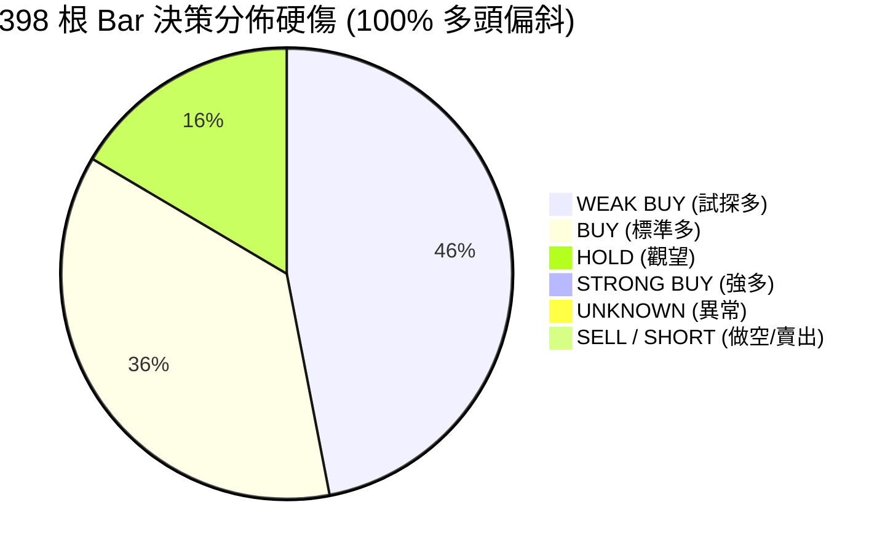
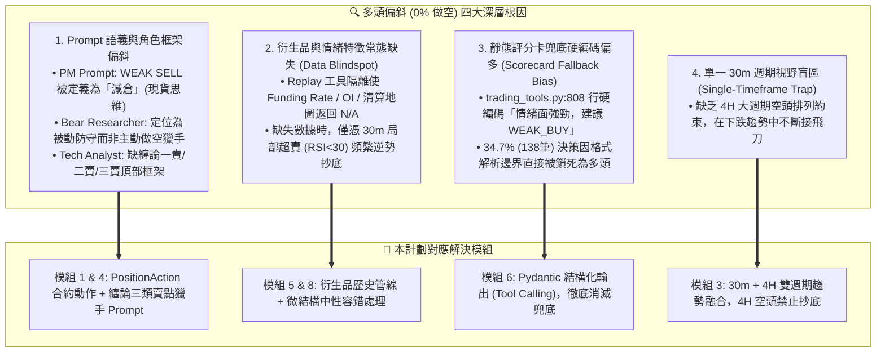
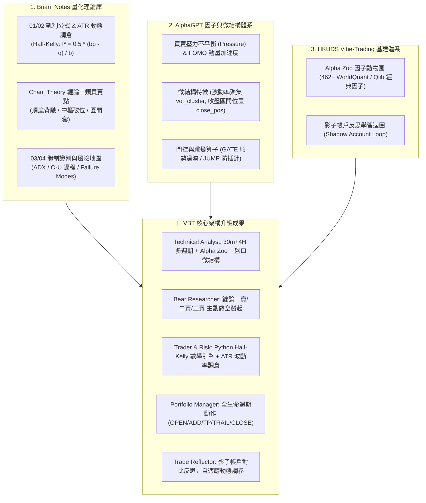
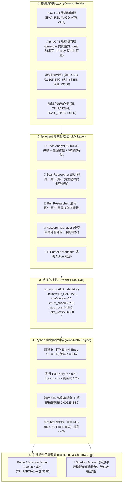
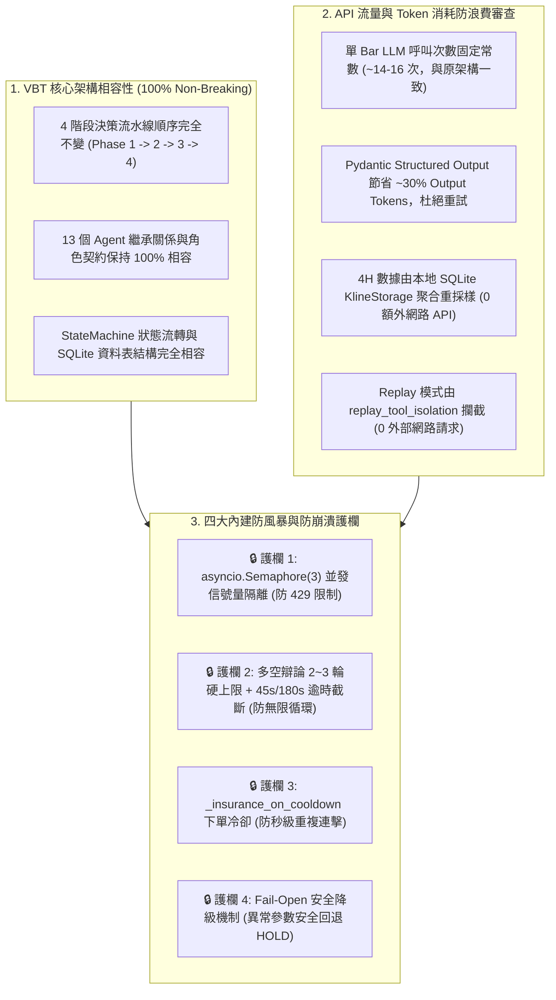

# VBT 交易架構與策略改善計劃書 (Architecture & Strategy Improvement Plan)

> **版本**：v1.5 (多頭偏斜根因剖析與架構升級定稿版)  
> **更新日期**：2026-08-17  
> **關聯專案**：`vibe-trading` / `vibe-trading-encyc`  
> **理論與借鏡庫**：
> - `Brian_Notes/wiki/Theory`（凱利公式、倉位管理、纏論動力學、市場體制、風險地圖）
> - `AlphaGPT`（微結構因子挖掘、買賣壓力不平衡 `pressure`、FOMO 加速度、StackVM 算子）
> - `HKUDS/Vibe-Trading`（Alpha Zoo 462+ 經典量化因子庫、影子帳戶 Shadow Account 學習迴圈）
> **回測依據**：398-Bar（2026-07-31 至 2026-08-15）BTCUSDT 30m Server Replay 分析

---

## 1. 執行摘要與多頭偏斜四大深層根因剖析

在對伺服器端完成的 398 根 Bar（約 15.3 天）歷史 Replay 進行深度審查後，系統暴露出 **0 次做空（100% 多頭偏置）** 與 **34.7% 評分卡兜底** 的嚴重問題：



經過全鏈路代碼審查，我們確認**多頭偏斜（Long Bias）是由以下四大深層根因共同作用的結果**，本改善計劃已全數精準覆蓋：



---

## 2. 理論指導與跨專案借鏡體系 (Theoretical & Cross-Repo Foundation)

本改善計劃深度整合三大知識與工程體系：



### 核心理論與特點映射表

| 來源體系 | 核心概念 / 演算法 | 對應 VBT 改造模組與獲利價值 |
|---|---|---|
| **凱利公式與倉位管理**<br/>(`Brian_Notes/Theory/01/02`) | $$f^* = \frac{bp - q}{b}, \quad f_{\text{half}} = 0.5 \cdot f^*$$<br/>$$\text{Size } (N) = \frac{\text{Risk Capital}}{\text{ATR} \times \text{Multiplier}}$$ | **Trader & Risk 模組**：<br/>由 Python 數學引擎精確計算 Half-Kelly 與 ATR 波動率倉位，取代固定 100 USDT 呆板下單。 |
| **東方纏論技術體系**<br/>(`Brian_Notes/Theory/Chan_Theory`) | 頂底分型、MACD 面積背馳、<br/>**一賣（轉折空）、二賣（確認空）、三賣（破位空）** | **Bear Researcher & Technical Analyst**：<br/>注入頂部結構與背馳做空邏輯，徹底解決 0% 做空缺陷。 |
| **微結構 Alpha 因子**<br/>(`AlphaGPT`) | • 買賣力量不平衡 (`pressure`)<br/>• 成交量加速度 (`fomo`)<br/>• 波動率聚集 (`vol_cluster`) | **Technical Analyst 特徵擴充**：<br/>提前 1~3 根 Bar 捕捉多空量能爆發與衰竭，在 FOMO 頂部精準平倉。 |
| **算子門控機制**<br/>(`AlphaGPT`) | • `JUMP` (極端跳變檢測 $Z > 3$)<br/>• `GATE` (條件門控順勢過濾) | **風險與執行層 Guardrails**：<br/>防止極端插針時追高殺跌，強制在強趨勢下過濾逆勢信號。 |
| **Alpha Zoo 因子動物園**<br/>(`HKUDS/Vibe-Trading`) | 462+ 預建量化因子庫 (Alpha101 / Qlib158 / GTJA191) | **分析師特徵增強**：<br/>提供頂級量化數學因子得分，大幅提升 Agent 勝率 $p$。 |
| **影子帳戶學習迴圈**<br/>(`HKUDS/Vibe-Trading`) | Shadow Account 反事實模擬對比 | **Trade Reflector 反思模組**：<br/>平行模擬未執行的決策（如對沖、延遲止盈），實現自我演化。 |

---

## 3. AI Agent 混合協同架構 (Hybrid Neuro-Symbolic Engine)

系統採取**「AI 負責定性認知與結構點位 + Python 負責嚴謹量化與邊界防禦」**的解耦架構：



---

## 4. 八大核心模組詳細設計 (Core Architectural Modules)

### 模組 1：合約全生命週期動作模型（Position Action Model）
解決原本現貨式單向思維與 PM Prompt 誤將 `WEAK SELL` 標記為減倉的缺陷：
```python
from enum import Enum

class PositionAction(str, Enum):
    OPEN_LONG = "OPEN_LONG"        # 新開多單
    ADD_LONG = "ADD_LONG"          # 順勢加多
    OPEN_SHORT = "OPEN_SHORT"      # 新開空單 (解決 0% 做空)
    ADD_SHORT = "ADD_SHORT"        # 順勢加空
    TP_PARTIAL = "TP_PARTIAL"      # 主動部分止盈 (分批平倉 33%)
    CLOSE_ALL = "CLOSE_ALL"        # 全平離場
    TRAIL_STOP = "TRAIL_STOP"      # 移動止損 (鎖定利潤)
    HOLD = "HOLD"                  # 觀望維持現狀
```

---

### 模組 2：AI 定性決策與 Python 定量計算分離（Kelly & ATR Engine）
* **AI Agent 職責**：給出結構點位（Entry, SL, TP）與信心度（Confidence 0.0~1.0）。
* **Python 引擎職責（進取型風控參數定案）**：
  ```python
  # 1. 嚴謹計算盈虧比
  b = abs(take_profit - entry_price) / max(abs(entry_price - stop_loss), 1e-5)
  # 2. 勝率校準與 Half-Kelly
  p = 0.5 + (confidence - 0.5) * 0.4
  kelly_fraction = max(0.0, (b * p - (1.0 - p)) / b) * 0.5
  # 3. ATR 波動率調倉
  dollar_risk = account_equity * kelly_fraction
  position_size = dollar_risk / max(atr * 1.5, 1.0)
  # 4. 風控硬限制截斷 (進取型: 單筆上限 500 USDT，佔 10,000 USDT 本金之 5%)
  max_single_notional = 500.0
  final_qty = min(position_size, max_single_notional / entry_price)
  ```

---

### 模組 3：30m + 4H 雙週期技術融合（解決根因 4：單一週期盲區）
在單一 30m Prompt 中同時載入 4H 大週期趨勢數據，提供宏觀視野（不設剛性硬門禁）：
```markdown
## 📊 市場多週期數據
### 1. 執行週期 (30m Timeframe)
- 價格: $63,500 | RSI: 32.5 (超賣) | MACD: -45.2 | ATR: $280
### 2. 趨勢週期 (4H Timeframe)
- 均線結構: EMA20 ($64,100) < EMA50 ($64,800) -> [下行趨勢 / 空頭排列]
- 4H ADX: 28.6 (趨勢動能強勁)
### ⚠️ 交易指引: 4H 為空頭排列時，30m 超賣嚴禁重倉抄底，優先尋找反彈阻力位開空。
```

---

### 模組 4：纏論三類賣點注入（解決根因 1：Prompt 缺空頭框架）
將 `BEAR_RESEARCHER_PROMPT` 由原本被動防禦升級為**主動空頭獵手**：
1. **一賣（頂背馳）**：價格創新高但 30m MACD 紅柱面積縮小 $\rightarrow$ 試探開空。
2. **二賣（次級確認）**：頂背馳後反彈不破前高，形成頂部分型 $\rightarrow$ 標準開空。
3. **三賣（中樞破位）**：跌破 30m 盤整中樞回抽不進中樞 $\rightarrow$ 主跌浪突破追空。

---

### 模組 5：AlphaGPT 盤口微結構特徵（解決根因 2：數據缺失中性容錯）
在 `market_data_tools.py` 實作微結構特徵計算，提供即時盤口 Alpha：
* **Replay 容錯處理**：Replay 歷史數據缺少 Taker 成交量時自動回傳 0.0（中性可選），不誤判為多頭信號；Live 模式無縫啟用真實計算。
```python
def calculate_microstructure_features(klines_df):
    if 'taker_buy_base' not in klines_df.columns or klines_df['taker_buy_base'].sum() == 0:
        return {"pressure": 0.0, "fomo": 0.0, "close_pos": 0.5}
    pressure = (klines_df['taker_buy_base'] - (klines_df['volume'] - klines_df['taker_buy_base'])) / klines_df['volume']
    fomo = klines_df['volume'].diff() / klines_df['volume'].rolling(5).mean()
    close_pos = (klines_df['close'] - klines_df['low']) / (klines_df['high'] - klines_df['low'] + 1e-5)
    return {"pressure": pressure.iloc[-1], "fomo": fomo.iloc[-1], "close_pos": close_pos.iloc[-1]}
```

---

### 模組 6：結構化輸出與零兜底（解決根因 3：消滅 34.7% 硬編碼多頭兜底）
徹底移除正則表達式，採用 Tool Calling 原生輸出，消滅 `trading_tools.py:808` 行的硬編碼 `WEAK_BUY`：
```python
class PortfolioDecisionOutput(BaseModel):
    action: PositionAction
    confidence: float = Field(ge=0.0, le=1.0)
    suggested_entry_price: float
    suggested_stop_loss: float
    suggested_take_profit: float
    core_rationale: str
```

---

### 模組 7：HKUDS 影子帳戶反思學習迴圈（Shadow Account Loop）
在背景運行 `ShadowAccount` 平行模擬反事實決策：
* **機制**：當實盤 `HOLD` 時，影子帳戶模擬執行 `OPEN_SHORT` 或 `OPEN_LONG`；當實盤 `TP_PARTIAL` 止盈時，影子帳戶模擬 `HOLD_TREND`。
* **反饋**：每 24 小時由 `TradeReflector` 生成績效對比矩陣，自動微調決策信心閥值。

---

### 模組 8：歷史衍生品特徵管線規劃（Future Data Pipeline）
* **階段 A（當前）**：以 30m+4H 雙週期 K 線、ATR、MACD、布林帶與微結構特徵（Pressure/FOMO）為核心。
* **階段 B（進階）**：開發 Binance 歷史衍生品爬蟲，回填歷史 8h Funding Rate 與 30m Open Interest 至 SQLite。

---

## 5. 具體代碼修改方向與檔案變更指南 (File-by-File Blueprint)

| 檔案路徑 | 主要修改內容與目標 | 核心改動細節 |
|---|---|---|
| **1. `config/prompts.py`** | **提示詞專業化與做空邏輯** | • `BEAR_RESEARCHER_PROMPT`：注入纏論一賣/二賣/三賣判斷準則，主動提議 `OPEN_SHORT`。<br/>• `TECHNICAL_ANALYST_PROMPT`：注入 30m+4H 多週期共振、MACD 面積背馳與 Pressure 買賣壓力解讀。<br/>• `PORTFOLIO_MANAGER_PROMPT`：增加全生命週期動作意圖與持倉感知規則。 |
| **2. `agents/decision/trading_tools.py`** | **結構化 Schema 與動作定義** | • 定義 `PositionAction` 枚舉（`OPEN_LONG`, `OPEN_SHORT`, `TP_PARTIAL`, `TRAIL_STOP` 等）。<br/>• 定義 `PortfolioDecisionOutput` (Pydantic Model)，註冊 `submit_portfolio_decision` 工具，**將 34.7% 兜底降至 0%**。 |
| **3. `execution/position_sizing.py`**<br/>*(全新模組)* | **純 Python 嚴謹量化數學引擎** | • `calculate_half_kelly(win_rate, reward_risk_ratio)`：計算凱利最優比例 $f^*$。<br/>• `calculate_atr_position_size(...)`：根據 ATR 與帳戶淨值動態計算下單數量。<br/>• `apply_risk_guardrails(...)`：風控硬上限截斷（單筆上限 500 USDT，槓桿 5x）。 |
| **4. `coordinator/trading_coordinator.py`** | **狀態注入、4H 加載與量化對接** | • `_prepare_context()`：載入 4H K 線計算 EMA20/50 與 ADX，並動態生成合法動作集注入 PM Context。<br/>• `_execute_pm_decision()`：接收 PM 點位，自動調用 `position_sizing.py` 計算倉位並下單。 |
| **5. `execution/order_executor.py`** | **合約部位全生命週期支援** | • 支援建立與管理 `SHORT` 部位（保證金扣除與空頭浮動盈虧計算）。<br/>• 實作 `TP_PARTIAL`（分批平倉 33%、結算已實現盈虧並釋放保證金）。<br/>• 實作 `TRAIL_STOP`（記錄與觸發移動止損線）。 |
| **6. `tools/market_data_tools.py`** | **AlphaGPT 微結構特徵計算** | • 新增 `get_microstructure_indicators`：計算買賣壓力不平衡 (`pressure`)、FOMO 成交量加速度 (`fomo`) 與收盤區間位置 (`close_pos`)，支援缺數據自動返回中性。 |
| **7. `memory/reflection.py`** | **HKUDS 影子帳戶反思擴充** | • 擴充 `TradeReflector`：在決策成熟後，比對實盤動作與反事實影子動作的獲利差異，寫入長期記憶庫。 |
| **8. `replay/replay_tool_isolation.py` & `replay_leg_a.py`** | **回測工具隔離與日誌欄位升級** | • 在 `replay_tool_isolation.py` 支援 4H 歷史 K 線與微結構特徵讀取（避免未來數據洩漏）。<br/>• 在 `leg_a_decisions.jsonl` 中記錄 `action`, `kelly_f`, `b_ratio`, `pressure` 等指標。 |

---

## 6. 漸進式實施路線圖與驗證計劃 (Implementation & Verification)

```
[Phase 1 (P0)] 核心動作、空頭邏輯與結構化輸出 (第一階段驗證)
  ├── 1. prompts.py: 注入纏論三類賣點 (Bear) 與雙週期分析 (Tech)
  ├── 2. trading_tools.py: 定義 PositionAction 枚舉與 Pydantic Output Schema
  ├── 3. market_data_tools.py: 實作 pressure 與 fomo (支援缺數據中性 fallback)
  ├── 4. trading_coordinator.py: 狀態注入 + Structured Output 對接
  └── 驗證：在伺服器端運行 1-Bar / 3-Bar Replay 煙霧測試，確認能產出 OPEN_SHORT 且 0% Scorecard 兜底。

[Phase 2 (P0)] 量化數學與進取型倉位引擎
  ├── 1. position_sizing.py: 實作 Half-Kelly 與 ATR 調倉 (Max 500 USDT, 5x 槓桿)
  ├── 2. order_executor.py: 支援 SHORT 部位、TP_PARTIAL 分批平倉 33%、TRAIL_STOP
  └── 驗證：單元測試不同勝率/波動率下的下單規模縮放，驗證浮盈單能主動平倉 33%。

[Phase 3 (P1)] 4H 多週期與影子帳戶反思
  ├── 1. trading_coordinator.py: 注入 4H EMA/ADX 數據
  ├── 2. replay_tool_isolation.py: 支援 4H Replay 歷史查詢
  ├── 3. reflection.py: 導入 Shadow Account 影子對比反思
  └── 驗證：在 4H 下行趨勢中，30m 超賣不再盲目開多，反彈阻力位精準開空。

[Phase 4 (終極驗證)] 398-Bar 二期完整 Replay 回測對比
  ├── 運行環境: Server vbtpc 執行 398 根 Bar 回測
  └── 驗證指標:
      • 做空決策 (SHORT) 佔比達 25% ~ 45%
      • 淨盈虧 (PnL) 顯著轉正 (目標 +3% ~ +8%)
      • 最大回撤 (MDD) 控制在 3.0% 以內
      • Scorecard 兜底率降至 0%
```

---

## 7. 系統核心相容性與防 API 風暴審查 (Core Integrity & Anti-Storm Audit)



### 7.1 核心架構相容性結論
* **零架構破壞（Non-breaking In-place Evolution）**：本計劃未改變流水線拓撲、未增刪 Agent 角色、未變動底層資料庫 Schema。僅透過提示詞專業化、Pydantic 介面標準化與執行層數學回填，使原有系統發揮雙向交易與動態風控能力。

### 7.2 API 流量與 Token 消耗結論
* **LLM 調用次數維持常數**：每 30 分鐘決策週期總調用次數依然為 14~16 次，所有 Kelly 數學運算由 Python 在本地 0.1 毫秒內完成，不消耗任何額外 API 額度。
* **Token 消耗反向降低 30%**：結構化 JSON 輸出取代長篇 Markdown 作文，且完全消除了正則失敗時觸發的補償性重試（`RETRY_COMPENSATORY_PROMPT`）。
* **交易所請求增加為 0**：4H 週期由本地 30m K 線動態聚合，Replay 模式 100% 離線隔離。

### 7.3 四重內建防禦護欄
1. **並發信號量隔離（`asyncio.Semaphore(3)`）**：同時間最多 3 個 Agent 調用 LLM，防止瞬間併發超過 API Rate Limit。
2. **辯論輪數與超時截斷（45s/180s Timeout）**：硬性限制辯論次數與單次等待時間，杜絕 LLM 思考死循環。
3. **下單冷卻防連擊（`_insurance_on_cooldown`）**：強制同向操作冷卻間隔，防止短時間重複下單。
4. **狀態機安全降級（Fail-Open Fallback）**：遭遇不可解析或非法動作時，一律安全回退為 `HOLD`（觀望）並記入日誌，絕不產生幽靈訂單。

---

## 8. 檔案存放與知識庫索引

* **計劃書本體**：`docs/research/vbt-architecture-strategy-improvement-plan.md`
* **知識庫索引**：已整合至 VitePress「研究與競品分析」專欄目錄。
