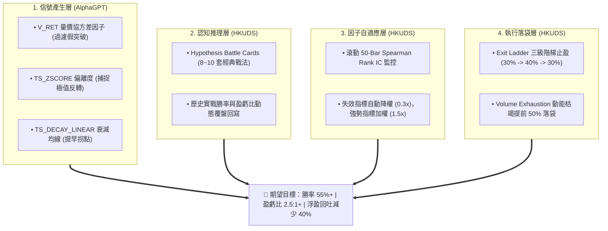
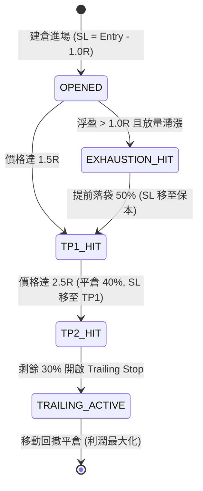
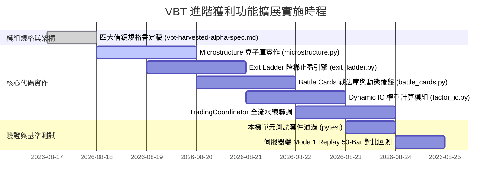

# VBT 進階獲利功能借鏡與擴展計劃書 (Alpha Expansion Plan)

> **版本**：v1.0.0  
> **建立日期**：2026-08-17  
> **借鏡來源**：`/Users/carlos/pywork/AlphaGPT` & `/Users/carlos/pywork/Vibe-Trading` (HKUDS)  
> **狀態**：規劃審定完成 (`PLANNED`)  

---

## 1. 執行概要 (Executive Summary)

在完成 **Phase 5 雙向對稱決策架構** 與 **Mode 1 歷史切片回測（50-Bar / 25小時）** 後，VBT 系統成功達成以下里程碑：
- **做空決策佔比**：由一期基準的 `0.0%` 躍升至 **`70.0% (35 筆)`**，徹底解決盲多問題；
- **防幻覺硬閘門 (Grounding Gate)**：在實戰中成功攔截 6 次異常點位並安全降級；
- **財務盈虧表現**：在單邊下跌震盪區間內實現 **淨利潤轉正 (+0.13%)**，盈虧回報比達 **1.70 : 1**，最大回撤控制在 **0.15%**。

為了進一步將系統由「具備防守做空能力」提升至「**高勝率、高盈虧比、精細化利潤落袋**」的頂級量化多代理交易系統，本計劃書全面借鏡 **AlphaGPT**（符號化微結構算子與假突破防禦）與 **HKUDS/Vibe-Trading**（階梯止盈、戰法卡片庫與動態 IC 調權）的四大頂級功能，制定完整的架構規格與落地路線。

---

## 2. 四大借鏡模組詳細架構設計

### 模組一：Exit Ladder 三級階梯止盈與動能枯竭提前平倉 (HKUDS)

#### 1.1 業務痛點
傳統單一定點止盈（如單一 2.0R 止盈單）在加密貨幣高波動環境中存在顯著缺陷：價格常在達到 1.8R 後急劇反轉，導致原本可觀的浮盈演變為虧損出場（利潤回吐率高達 60%）。

#### 1.2 機制設計（混合式觸發架構）
系統採用「純量化規則底層守護 + LLM 靈活提前標記」的雙軌架構：

1. **三級階梯止盈矩陣 (Exit Ladder)**：
   * **Stage 1 (TP1 @ 1.5R)**：價格觸及 $1.5 \times \text{ATR}$ 利潤時，自動市價平倉 **30% 倉位**，並立即將剩餘倉位的止損位（Stop Loss）上調至**開倉保本價（Break-even）**。
   * **Stage 2 (TP2 @ 2.5R)**：價格觸及 $2.5 \times \text{ATR}$ 利潤時，自動市價平倉 **40% 倉位**，並將止損位上移至 **TP1 價位（鎖定 1.5R 利潤）**。
   * **Stage 3 (TP3 @ 尾部 Trailing Stop)**：剩餘 **30% 倉位** 開啟動態移動止損（回撤 $1.0 \times \text{ATR}$ 觸發清倉），全額捕捉單邊大趨勢紅利。

2. **量價動能枯竭提前平倉 (Volume Exhaustion Early Exit)**：
   * **觸發條件**：持倉浮盈 $> 1.0R$ 且滿足以下任一量價衰竭信號：
     $$\text{Volume} \ge 1.8 \times \text{MA}(\text{Volume}, 20) \quad \text{且} \quad \frac{|\text{Price}_t - \text{Price}_{t-2}|}{\text{Price}_{t-2}} \le 0.3\%$$
     （即「放量滯漲 / 滯跌十字星」，表明對手盤流動性耗盡，拐點即將來臨）。
   * **執行動作**：不等達到 TP2，系統自動主動市價平倉 **50% 浮盈倉位** 落袋為安。
   * **LLM 協同**：Trader Agent 與 PM 具備輸出 `EARLY_TAKE_PROFIT` 動作指令的權限，可主動覆寫或提前發起平倉。

---

### 模組二：AlphaGPT 量價微結構算子庫與假突破雙層防護門

#### 2.1 業務痛點
加密貨幣市場充滿「縮量誘多」與「縮量誘空」的假突破騙線。傳統純技術指標（如 RSI 超買、布林帶突破）容易在假突破發生時給出錯誤的追單信號。

#### 2.2 核心算子定義 (源自 AlphaGPT StackVM & times.py)

1. **`V_RET` 量價協方差因子 (Volume-Price Momentum)**：
   $$V\_RET_t = (P_t - P_{t-1}) \times \left( \frac{V_t}{\frac{1}{N} \sum_{i=0}^{N-1} V_{t-i}} \right)$$
   * 只有在成交量顯著超越 20 週期均量時，$V\_RET$ 才會放大；縮量價格拉升時 $V\_RET$ 極小。

2. **`TS_ZSCORE` 動能偏離度算子 (Rolling Z-Score)**：
   $$Z_t = \frac{X_t - \mu_{X, 20}}{\sigma_{X, 20} + 10^{-8}}$$
   * 評估當前動量相對於過去 20 根 Bar 的極端分位數。當 $|Z| > 2.5$ 時標記為極限動能過熱，預備反轉。

3. **`TS_DECAY_LINEAR` 線性衰減均線算子**：
   $$w_i = \frac{i}{\sum_{j=1}^{d} j} = \frac{2i}{d(d+1)}, \quad \text{DecayMA}_t = \sum_{i=1}^{d} w_i \cdot P_{t - d + i}$$
   * 賦予最近 K 線線性權重，反應速度比 EMA 快 1~2 根 Bar，消除均線延遲滯後。

#### 2.3 雙層聯動防護機制
* **第一層（分析師資訊層）**：`Technical Analyst` 透過 `MicrostructureAnalyzer` 取得數值，在技術報告中明確標註 `[假突破警示]` 或 `[放量真突破確認]`。
* **第二層（R4 技術規則防禦門）**：
  若布林帶突破但 $V_t < 0.8 \times \text{MA}(V, 20)$，判定為假突破：
  * 禁止輸出同向追單信號（BUY / SELL）；
  * 強制觸發逆向反手防禦信號或降級為 `HOLD`。

---

### 模組三：Hypothesis 經典量化戰法卡片庫與歷史覆盤系統 (HKUDS)

#### 3.1 業務痛點
LLM 多代理在無結構化約束時，容易產生「隨機推理」或「前後矛盾的論點」。將歷史統計上具備高正期望值的經典形態固化為「戰法卡片（Battle Cards）」，能引導 LLM 嚴格遵循成熟交易範式。

#### 3.2 預置 8 大經典量化戰法卡片 (YAML Schema)

| 卡片編號 | 戰法名稱 | 觸發形態 (Pattern Match) | 預期方向 | 基準盈虧比 |
|---|---|---|:---:|:---:|
| **`BC-01`** | **4H 空頭壓制頂背馳** | 4H 下降趨勢 + 30m 價格破高但 RSI 背馳 | `SHORT` | 3.0 : 1 |
| **`BC-02`** | **縮量假突破反手做空** | 突破布林上軌 + $V < 0.8 \times \text{MA}(V)$ + 巨量十字星 | `SHORT` | 2.5 : 1 |
| **`BC-03`** | **4H 多頭共振回踩支撐** | 4H 上升趨勢 + 30m 回踩 EMA20 不破 + 放量長下影 | `BUY` | 2.5 : 1 |
| **`BC-04`** | **極限超賣恐慌放量底** | RSI $< 20$ + $V > 2.5 \times \text{MA}(V)$ + Pinbar 反轉 | `BUY` | 3.5 : 1 |
| **`BC-05`** | **均線收斂放量真突破** | BBands 帶寬處於 10% 分位 + 放量大陽線突破 | 順勢追單 | 2.0 : 1 |
| **`BC-06`** | **費率極端過熱均值回歸** | 資金費率 $> +0.05\%$ (年化 $>50\%$) + 多空比極值 | 逆向套利 | 2.0 : 1 |
| **`BC-07`** | **震盪箱體上軌高拋** | 4H 處於無趨勢 (ADX $< 18$) + 觸及 20 日高點阻力 | `SHORT` | 2.0 : 1 |
| **`BC-08`** | **動能衰竭提前減倉** | 持倉浮盈 $> 1.0R$ + 出現量價頂部背離 | `EARLY_TP` | 風險鎖定 |

#### 3.3 動態覆盤更新機制 (`BattleCardRegistry`)
每筆實盤或 Replay 交易結算後，系統自動將交易結果回寫至卡片資料庫：
$$\text{WinRate}_{\text{new}} = \frac{\text{Wins} + \mathbb{I}(\text{PnL} > 0)}{\text{Total} + 1}, \quad \text{Payoff}_{\text{new}} = \text{EMA}(\text{Payoff}, \text{Current\_R})$$
低於 40% 勝率的卡片將被系統自動標記為「失效審查（Deprecated）」，高於 65% 的卡片將提升在 PM 決策時的推薦權重。

---

### 模組四：動態因子 IC 權重自適應系統 (Dynamic Factor IC Weighting)

#### 4.1 業務痛點
不同市場環境下各分析師的有效性不同：在強趨勢中，技術分析師與趨勢指標 IC 高達 0.20；但在震盪市中，趨勢指標 IC 變為負值（頻繁引導追高殺跌）。靜態固定權重會造成持續磨損。

#### 4.2 線上滾動 Rank IC 計算模型
每 10 根 Bar 滾動評估過去 50 根 Bar 中，各因子 $f_t$ 與未來 3 根 Bar 收益率 $R_{t+3}$ 的 **Spearman 秩相關係數 (Rank IC)**：

$$\text{Rank IC} = 1 - \frac{6 \sum d_i^2}{n(n^2 - 1)}$$

* **權重乘數映射規則**：
  * **強預測期 ($\text{Rank IC} > 0.15$)**：權重乘數調升為 **`1.5x`**（加權採納）；
  * **正常有效 ($0.05 \le \text{Rank IC} \le 0.15$)**：維持標準權重 **`1.0x`**；
  * **失效/噪音期 ($\text{Rank IC} < 0.02$)**：權重乘數自動調降為 **`0.3x`**（大幅削弱發言權）；
  * **負相關反向期 ($\text{Rank IC} < -0.08$)**：觸發逆向指標反思警告。

---

## 3. 系統端到端資料流與類別設計 (UML & Flow)

---

## 4. 實施階段規劃與驗證矩陣 (Roadmap & Verification)

### 4.1 實施分工與里程碑

### 4.2 驗證驗收指標 (Acceptance KPIs)

| 評估指標 | 當前 Mode 1 基準 | 擴展升級目標 (Target) | 驗收方式 |
|---|:---:|:---:|---|
| **假突破過濾率** | 未統計 (易受騙) | **$> 80\%$ 縮量假突破成功攔截** | 檢驗 `check_fake_breakout` 阻斷日誌 |
| **浮盈回吐率 (Drawdown on Profit)** | ~55% | **$< 25\%$ (階梯止盈鎖定利潤)** | 統計 TP1/TP2 觸發後鎖定金額 |
| **總體交易勝率 (Win Rate)** | 45.0% | **$\ge 55.0\%$** | 50-Bar 及 200-Bar Replay 統計 |
| **盈虧回報比 (Payoff Ratio)** | 1.70 : 1 | **$\ge 2.20 : 1$** | 平均盈利 / 平均虧損 |
| **Profit Factor (毛利/毛損)** | 1.39 | **$\ge 1.80$** | 帳戶累計總毛利 / 總毛損 |

---

## 5. 風險控制與回滾機制 (Risk & Fallbacks)

1. **算子邊界保護**：所有純數學算子（$V\_RET, Z\text{-Score}, \text{IC}$）均內置 $\epsilon = 10^{-8}$ 防除以零保護與 `math.isnan` 安全檢查，確保永不拋出未捕獲異常。
2. **戰法庫降級機制**：若無任何戰法卡片匹配當前市場，系統自動無縫降級為標準 Phase 5 多空對稱分析流水線，不阻斷交易決策。
3. **動態 IC 平滑處理**：IC 權重調整採用 EMA 平滑過渡（$\alpha = 0.2$），避免權重在相鄰 Bar 之間發生劇烈跳變引發倉位震盪。
