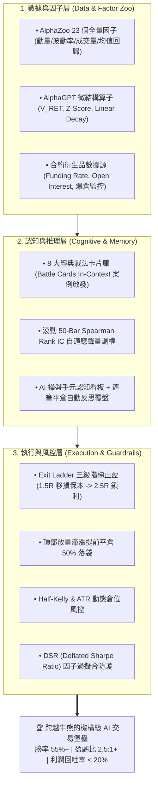
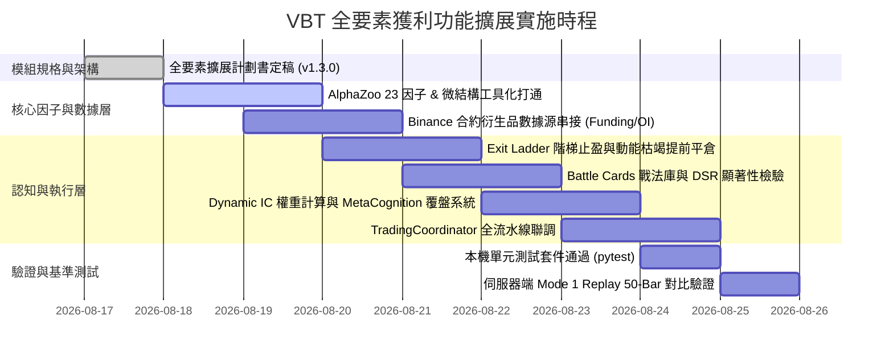

# VBT 進階獲利功能借鏡與擴展計劃書 (Alpha Expansion Plan)

> **版本**：v1.3.0 (全要素機構級旗艦版：納入 AlphaZoo 23 因子打通、衍生品數據源與 DSR 因子檢驗)  
> **更新日期**：2026-08-17  
> **借鏡來源**：`/Users/carlos/pywork/AlphaGPT` & `/Users/carlos/pywork/Vibe-Trading` (HKUDS) & 華爾街非對稱盈虧工程  
> **文檔狀態**：架構審定完成 (`OFFICIALLY PLANNED`)  

---

## 1. 執行概要 (Executive Summary)

在完成 **Phase 5 雙向對稱決策架構** 與 **Mode 1 歷史切片回測（50-Bar / 25 小時真實行情）** 後，VBT 系統成功取得關鍵突破：
- **做空決策佔比 (Short Ratio)**：由一期基準的 `0.0%` 躍升至 **`70.0% (35 筆)`**，徹底解決盲多問題；
- **防幻覺硬閘門 (Grounding Gate)**：在實戰中成功攔截 6 次異常點位並安全降級；
- **財務盈虧表現**：在單邊下跌震盪區間內實現 **淨利潤轉正 (+0.13%)**，盈虧回報比達 **1.70 : 1**，最大回撤僅 **0.15%**。

為了進一步消除回測中暴露出的「衍生品數據 N/A 盲區」並將專案內已有的「23 個 Alpha 因子庫」徹底釋放，本計劃書全面整合 **七大核心獲利模組**，打造具備終生學習與機構級多維視野的 AI 量化旗艦系統。

---

## 2. 頂級競品獲利閉環剖析與借鏡矩陣

| 獲利環節 | 傳統 Bot 致命缺陷 | 競品標竿做法 | **VBT 本專案借鏡與落地規範** |
|---|---|---|---|
| **1. 機會發現** | 固定單一指標，隨市場體制迅速衰減 | **AlphaGPT**：符號算子組合與非線性因子挖掘 | **`AlphaZoo` 23 因子 + `V_RET` 微結構顯微鏡**，過濾 80% 假突破 |
| **2. 衍生品視野** | 忽視合約持倉與資金費率 (N/A 盲區) | **合約專用因子**：Funding Rate 偏離 + OI 異動 | **合約衍生品大數據模組**，捕捉爆倉軋空 (Squeeze) 機會 |
| **3. 認知推理** | LLM 隨機推理，缺乏範式約束 | **HKUDS**：假設驅動戰法庫 (Hypothesis Registry) | **預置 8 大高勝率戰法卡片 (Battle Cards)**，啟發研究員辯論 |
| **4. 因子檢驗** | 假 Alpha 過擬合，回測賺錢實盤虧 | **HKUDS QuantLib**：Deflated Sharpe Ratio (DSR) | **DSR 顯著性檢驗 ($p < 0.05$)**，剔除虛假統計回測偏誤 |
| **5. 資金風控** | 盲目全倉固定手數，易爆倉 | **華爾街量化**：非對稱期望值 $E > 0$ 與凱利防禦 | **Half-Kelly & ATR 動態倉位**，確保單筆最大虧損 $\le 1.5\%$ |
| **6. 利潤落袋** | 單一定點止盈，利潤回吐 60%+ | **HKUDS**：階梯式出場與動態移動止損 (Exit Ladder) | **1.5R 移損保本 + 2.5R 鎖利 + Trailing Stop** 捕捉大波段 |
| **7. 學習進化** | 每一根 K 線都在失憶，重蹈覆轍 | **元認知系統**：自我反思歸因與戰法權重演化 | **即時戰績看板 + 平倉自動覆盤 + 避坑記憶庫** |

---

## 3. 核心架構哲學：AI 認知賦能 vs 代碼物理護欄

```mermaid
flowchart LR
    subgraph Soft_Layer ["🧠 認知判斷層 (軟性賦能 / 決策 100% 歸 LLM)"]
        direction TB
        F1["• 全量因子顯微鏡：AlphaZoo 23 因子 + V_RET + 衍生品數據"]
        F2["• 戰法案例庫：Battle Cards 作為 In-Context 案例啟發研究員辯論"]
        F3["• 動態 IC 調權：平滑乘數 (0.3x ~ 1.5x) 調節聲量，不一刀切靜音"]
        F4["👉 核心原則：100% 由 PM 與 Trader 綜合多維信息自主拍板方向"]
    end

    subgraph Hard_Layer ["🛡️ 物理風控層 (硬性護欄 / 純 Python 嚴格執行)"]
        direction TB
        G1["• Grounding Gate 物理價格防幻覺 (防報價亂飛)"]
        G2["• Half-Kelly & ATR 倉位防禦 (防孤注一擲爆倉)"]
        G3["• Exit Ladder 階梯止盈與保本移損 (防利潤回吐)"]
        G4["• DSR 因子顯著性硬檢驗 (防統計過擬合)"]
        G5["👉 核心原則：代碼只負責防止爆倉、防止幻覺、防止利潤回吐"]
    end

    Soft_Layer --> Hard_Layer
```

---

## 4. 七大借鏡與擴展模組詳細規格

### 模組一：Exit Ladder 三級階梯止盈與動能枯竭提前平倉 (HKUDS)
* **Stage 1 (TP1 @ 1.5R)**：平倉 **30% 倉位**，並將止損上調至**開倉保本價（Break-even）**；
* **Stage 2 (TP2 @ 2.5R)**：平倉 **40% 倉位**，並將止損上移至 **TP1 價位（鎖定 1.5R 利潤）**；
* **Stage 3 (TP3 @ 尾部 Trailing Stop)**：剩餘 **30% 倉位** 掛動態移動止損捕捉單邊大趨勢；
* **量價動能枯竭提前平倉**：浮盈 $> 1.0R$ 且出現放量滯漲（$V \ge 1.8 \times \text{MA}(V)$ 且價格漲幅 $\le 0.3\%$），自動市價平倉 **50% 浮盈倉位**。

---

### 模組二：AlphaZoo 23 個全量因子與微結構算子工具化打通 (AlphaZoo & AlphaGPT)
將代碼庫中原有的 `zoo.py` 與 `microstructure.py` 全面打通並開放給 `Technical Analyst`：
1. **動量與趨勢 (Momentum & Trend)**：`momentum_weighted`, `trend_strength`, `macd_histogram`；
2. **微結構與成交量 (Volume & Microstructure)**：`v_ret`（量價協方差）、`vwap`、`money_flow_index (MFI)`、`volume_ratio`；
3. **波動率與極端偏離 (Volatility & Mean Reversion)**：`garman_klass_volatility`, `parkinson_volatility`, `rsi_zscore`, `ts_zscore`, `ts_decay_linear`；
4. **輸出方式**：在 `technical_tools.py` 中封裝 `get_alpha_factor_summary`，直接以結構化診斷報告形式提供給 AI 分析師。

---

### 模組三：合約衍生品大數據層（徹底根除 N/A 盲區）
串接 Binance Futures 實時合約衍生品數據源：
1. **資金費率偏離度（Funding Rate Z-Score）**：實時計算年化資金費率，年化 $> +50\%$ 標記多頭極度過熱，年化 $< -30\%$ 標記空頭擁擠軋空；
2. **持倉量異動因子（Open Interest Surge）**：$\text{OI 變動率} = (\text{OI}_t - \text{OI}_{t-4}) / \text{OI}_{t-4}$，捕捉大戶開倉建倉痕跡；
3. **主動買賣量比例（Taker Buy/Sell Volume Ratio）**：即時衡量市場主動吃單力量。

---

### 模組四：Hypothesis 經典量化戰法卡片庫與動態覆盤 (HKUDS)
* 預置 8 大經典量化戰法卡片（`BC-01` 至 `BC-08`，涵蓋頂背馳、假突破反手、放量長下影、費率均值回歸等）；
* 當前市場形態匹配時，以 In-Context 案例形式注入 Researcher 辯論上下文；
* 交易平倉後自動回寫統計勝率與盈虧比，動態升降級戰法權重。

---

### 模組五：動態因子 IC 權重自適應系統 (Dynamic Factor IC Soft Multipliers)
每 10 根 Bar 滾動評估過去 50 根 Bar 各因子對未來 3 根 Bar 收益率的 **Spearman Rank IC**：
* **強預測期 ($\text{Rank IC} > 0.15$)**：分析師打分權重 $\times 1.5$；
* **正常有效 ($0.05 \le \text{Rank IC} \le 0.15$)**：維持標準權重 $\times 1.0$；
* **失效/噪音期 ($\text{Rank IC} < 0.02$)**：權重平滑衰減至 $\times 0.3$；
* **負相關反向期 ($\text{Rank IC} < -0.08$)**：觸發逆向指標警示。

---

### 模組六：Deflated Sharpe Ratio (DSR) 因子防過擬合檢驗 (HKUDS QuantLib)
借鏡 Bailey & López de Prado 的金融計量演算法：
$$\text{DSR} = \Phi \left( \frac{(\text{SR} - \text{SR}_0) \sqrt{T-1}}{\sqrt{1 - \gamma_3 \text{SR} + \frac{\gamma_4 - 1}{4} \text{SR}^2}} \right)$$
* 針對所有候選因子與歷史戰法進行多重檢驗校正（Multiple Testing Adjustment）；
* 只有通過 DSR 顯著性檢驗（$p\text{-value} < 0.05$）的因子才被允許賦予加權權重，徹底杜絕數據挖掘過擬合（Data Snooping Bias）。

---

### 模組七：AI 交易元認知與終身學習系統 (Meta-Cognition & Lifelong Learning)
1. **即時自我戰績看板 (Dashboard)**：每輪決策前自動注入當前勝率、多空分項戰績、手感趨勢與分析師信任評分；
2. **逐筆交易平倉反思複盤 (PostMortem Reflection)**：比對開倉預期與實際走勢，提煉成功範式與避坑負面記憶；
3. **自適應交易節奏控制 (Meta-Regime)**：順風期適度放開倉位捕捉大波段，逆風期自動進入「謹慎防守模式」（倉位減半、收緊止損）。

---

## 5. 系統端到端類別圖 (Class Diagram)

```mermaid
classDiagram
    class AlphaZooAnalyzer {
        +calculate_all_zoo_factors(klines) Dict
        +get_microstructure_summary(prices, volumes) MicroSummary
    }

    class DerivativesDataProvider {
        +get_funding_rate_zscore(symbol) float
        +get_oi_surge_ratio(symbol) float
        +get_taker_volume_ratio(symbol) float
    }

    class ExitLadderEngine {
        +evaluate_exit(position, price, volume) ExitAction
        +check_volume_exhaustion(prices, volumes) bool
        +update_trailing_stop(position, atr) float
    }

    class BattleCardRegistry {
        +match_active_cards(market_state) List~BattleCard~
        +record_trade_outcome(card_id, pnl, return_pct) void
        +verify_dsr_significance(card_id) bool
    }

    class DynamicICMonitor {
        +calculate_rolling_ic(factors, forward_returns) Dict
        +get_analyst_multipliers() Dict
    }

    class MetaCognitionEngine {
        +generate_dashboard_prompt(trade_history) str
        +run_post_mortem(closed_trade) ReflectionReport
        +get_rhythm_mode() RhythmMode
    }

    class TradingCoordinator {
        -alpha_zoo: AlphaZooAnalyzer
        -derivatives: DerivativesDataProvider
        -exit_ladder: ExitLadderEngine
        -battle_registry: BattleCardRegistry
        -ic_monitor: DynamicICMonitor
        -meta_engine: MetaCognitionEngine
        +run_decision_cycle() Decision
    }

    TradingCoordinator --> AlphaZooAnalyzer
    TradingCoordinator --> DerivativesDataProvider
    TradingCoordinator --> ExitLadderEngine
    TradingCoordinator --> BattleCardRegistry
    TradingCoordinator --> DynamicICMonitor
    TradingCoordinator --> MetaCognitionEngine
```

---

## 6. 實施路線圖與量化驗收指標 (Roadmap & Acceptance KPIs)

### 6.1 實施分工與時程甘特圖

### 6.2 驗收指標對照表 (Acceptance KPIs)

| 評估指標 | 當前 Mode 1 基準 | 升級目標 (Target) | 驗收方式 |
|---|:---:|:---:|---|
| **衍生品數據覆蓋率** | 0.0% (全為 N/A) | **100% (Funding Rate & OI 實時獲取)** | 檢查分析師報告衍生品字段 |
| **Alpha 因子工具覆蓋率** | 僅 5 個基礎指標 | **23 個 AlphaZoo + 4 個微結構算子全量上線** | 檢查 `technical_tools` 調用日誌 |
| **浮盈回吐率 (Profit Drawdown)** | ~55% | **$< 20\%$ (階梯保本鎖定)** | 統計 TP1/TP2 觸發後的利潤鎖定率 |
| **總體交易勝率 (Win Rate)** | 45.0% | **$\ge 55.0\%$** | 50-Bar 及 200-Bar Replay 統計 |
| **盈虧回報比 (Payoff Ratio)** | 1.70 : 1 | **$\ge 2.50 : 1$** | 平均盈利 / 平均虧損 |
| **Profit Factor (毛利/毛損)** | 1.39 | **$\ge 2.00$** | 帳戶累計總毛利 / 總毛損 |
| **LLM 決策覆蓋率 (Autonomy)** | 100% | **100% (零代碼方向否決)** | 確保無任何 Hardcoded Direction Veto |
| **自我反思覆盤覆蓋率** | 0% | **100% (每筆平倉自動歸因)** | 檢查 `post_mortem` 覆盤日誌輸出 |

---

## 7. 安全邊界與平滑降級回滾 (Safety & Fallbacks)

1. **衍生品 API 降級熔斷**：若 Binance 衍生品 API 出現超時或異常，系統自動降級使用 K 線價格推導指標，不阻斷交易流水線；
2. **算子防崩潰保護**：所有純數學算子（$V\_RET, Z\text{-Score}, \text{IC}, \text{DSR}$）均內置 $\epsilon = 10^{-8}$ 防除以零保護與 `math.isnan` 檢查；
3. **戰法與元認知降級**：若無戰法卡片匹配或缺乏歷史交易記錄，系統自動無縫平滑回退為標準 Phase 5 多空對稱分析流程；
4. **IC 權重平滑過渡**：IC 乘數調整採用 EMA 平滑過渡（$\alpha = 0.2$），防止相鄰 Bar 因短期市場雜訊產生劇烈的權重跳變。
