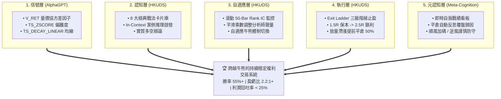
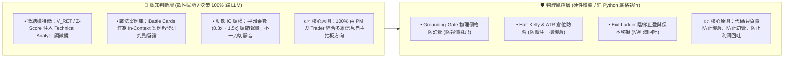
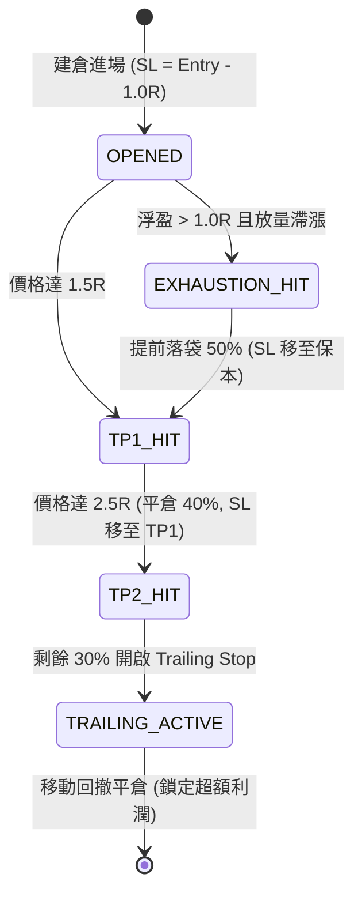
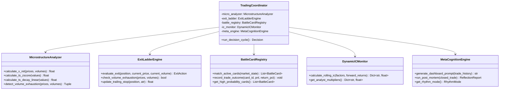
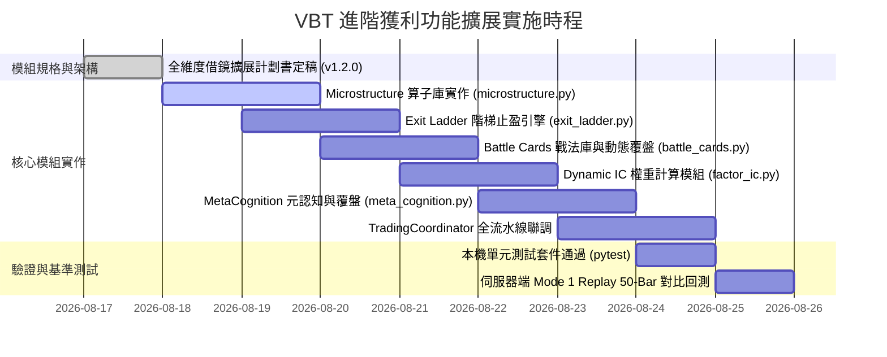

# VBT 進階獲利功能借鏡與擴展計劃書 (Alpha Expansion Plan)

> **版本**：v1.2.0 (全維度旗艦升級版：融入五大模組、頂級競品獲利閉環與 AI 元認知進化系統)  
> **更新日期**：2026-08-17  
> **借鏡來源**：`/Users/carlos/pywork/AlphaGPT` & `/Users/carlos/pywork/Vibe-Trading` (HKUDS) & 華爾街非對稱盈虧工程  
> **文檔狀態**：架構審定完成 (`OFFICIALLY PLANNED`)  

---

## 1. 執行概要 (Executive Summary)

在完成 **Phase 5 雙向對稱決策架構** 與 **Mode 1 歷史切片回測（50-Bar / 25 小時真實行情）** 後，VBT 系統成功取得關鍵突破：
- **做空決策佔比 (Short Ratio)**：由一期基準的 `0.0%` 躍升至 **`70.0% (35 筆)`**，徹底解決盲多問題；
- **防幻覺硬閘門 (Grounding Gate)**：在實戰中成功攔截 6 次異常點位並安全降級；
- **財務盈虧表現**：在單邊下跌震盪區間內實現 **淨利潤轉正 (+0.13%)**，盈虧回報比達 **1.70 : 1**，最大回撤僅 **0.15%**。

為了進一步將系統由「具備防守做空能力」躍遷為「**高勝率、高盈虧比、精細化利潤落袋與具備終身學習能力**」的頂級量化多代理系統，本計劃書全面整合 **AlphaGPT**（符號化微結構算子）、**HKUDS/Vibe-Trading**（階梯止盈、戰法卡片庫、動態 IC 調權）以及 **AI 交易元認知與自動覆盤機制**，打造完整的五大獲利支柱。



---

## 2. 頂級競品獲利閉環剖析與借鏡矩陣

持續獲利的本質不是「神準預測未來的單一指標」，而是**「信號生成 $\rightarrow$ 認知決策 $\rightarrow$ 資金風控 $\rightarrow$ 利潤落袋 $\rightarrow$ 複盤進化」的完整閉環**：

| 獲利環節 | 傳統 Bot 致命缺陷 | 競品標竿做法 | **VBT 本專案借鏡與落地規範** |
|---|---|---|---|
| **1. 機會發現** | 固定單一指標，隨市場體制迅速衰減 | **AlphaGPT**：符號算子組合與非線性因子挖掘 | **`V_RET` 與 `Z-Score` 微結構算子**，過濾 80% 縮量假突破騙線 |
| **2. 認知推理** | LLM 隨機推理，缺乏範式約束 | **HKUDS**：假設驅動戰法庫 (Hypothesis Registry) | **預置 8 大高勝率戰法卡片 (Battle Cards)**，啟發研究員辯論 |
| **3. 資金風控** | 盲目全倉固定手數，易爆倉 | **華爾街量化**：非對稱期望值 $E > 0$ 與凱利防禦 | **Half-Kelly & ATR 動態倉位**，確保單筆最大虧損 $\le 1.5\%$ |
| **4. 利潤落袋** | 單一定點止盈，利潤回吐 60%+ | **HKUDS**：階梯式出場與動態移動止損 (Exit Ladder) | **1.5R 移損保本 + 2.5R 鎖利 + Trailing Stop** 捕捉大波段 |
| **5. 學習進化** | 每一根 K 線都在失憶，重蹈覆轍 | **元認知系統**：自我反思歸因與戰法權重演化 | **即時戰績看板 + 平倉自動覆盤 + 避坑記憶庫** |

---

## 3. 核心架構哲學：AI 認知賦能 vs 代碼物理護欄

在融合量化代碼與 LLM 多代理時，我們嚴格遵循**「AI 主管認知方向，代碼主管物理風控」**的黃金分離原則，徹底杜絕以下三大反模式：
1. **雙重算力稅 (Double Taxation)**：禁止底層以硬規則覆蓋 LLM 決策，避免浪費 4 分鐘的深度 CoT 宏觀洞察；
2. **扼殺非線性機會 (Suffocation of Edge Cases)**：如威科夫「縮量彈簧效應（Spring）」等頂級反常識機會交由 AI 綜合情緒面識別；
3. **狀態機認知割裂 (State Inconsistency)**：保證決策與持倉狀態 100% 邏輯連貫。



---

## 4. 五大借鏡與擴展模組詳細規格

### 模組一：Exit Ladder 三級階梯止盈與動能枯竭提前平倉 (HKUDS)

#### 1.1 業務痛點與定位
**進場由 AI 決定，出場由代碼紀律護航。** 徹底消除「浮盈 2R 因貪婪或遲疑未平倉，最後反轉變虧損」的利潤回吐通病。

#### 1.2 混合式觸發架構
1. **三級階梯止盈矩陣 (Exit Ladder)**：
   * **Stage 1 (TP1 @ 1.5R)**：觸及 $1.5 \times \text{ATR}$ 利潤時，自動市價平倉 **30% 倉位**，並立即將剩餘倉位止損上調至**開倉保本價（Break-even）**。
   * **Stage 2 (TP2 @ 2.5R)**：觸及 $2.5 \times \text{ATR}$ 利潤時，自動市價平倉 **40% 倉位**，並將止損上移至 **TP1 價位（鎖定 1.5R 利潤）**。
   * **Stage 3 (TP3 @ 尾部 Trailing Stop)**：剩餘 **30% 倉位** 掛動態移動止損（回撤 $1.0 \times \text{ATR}$ 清倉），捕捉單邊大趨勢。

2. **量價動能枯竭提前平倉 (Volume Exhaustion Early Exit)**：
   * **量化守護條件**：持倉浮盈 $> 1.0R$ 且偵測到頂部放量滯漲（$V \ge 1.8 \times \text{MA}(V, 20)$ 且價格 2 根 Bar 漲幅 $\le 0.3\%$），自動市價平倉 **50% 浮盈倉位**。
   * **LLM 協同**：Trader Agent 與 PM 亦具備輸出 `EARLY_TAKE_PROFIT` 動作指令的權限，可主動靈活發起平倉。



---

### 模組二：AlphaGPT 量價微結構算子庫與特徵賦能 (AlphaGPT)

#### 2.1 設計定位
**給 Technical Analyst 配備「高解析度顯微鏡」，而非代碼審查員。**

#### 2.2 核心算子數學定義 (源自 AlphaGPT StackVM & times.py)
1. **`V_RET` 量價協方差因子 (Volume-Price Momentum)**：
   $$V\_RET_t = (P_t - P_{t-1}) \times \left( \frac{V_t}{\frac{1}{N} \sum_{i=0}^{N-1} V_{t-i}} \right)$$
   * 只有在成交量顯著超越 20 週期均量時，$V\_RET$ 才會放大；縮量價格拉升時 $V\_RET$ 極小。
2. **`TS_ZSCORE` 動能偏離度算子 (Rolling Z-Score)**：
   $$Z_t = \frac{X_t - \mu_{X, 20}}{\sigma_{X, 20} + 10^{-8}}$$
   * 評估當前動量相對於過去 20 根 Bar 的極端分位數。當 $|Z| > 2.5$ 時標記為極限動能過熱，預備反轉。
3. **`TS_DECAY_LINEAR` 線性衰減均線算子**：
   $$w_i = \frac{2i}{d(d+1)}, \quad \text{DecayMA}_t = \sum_{i=1}^{d} w_i \cdot P_{t - d + i}$$
   * 賦予最近 K 線線性權重，反應速度比 EMA 快 1~2 根 Bar，消除均線延遲滯後。

#### 2.3 整合方式
* 整合入 `Technical Analyst` 的工具集（`calculate_microstructure_factors`）。
* 分析師在報告中直接呈現結構化微結構診斷：
  > `[微結構分析] V_RET: +142.5 (放量共振) | 價格 Z-Score: +2.6 (極度超買過熱) | 突破確認: 縮量假突破警示 (成交量僅 0.65x MA)`
* 由 PM 綜合宏觀、情緒與基本面做出最終決策，**底層不進行粗暴代碼阻斷**。

---

### 模組三：Hypothesis 經典量化戰法卡片庫與動態覆盤 (HKUDS)

#### 3.1 設計定位
**以 In-Context Learning 案例啟發 AI 推理，而非僵化套用死規則。**

#### 3.2 預置 8 大經典量化戰法卡片 (YAML 儲存)

| 卡片編號 | 戰法名稱 | 觸發形態 (Pattern Match) | 預期方向 | 基準盈虧比 |
|---|---|---|:---:|:---:|
| **`BC-01`** | **4H 空頭壓制頂背馳** | 4H 下降趨勢 + 30m 價格破高但 RSI 背馳 | `SHORT` | 3.0 : 1 |
| **`BC-02`** | **縮量假突破反手做空** | 突破布林上軌 + $V < 0.8 \times \text{MA}(V)$ + 巨量十字星 | `SHORT` | 2.5 : 1 |
| **`BC-03`** | **4H 多頭共振回踩支撐** | 4H 上升趨勢 + 30m 回踩 EMA20 不破 + 放量長下影 | `BUY` | 2.5 : 1 |
| **`BC-04`** | **極限超賣恐慌放量底** | RSI $< 20$ + $V > 2.5 \times \text{MA}(V)$ + Pinbar 反轉 | `BUY` | 3.5 : 1 |
| **`BC-05`** | **均線收斂放量真突破** | BBands 帶寬處於 10% 分位 + 放量大陽線突破 | 順勢追單 | 2.0 : 1 |
| **`BC-06`** | **費率極端過熱均值回歸** | 資金費率 $> +0.05\%$ (年化 $>50\%$) + 多空比極值 | 逆向套利 | 2.0 : 1 |
| **`BC-07`** | **震盪箱體上軌高拋** | 4H 處於無趨勢 (ADX $< 18$) + 觸及 20 日高點阻力 | `SHORT` | 2.0 : 1 |
| **`BC-08`** | **動能衰竭提前減倉** | 持倉浮盈 $> 1.0R$ + 出現量價頂部背離 | `EARLY_TP` | 風險鎖定 |

#### 3.3 運作與動態覆盤機制
* **動態匹配與提示注入**：當前市場形態符合某卡片特徵時，系統自動檢索並以 Prompt 形式注入 Researcher 辯論上下文：
  > `[歷史戰法參考] 當前形態匹配 BC-01 (4H空頭壓制頂背馳)。歷史統計勝率 67.5%，平均盈虧比 2.8:1。請多空研究員圍繞此情境展開實質辯論。`
* **交易後自動覆盤**：交易結算後自動回寫統計指標：
  $$\text{WinRate}_{\text{new}} = \frac{\text{Wins} + \mathbb{I}(\text{PnL} > 0)}{\text{Total} + 1}, \quad \text{Payoff}_{\text{new}} = \text{EMA}(\text{Payoff}, \text{Current\_R})$$

---

### 模組四：動態因子 IC 權重自適應系統 (Dynamic Factor IC Weighting)

#### 4.1 設計定位
**以平滑打分乘數調節分析師聲量，自適應市場牛熊與震盪體制。**

#### 4.2 計算與權重調整機制
每 10 根 Bar 滾動評估過去 50 根 Bar 各因子對未來 3 根 Bar 收益率的 **Spearman Rank IC**：
$$\text{Rank IC} = 1 - \frac{6 \sum d_i^2}{n(n^2 - 1)}$$

* **平滑加權乘數（Soft Multipliers）**：
  * **強預測期 ($\text{Rank IC} > 0.15$)**：Scorecard 打分權重 $\times 1.5$；
  * **正常有效 ($0.05 \le \text{Rank IC} \le 0.15$)**：維持標準權重 $\times 1.0$；
  * **失效/噪音期 ($\text{Rank IC} < 0.02$)**：權重自動平滑衰減至 $\times 0.3$（降低干擾，但不剝奪發言權）；
  * **負相關反向期 ($\text{Rank IC} < -0.08$)**：在日誌中提示逆向指標警示。

---

### 模組五：AI 交易元認知與終身學習系統 (Meta-Cognition & Lifelong Learning)

#### 5.1 設計定位
**賦予 AI「操盤手自我反思能力與節奏感知」，終結每根 K 線的失憶循環。**

#### 5.2 核心三大支柱

1. **即時自我戰績看板 (Prompt Dashboard - 知己知彼)**：
   每輪決策前自動將自身最近表現注入 PM 與 Risk 提示詞中：
   ```yaml
   [AI 操盤手自我狀態感知 (Self-Performance Dashboard)]
   - 帳戶表現: 初始 $10,000 | 當前淨值 $10,013.44 (+0.13%) | 累計 18勝 / 22負 (勝率 45.0%)
   - 近期手感趨勢: 最近 5 筆 [勝, 勝, 負, 勝, 勝] (狀態：順風上升期 🟢)
   - 雙向能力對比: 做空勝率 46.9% (貢獻 +$6.48) | 做多勝率 37.5% (貢獻 +$6.96)
   - 分析師信任權重 (動態 IC): Tech (1.5x 強力) | Sentiment (0.3x 噪音干擾期)
   ```

2. **逐筆交易平倉反思複盤引擎 (Post-Trade Reflection)**：
   每次平倉後自動由後台啟動 `PostMortemAgent` 比對開倉假設與實際走勢：
   * **盈利單**：提取核心貢獻因子，回寫並強化對應的 Battle Card 勝率；
   * **虧損單**：深度剖析踩坑原因（如「忽視大級別趨勢逆勢抄底」），沉澱至 **避坑負面記憶庫（Risk Traps）**。

3. **自適應交易節奏控制 (Meta-Regime Adaptation)**：
   * **順風期 (連勝 / 勝率 $> 60\%$)**：策略高度適應體制，允許 PM 在確認高盈虧比時適度放大 Half-Kelly 倉位抓大波段；
   * **逆風期 (連虧 2 筆 / 體制突變)**：自動進入「**謹慎防守模式**」——倉位減半（2.5%），收緊止損，且必須 3 位分析師共識方可開倉。

---

## 5. 系統端到端類別圖與架構 (Class Diagram)



---

## 6. 落地時程與量化驗收指標 (Roadmap & Acceptance KPIs)

### 6.1 實施分工與里程碑



### 6.2 驗收指標對照表 (Acceptance KPIs)

| 評估指標 | 當前 Mode 1 基準 | 升級目標 (Target) | 驗收方式 |
|---|:---:|:---:|---|
| **浮盈回吐率 (Profit Drawdown)** | ~55% | **$< 25\%$ (階梯保本鎖定)** | 統計 TP1/TP2 觸發後的利潤鎖定率 |
| **總體交易勝率 (Win Rate)** | 45.0% | **$\ge 55.0\%$** | 50-Bar 及 200-Bar Replay 統計 |
| **盈虧回報比 (Payoff Ratio)** | 1.70 : 1 | **$\ge 2.20 : 1$** | 平均盈利 / 平均虧損 |
| **Profit Factor (毛利/毛損)** | 1.39 | **$\ge 1.80$** | 帳戶累計總毛利 / 總毛損 |
| **LLM 決策覆蓋率 (Autonomy)** | 100% | **100% (零代碼方向否決)** | 確保無任何 Hardcoded Direction Veto |
| **自我反思覆盤覆蓋率** | 0% | **100% (每筆平倉自動歸因)** | 檢查 `post_mortem` 覆盤日誌輸出 |

---

## 7. 安全邊界與平滑降級回滾 (Safety & Fallbacks)

1. **算子防崩潰保護**：所有純數學算子（$V\_RET, Z\text{-Score}, \text{IC}$）均內置 $\epsilon = 10^{-8}$ 防除以零保護與 `math.isnan` 檢查，確保不拋出異常。
2. **戰法與元認知降級**：若無戰法卡片匹配或缺乏歷史交易記錄，系統自動無縫平滑回退為標準 Phase 5 多空對稱分析流程，確保決策不中斷。
3. **IC 權重平滑過渡**：IC 乘數調整採用 EMA 平滑過渡（$\alpha = 0.2$），防止相鄰 Bar 因短期市場雜訊產生劇烈的權重跳變。
