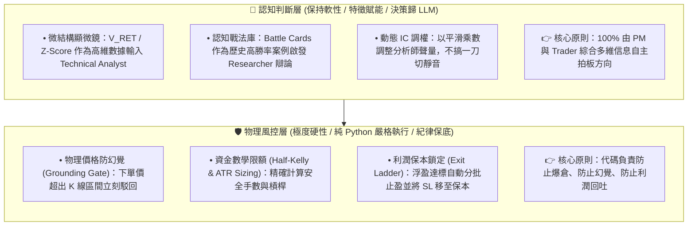
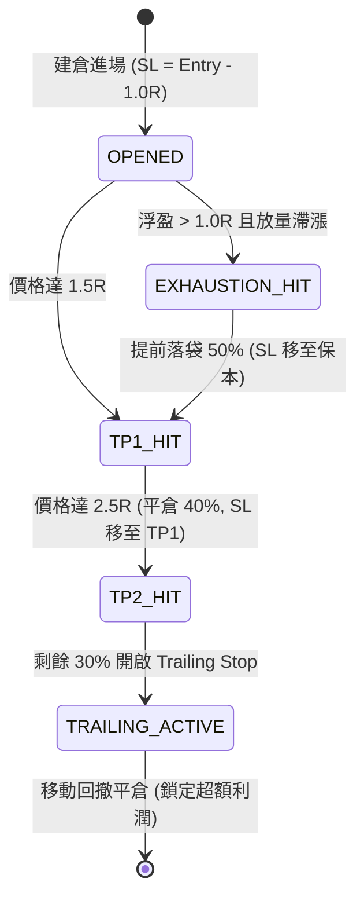
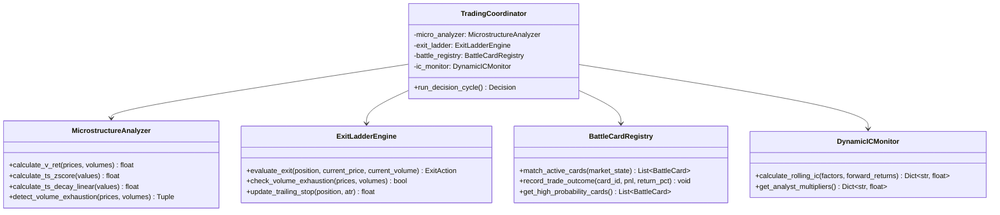

# VBT 進階獲利功能借鏡與擴展計劃書 (Alpha Expansion Plan)

> **版本**：v1.1.0 (融入「賦能而非閹割」架構哲學)  
> **更新日期**：2026-08-17  
> **借鏡來源**：`/Users/carlos/pywork/AlphaGPT` & `/Users/carlos/pywork/Vibe-Trading` (HKUDS)  
> **狀態**：規劃審定完成 (`PLANNED`)  

---

## 1. 執行概要 (Executive Summary)

在完成 **Phase 5 雙向對稱決策架構** 與 **Mode 1 歷史切片回測（50-Bar / 25小時）** 後，VBT 系統成功達成以下關鍵里程碑：
- **做空決策佔比**：由一期基準的 `0.0%` 躍升至 **`70.0% (35 筆)`**，徹底解決盲多問題；
- **防幻覺硬閘門 (Grounding Gate)**：在實戰中成功攔截 6 次異常點位並安全降級；
- **財務盈虧表現**：在單邊下跌震盪區間內實現 **淨利潤轉正 (+0.13%)**，盈虧回報比達 **1.70 : 1**，最大回撤控制在 **0.15%**。

為了進一步將系統由「具備防守做空能力」提升至「**高勝率、高盈虧比、精細化利潤落袋**」的頂級量化多代理交易系統，本計劃書全面借鏡 **AlphaGPT**（符號化微結構算子）與 **HKUDS/Vibe-Trading**（階梯止盈、戰法卡片庫與動態 IC 調權）的四大頂級功能。

---

## 2. 核心架構哲學：AI 認知賦能 vs 代碼物理護欄

在融合量化因子與 LLM 多代理時，**最致命的架構反模式（Anti-Pattern）是「用死板的硬代碼去否定/覆蓋 LLM 的方向判斷」**：
1. **雙重成本稅 (Double Taxation)**：13 個 Agent 消耗了數分鐘深度 CoT 推理、鏈上與宏觀數據；若底層硬規則一刀切否定，既浪費算力與 Token，又退化為傳統脆弱的規則系統。
2. **扼殺非線性頂級機會 (Suffocation of Edge Cases)**：如威科夫操盤法中的「縮量彈簧效應（Spring）」——主力故意縮量假跌破誘空後暴拉；硬規則會誤殺這類高盈虧比機會，而具備多維視野的 LLM 能結合情緒面精準識別。
3. **上下文狀態機撕裂 (State Inconsistency)**：決策被底層強改會導致後續 K 線中 AI 看到反向持倉而產生嚴重的推理混亂。

### 🌟 VBT 的黃金分離原則 (Separation of Concerns)

| 維度 | 錯誤做法（限制過度/引發反效果） | **VBT 正確做法（賦能增強 + 紀律護航）** | 系統邊界 |
|---|---|---|---|
| **方向決策** | ❌ 代碼以硬編碼規則覆蓋 LLM 輸出 | **✅ 100% 尊重 LLM 團隊綜合決策** | 🧠 認知決策層 (軟) |
| **微結構算子** | ❌ 縮量直接硬阻斷下單 | **✅ 作為 Tool 數據注入給技術分析師**，在報告中明確標註 | 📊 特徵工具層 (軟) |
| **戰法卡片** | ❌ 強制 AI 死套戰法範本 | **✅ 作為 In-Context 歷史案例啟發**，輔助辯論 | 💡 認知啟發層 (軟) |
| **價格有效性** | ❌ 允許 AI 憑空捏造價格 | **✅ 物理硬攔截**（Grounding Gate 邊界校驗） | 🛡️ 物理常識層 (硬) |
| **倉位與止損** | ❌ 允許 AI 隨意全倉孤注一擲 | **✅ 數學硬計算**（Half-Kelly & ATR 倉位防禦） | 💰 資金風控層 (硬) |
| **利潤鎖定** | ❌ 依賴 AI 主觀記憶手動止盈 | **✅ 階梯硬執行**（Exit Ladder 自動保本分批平倉） | 🚀 執行落袋層 (硬) |

---

## 3. 四大借鏡模組詳細設計

### 模組一：Exit Ladder 三級階梯止盈與動能枯竭提前平倉 (HKUDS)

#### 1.1 設計定位
**進場由 AI 決定，出場由代碼紀律護航。** 徹底解決「浮盈 2R 因貪婪或遲疑未平倉，最後反轉變虧損」的利潤回吐通病。

#### 1.2 混合式觸發架構
1. **三級階梯止盈矩陣 (Exit Ladder)**：
   * **Stage 1 (TP1 @ 1.5R)**：觸及 $1.5 \times \text{ATR}$ 利潤時，自動市價平倉 **30% 倉位**，並立即將剩餘倉位止損上調至**開倉保本價（Break-even）**。
   * **Stage 2 (TP2 @ 2.5R)**：觸及 $2.5 \times \text{ATR}$ 利潤時，自動市價平倉 **40% 倉位**，並將止損上移至 **TP1 價位（鎖定 1.5R 利潤）**。
   * **Stage 3 (TP3 @ 尾部 Trailing Stop)**：剩餘 **30% 倉位** 掛動態移動止損（回撤 $1.0 \times \text{ATR}$ 清倉），捕捉單邊大趨勢。

2. **量價動能枯竭提前平倉 (Volume Exhaustion Early Exit)**：
   * **量化守護條件**：持倉浮盈 $> 1.0R$ 且偵測到頂部放量滯漲（$V \ge 1.8 \times \text{MA}(V, 20)$ 且價格 2 根 Bar 漲幅 $\le 0.3\%$），自動市價平倉 **50% 浮盈倉位**。
   * **LLM 協同**：Trader Agent 與 PM 亦具備輸出 `EARLY_TAKE_PROFIT` 動作指令的權限，可主動靈活發起平倉。

---

### 模組二：AlphaGPT 量價微結構算子庫與特徵賦能 (AlphaGPT)

#### 2.1 設計定位
**給 Technical Analyst 配備「高解析度顯微鏡」，而非代碼審查員。**

#### 2.2 核心算子定義 (源自 AlphaGPT StackVM & times.py)
1. **`V_RET` 量價協方差因子 (Volume-Price Momentum)**：
   $$V\_RET_t = (P_t - P_{t-1}) \times \left( \frac{V_t}{\frac{1}{N} \sum_{i=0}^{N-1} V_{t-i}} \right)$$
2. **`TS_ZSCORE` 動能偏離度算子 (Rolling Z-Score)**：
   $$Z_t = \frac{X_t - \mu_{X, 20}}{\sigma_{X, 20} + 10^{-8}}$$
3. **`TS_DECAY_LINEAR` 線性衰減均線算子**：
   $$w_i = \frac{2i}{d(d+1)}, \quad \text{DecayMA}_t = \sum_{i=1}^{d} w_i \cdot P_{t - d + i}$$

#### 2.3 整合方式
* 整合入 `Technical Analyst` 的工具集（`calculate_microstructure_factors`）。
* 分析師在報告中直接呈現結構化微結構診斷：
  > `[微結構分析] V_RET: +142.5 (放量共振) | 價格 Z-Score: +2.6 (極度超買過熱) | 突破確認: 縮量假突破警示 (成交量僅 0.65x MA)`
* 由 PM 綜合宏觀、情緒與基本面做出最終決策，**底層不進行粗暴代碼阻斷**。

---

### 模組三：Hypothesis 經典量化戰法卡片庫與動態覆盤 (HKUDS)

#### 3.1 設計定位
**以 In-Context Learning 案例啟發 AI 推理，而非僵化套用死規則。**

#### 3.2 預置 8 大經典量化戰法卡片 (YAML 儲存)
1. **`BC-01`**：4H 均線空頭壓制 + 30m 頂背馳高空（預期方向 `SHORT`，基準盈虧比 3.0:1）
2. **`BC-02`**：布林上軌突破 + 縮量假突破反手做空（預期方向 `SHORT`，基準盈虧比 2.5:1）
3. **`BC-03`**：4H 多頭共振 + 30m 回踩均線低多（預期方向 `BUY`，基準盈虧比 2.5:1）
4. **`BC-04`**：恐慌超賣極限 + 放量長下影線反彈多（預期方向 `BUY`，基準盈虧比 3.5:1）
5. **`BC-05`**：橫盤突破放量真突破順勢追單（順勢追單，基準盈虧比 2.0:1）
6. **`BC-06`**：資金費率過熱極值逆向均值回歸（逆向套利，基準盈虧比 2.0:1）
7. **`BC-07`**：震盪箱體上軌高拋低吸（預期方向 `SHORT`，基準盈虧比 2.0:1）
8. **`BC-08`**：趨勢動能衰竭提前減倉防守（預期動作 `EARLY_TP`，風險鎖定）

#### 3.3 運作與動態覆盤機制
* **動態匹配與提示注入**：當前市場形態符合某卡片特徵時，系統自動檢索並以 Prompt 形式注入 Researcher 辯論上下文：
  > `[歷史戰法參考] 當前形態匹配 BC-01 (4H空頭壓制頂背馳)。歷史統計勝率 67.5%，平均盈虧比 2.8:1。請多空研究員圍繞此情境展開實質辯論。`
* **交易後自動覆盤**：交易結算後自動回寫統計指標：
  $$\text{WinRate}_{\text{new}} = \frac{\text{Wins} + \mathbb{I}(\text{PnL} > 0)}{\text{Total} + 1}, \quad \text{Payoff}_{\text{new}} = \text{EMA}(\text{Payoff}, \text{Current\_R})$$

---

### 模組四：動態因子 IC 權重自適應系統 (Dynamic Factor IC Weighting)

#### 4.1 設計定位
**以平滑打分乘數調節分析師聲量，自適應市場牛熊與震盪體制。**

#### 4.2 計算與權重調整機制
每 10 根 Bar 滾動評估過去 50 根 Bar 各因子對未來 3 根 Bar 收益率的 **Spearman Rank IC**：
$$\text{Rank IC} = 1 - \frac{6 \sum d_i^2}{n(n^2 - 1)}$$

* **平滑加權乘數（Soft Multipliers）**：
  * **強預測期 ($\text{Rank IC} > 0.15$)**：Scorecard 打分權重 $\times 1.5$；
  * **正常有效 ($0.05 \le \text{Rank IC} \le 0.15$)**：維持標準權重 $\times 1.0$；
  * **失效/噪音期 ($\text{Rank IC} < 0.02$)**：權重自動平滑衰減至 $\times 0.3$（降低干擾，但不剝奪發言權）；
  * **負相關反向期 ($\text{Rank IC} < -0.08$)**：在日誌中提示逆向指標警示。

---

## 4. 系統類別圖 (Class Diagram)

---

## 5. 驗證驗收指標 (Target Acceptance KPIs)

| 評估指標 | 當前 Mode 1 基準 | 升級目標 (Target) | 驗收方式 |
|---|:---:|:---:|---|
| **浮盈回吐率 (Profit Drawdown)** | ~55% | **$< 25\%$ (階梯保本鎖定)** | 統計 TP1/TP2 觸發後的利潤鎖定率 |
| **總體交易勝率 (Win Rate)** | 45.0% | **$\ge 55.0\%$** | 50-Bar 及 200-Bar Replay 統計 |
| **盈虧回報比 (Payoff Ratio)** | 1.70 : 1 | **$\ge 2.20 : 1$** | 平均盈利 / 平均虧損 |
| **Profit Factor (毛利/毛損)** | 1.39 | **$\ge 1.80$** | 帳戶累計總毛利 / 總毛損 |
| **LLM 決策覆蓋率 (Autonomy)** | 100% | **100% (零代碼方向否決)** | 確保無任何 Hardcoded Direction Veto |
