# VBT 雙向交易架構與神經符號量化策略規格書 (Dual-Direction Strategy & Architecture Spec)

## 版本資訊
- **版本**: 1.0.0
- **日期**: 2026-08-17
- **狀態**: ✅ 已實施 (Implemented) — L1-L3 驗證完成；L4 (72h Paper) 已於 2026-08-28「印鈔機優先收斂計畫」取消（由 3×168h 回測 + 14d paper 取代），不再待實盤
- **關聯改善計劃**: [docs/research/vbt-architecture-strategy-improvement-plan.md](file:///Users/carlos/pywork/vibe-trading-encyc/docs/research/vbt-architecture-strategy-improvement-plan.md) (v1.7)
- **關聯演進路線**: [docs/research/evolution-roadmap.md](file:///Users/carlos/pywork/vibe-trading-encyc/docs/research/evolution-roadmap.md) (Phase 5)
- **理論基礎庫**: `Brian_Notes/wiki/Theory`（凱利公式、纏論動力學、市場體制、風險地圖）
- **架構原則**: 神經符號混合（AI 定性結構認知 + Python 嚴謹量化與邊界防禦）

---

## 1. 專案概述與系統目標

### 1.1 問題陳述
在 398 根 Bar（約 15.3 天，BTCUSDT 30m）歷史 Replay 基準測試中，系統暴露出四大致命缺陷：
1. **100% 多頭偏斜（零做空）**：全週期 0 次做空，失去單邊下行與震盪市的獲利與套保能力。
2. **34.7% 的評分卡硬編碼兜底**：138 筆決策因 Regex 解析邊界失敗，直接退化為靜態字符串 `"Rationale: 情绪面、risk表现强劲，因此建议WEAK_BUY"`，鎖死為多頭。
3. **呆板固定倉位與浮盈回吐**：缺乏動態倉位縮放，無主動分批止盈（TP）與移動止損（Trailing Stop）。
4. **單一 30m 週期視野盲區**：在 4H 下行趨勢中僅憑 30m 局部超賣頻繁逆勢抄底（接飛刀）。

### 1.2 核心解耦架構：神經符號混合體系 (Neuro-Symbolic Hybrid)

```mermaid
flowchart TD
    subgraph Context_Layer ["1. 上下文與特徵建構 (Context & Features)"]
        K30["30m K線 + 技術指標 (RSI, MACD, BBands, ATR)"]
        K4H["4H K線 + 趨勢共振 (EMA20/50, ADX)"]
        Micro["微結構特徵 (pressure, fomo - 缺數據中性 0.0)"]
        State["動態持倉狀態注入 (當前持倉量、成本、浮盈、合法動作集)"]
    end

    subgraph Agent_Layer ["2. 多 Agent 認知推理 (LLM + Reasoning Effort)"]
        Tech["📈 Tech Analyst (三信號原則: 4H趨勢 + 纏論結構 + Pressure)"]
        Bear["🐻 Bear Researcher (纏論一賣/二賣/三賣 主動做空獵手)"]
        Bull["🐂 Bull Researcher (纏論一買/二買/三買 做多獵手)"]
        RM["👔 Research Manager (多空辯論綜合裁決 + 盈虧比評估)"]
        PM["👨‍💼 Portfolio Manager (Reasoning Effort: high 輸出結構化動作與點位)"]
    end

    subgraph Schema_Layer ["3. 結構化通訊層 (Pydantic Tool Calling)"]
        Tool["submit_portfolio_decision(<br/>  action='OPEN_SHORT', confidence=0.85,<br/>  entry_price=64200, stop_loss=64800, take_profit=62800<br/>)"]
    end

    subgraph Math_Engine ["4. Python 確定性量化數學引擎 (Auto-Math Engine)"]
        b_calc["計算真實盈虧比: b = |TP - Entry| / |Entry - SL|"]
        Kelly["Half-Kelly 資金比: f* = 0.5 * (bp - q) / b"]
        ATRSizing["ATR 波動率調倉: Size = (Equity * f*) / (ATR * 1.5)"]
        RiskCap["風控硬門禁截斷: min(Size, 500U / Entry, 5x 槓桿)"]
    end

    subgraph Exec_Layer ["5. 執行與保護層 (Execution Guardrails)"]
        Guard["狀態機安全校驗 (無持倉禁止盈，違規自動降級 HOLD)"]
        Exec["Paper / Binance Order Executor 成交"]
        Tearsheet["📊 Tearsheet 專業淚表 (月度收益熱力圖 + 回撤區間)"]
    end

    Context_Layer --> Agent_Layer --> Schema_Layer --> Math_Engine --> Exec_Layer
```



### 1.3 核心量化 KPI 目標

| 指標 | 改造前 (398-Bar 基準) | 目標規格 (Target KPI) |
|---|---|---|
| **做空決策佔比 (Short Ratio)** | **0.0%** (0 次) | **25.0% ~ 45.0%** |
| **評分卡兜底率 (Fallback Rate)** | **34.7%** (138 次) | **0.0%** (完全消滅) |
| **總體淨盈虧 (PnL)** | **-1.51%** (-$150.56) | **+3.0% ~ +8.0%** 顯著轉正 |
| **最大回撤 (MDD)** | 1.54% | **< 3.0%** |
| **平均單筆盈虧比 (Avg R:R)** | 1.0 : 1 (固定下單) | **> 2.0 : 1** |

---

## 2. 數據與特徵層規格 (Data & Feature Layer)

### 2.1 多週期數據加載（30m + 4H 雙週期）
- **介面定義**：`KlineStorage.get_multi_timeframe_context(symbol: str, base_interval: str = "30m", macro_interval: str = "4h") -> MultiTimeframeData`
- **邏輯規範**：
  1. 讀取最近 100 根 30m K 線與最近 50 根 4H K 線（歷史 Replay 中從 SQLite 本地重採樣讀取，確保無未來數據洩漏）。
  2. 計算 4H EMA20、4H EMA50 與 4H ADX(14)。
  3. 判定 4H 大週期體制：
     - 若 `EMA20 < EMA50` 且 `ADX > 22`：標記為 `4H_STRONG_DOWNTREND`（強空頭趨勢）。
     - 若 `EMA20 > EMA50` 且 `ADX > 22`：標記為 `4H_STRONG_UPTREND`（強多頭趨勢）。
     - 其餘情況：標記為 `4H_CHOPPY_RANGE`（震盪盤整）。

### 2.2 盤口微結構特徵計算器 (`market_data_tools.py`)
```python
class MicrostructureFeatures(BaseModel):
    pressure: float = Field(description="主動買賣力量不平衡 (-1.0 到 +1.0)")
    fomo: float = Field(description="成交量加速度 (0.0 到 +inf)")
    close_pos: float = Field(description="收盤價在當根 K 線區間之相對位置 (0.0 到 1.0)")

def calculate_microstructure_features(klines_df: pd.DataFrame) -> MicrostructureFeatures:
    """計算微結構指標。若 Replay 歷史數據缺少 taker_buy_base 則中性容錯返回 0.0。"""
    if "taker_buy_base" not in klines_df.columns or klines_df["taker_buy_base"].sum() == 0:
        return MicrostructureFeatures(pressure=0.0, fomo=0.0, close_pos=0.5)
    
    vol = klines_df["volume"].replace(0, 1e-5)
    taker_buy = klines_df["taker_buy_base"]
    taker_sell = vol - taker_buy
    pressure = (taker_buy - taker_sell) / vol
    
    vol_ma5 = klines_df["volume"].rolling(5).mean().replace(0, 1e-5)
    fomo = klines_df["volume"].diff().clip(lower=0) / vol_ma5
    
    hl_range = (klines_df["high"] - klines_df["low"]).replace(0, 1e-5)
    close_pos = (klines_df["close"] - klines_df["low"]) / hl_range
    
    return MicrostructureFeatures(
        pressure=float(pressure.iloc[-1]),
        fomo=float(fomo.iloc[-1]),
        close_pos=float(close_pos.iloc[-1]),
    )
```

---

## 3. 多智能體提示詞與角色規格 (Agent Prompts & Roles)

遵循**「三信號原則（4H趨勢 + 纏論結構 + Pressure）」**與**「風控不設一票否決」**：

### 3.1 Bear Researcher (主動空頭獵手規格)
- **檔案**：`backend/src/vibe_trading/config/prompts.py`
- **核心任務**：由被動防禦升級為主動尋找做空 Alpha，嚴格依據纏論三類賣點論證：
  1. **一賣（頂背馳）**：價格向上突破新高，但 30m MACD 紅柱面積顯著縮小且黃白線未創新高 $\rightarrow$ 提議試探開空。
  2. **二賣（次級確認）**：頂背馳後快速回落，隨後次級別反彈未能突破前高，形成頂部分型 $\rightarrow$ 提議順勢開空。
  3. **三賣（中樞破位）**：跌破 30m 盤整中樞下軌，反抽未能重回中樞內部 $\rightarrow$ 提議突破加空。

### 3.2 Technical Analyst (雙週期共振規格)
- **三信號輸入卡片**：
  ```markdown
  ## 📊 核心技術面分析輸入 (BTCUSDT)
  1. 4H 趨勢體制: EMA20 ($64,100) < EMA50 ($64,800) -> [4H 空頭排列 / 下行趨勢] | 4H ADX: 28.5
  2. 30m 結構形態: 價格 $63,500 處於中樞破位後反抽受阻形態，MACD 處於零軸下方死叉
  3. 微結構動能: 買賣壓力 Pressure = -0.38 (主動賣盤佔優) | FOMO = 0.12
  ⚠️ 指引: 4H 空頭排列下，嚴禁因 30m 短線超賣盲目抄底；優先尋找反彈阻力位之做空機會。
  ```

### 3.3 Reasoning Effort 深度推理配置
- 在 `PortfolioManagerAgent` 與 `ResearchManagerAgent` 呼叫 LLM 時傳遞 `reasoning_effort="high"`（支援 Anthropic Extended Thinking 與 DeepSeek-R1 CoT），強制在重大動作前進行長鏈推導。

---

## 4. 通訊協定與結構化輸出規格 (Structured Outputs)

### 4.1 全生命週期動作枚舉 (`PositionAction`)
```python
from enum import Enum

class PositionAction(str, Enum):
    OPEN_LONG = "OPEN_LONG"        # 新開多單
    ADD_LONG = "ADD_LONG"          # 順勢加多
    OPEN_SHORT = "OPEN_SHORT"      # 新開空單 (徹底解鎖做空)
    ADD_SHORT = "ADD_SHORT"        # 順勢加空
    TP_PARTIAL = "TP_PARTIAL"      # 主動部分止盈 (分批平倉 33%)
    CLOSE_ALL = "CLOSE_ALL"        # 全平離場
    TRAIL_STOP = "TRAIL_STOP"      # 移動止損 (鎖定利潤)
    HOLD = "HOLD"                  # 觀望維持現狀
```

### 4.2 Pydantic 決策模型定義 (`trading_tools.py`)
```python
from pydantic import BaseModel, Field

class PortfolioDecisionOutput(BaseModel):
    """投資組合經理 (PM) 最終結構化決策輸出模型"""
    action: PositionAction = Field(description="交易動作枚舉意圖")
    confidence: float = Field(ge=0.0, le=1.0, description="決策置信度 (0.0 到 1.0)")
    suggested_entry_price: float = Field(description="建議進場或基準參考價")
    suggested_stop_loss: float = Field(description="結構止損價格")
    suggested_take_profit: float = Field(description="第一目標止盈價格 (TP1)")
    core_rationale: str = Field(description="核心決策邏輯摘要 (不超過 100 字)")
```

### 4.3 狀態動態注入規範 (State Injection)
在 `TradingCoordinator._prepare_context()` 中動態生成合法可選動作：
- **當前無持倉時**：`valid_actions = [OPEN_LONG, OPEN_SHORT, HOLD]`
- **持有多單時**：`valid_actions = [ADD_LONG, TP_PARTIAL, TRAIL_STOP, CLOSE_ALL, HOLD]`
- **持有空單時**：`valid_actions = [ADD_SHORT, TP_PARTIAL, TRAIL_STOP, CLOSE_ALL, HOLD]`

---

## 5. 確定性量化數學引擎規格 (Quantitative Math Engine)

模組路徑：`backend/src/vibe_trading/execution/position_sizing.py`

### 5.1 數學核心演算法
```python
def calculate_half_kelly(win_rate: float, reward_risk_ratio: float, fraction: float = 0.5) -> float:
    """
    計算分數凱利資金比例: f* = 0.5 * (bp - q) / b
    """
    if reward_risk_ratio <= 0.0 or win_rate <= 0.0:
        return 0.0
    q = 1.0 - win_rate
    f_star = (reward_risk_ratio * win_rate - q) / reward_risk_ratio
    return max(0.0, f_star * fraction)

def calculate_atr_position_size(
    account_equity: float,
    confidence: float,
    entry_price: float,
    stop_loss_price: float,
    take_profit_price: float,
    atr_30m: float,
    risk_multiplier: float = 1.5,
    max_single_notional: float = 500.0,
    max_leverage: float = 5.0,
) -> float:
    """
    結合真實盈虧比、校準勝率、Half-Kelly 與 ATR 波動率計算下單數量。
    """
    if entry_price <= 0 or stop_loss_price <= 0 or take_profit_price <= 0:
        return 0.0
    
    # 1. 嚴謹計算真實盈虧比 b
    risk_dist = abs(entry_price - stop_loss_price)
    reward_dist = abs(take_profit_price - entry_price)
    if risk_dist <= 0:
        return 0.0
    b = reward_dist / risk_dist
    
    # 2. 勝率動態校準 (以 0.50 為基準進行保守映射)
    p = 0.50 + (confidence - 0.50) * 0.40
    p = min(max(p, 0.35), 0.75)
    
    # 3. Half-Kelly 比例
    kelly_f = calculate_half_kelly(win_rate=p, reward_risk_ratio=b, fraction=0.5)
    if kelly_f <= 0:
        return 0.0
    
    # 4. ATR 波動率金額風險敞口
    dollar_risk = account_equity * kelly_f
    effective_atr = max(atr_30m, entry_price * 0.005)
    qty = dollar_risk / (effective_atr * risk_multiplier)
    
    # 5. 進取型風控硬門禁截斷 (單筆 Max 500 USDT, 槓桿 Max 5x)
    max_notional_cap = min(max_single_notional, account_equity * max_leverage)
    max_qty_cap = max_notional_cap / entry_price
    
    return float(min(qty, max_qty_cap))
```

---

## 6. 合約部位全生命週期與執行層規格 (Execution Layer)

### 6.1 SHORT 部位支援
- `PaperOrderExecutor` 支援 `side="SHORT"`：
  - 扣除保證金：`margin = (qty * entry_price) / leverage`
  - 未實現盈虧：$P_{\text{unrealized}} = \text{qty} \times (\text{entry\_price} - \text{current\_mark\_price})$
  - 平倉收益：$P_{\text{realized}} = \text{qty} \times (\text{entry\_price} - \text{exit\_price}) - \text{fees}$

### 6.2 兩段式出場機制 (`TP_PARTIAL`)
- 當收到 `TP_PARTIAL` 動作時：
  1. 平掉當前倉位的 **33%**（`close_qty = position.amount * 0.33`），釋放對應保證金並結算已實現盈虧。
  2. 自動將剩餘 67% 倉位的 `stop_loss_price` 更新為開倉成本價（`Breakeven Stop`）。

### 6.3 移動止損 (`TRAIL_STOP`)
- 在 Position 模型中記錄 `trailing_stop_price`，隨行情朝有利方向推移時動態上移（多單）或下移（空單），行情反轉觸及時自動全平。

### 6.4 狀態機安全降級 (Fail-Open Fallback)
- 若 PM 產出之動作與持倉狀態衝突（如無持倉卻給出 `TP_PARTIAL`），執行層一律自動安全降級為 `HOLD`（觀望）並記錄警告日誌，**絕不拋出未捕獲異常或產生幽靈訂單**。

---

## 7. 回測、淚表與反思系統規格 (Replay & Tearsheet)

### 7.1 Replay 歷史隔離升級 (`replay_tool_isolation.py`)
- 攔截 4H 多週期數據請求，直接從 Replay SQLite 資料庫中重採樣讀取，確保無任何未來數據洩漏。
- 微結構特徵在歷史缺少 Taker 數據時自動返回 0.0 中性。

### 7.2 回測 Tearsheet 淚表組件 (`replay/tearsheet.py`)
- 生成包含以下內容的專業 Markdown / JSON 報告：
  1. **月度收益熱力圖 (Monthly Returns Heatmap)**：12 個月 × 年份色彩矩陣。
  2. **Top-N 最大回撤事件剖析 (Drawdown Episodes)**：紀錄回撤起止時間、谷底深度與修復時長。
  3. **多空決策分佈與勝率矩陣 (Long/Short Win Rate & Profit Factor)**。

---

## 8. 檔案與模組變更清單 (File Change Matrix)

| 序號 | 檔案路徑 | 變更類型 | 主要職責與改動點 |
|---|---|---|---|
| 1 | `backend/src/vibe_trading/config/prompts.py` | [MODIFY] | 注入纏論三類賣點 (Bear)、雙週期分析 (Tech)、全動作枚舉 (PM)。 |
| 2 | `backend/src/vibe_trading/agents/decision/trading_tools.py` | [MODIFY] | 定義 `PositionAction`、`PortfolioDecisionOutput` 與 `submit_portfolio_decision` Tool。 |
| 3 | `backend/src/vibe_trading/execution/position_sizing.py` | **[NEW]** | 實作純 Python Half-Kelly 與 ATR 波動率調倉數學引擎。 |
| 4 | `backend/src/vibe_trading/coordinator/trading_coordinator.py` | [MODIFY] | 4H 數據載入、狀態動態注入、Reasoning Effort 傳遞與量化數學引擎對接。 |
| 5 | `backend/src/vibe_trading/execution/order_executor.py` | [MODIFY] | 支援 SHORT 部位、`TP_PARTIAL` 平倉 33% 兩段式止盈、`TRAIL_STOP`。 |
| 6 | `backend/src/vibe_trading/tools/market_data_tools.py` | [MODIFY] | 實作 `pressure` / `fomo` 微結構指標計算與中性容錯。 |
| 7 | `replay/replay_tool_isolation.py` & `replay_leg_a.py` | [MODIFY] | 支援 4H 歷史無未來數據讀取與新欄位記錄。 |
| 8 | `replay/tearsheet.py` | **[NEW]** | 產出月度收益熱力圖與 Top-N 回撤事件 Tearsheet 淚表。 |

---

## 9. 四階漸進式驗證與測試用例 (Verification Protocol)

```
[Level 1: 煙霧測試 (1~3 Bars on Server vbtpc)]  ✅ 已完成
  • 命令: python -m replay.replay_leg_a --symbol BTCUSDT --limit 3
  • 驗證: 成功輸出 OPEN_SHORT 決策，0% 評分卡兜底，Pydantic 解析正常。
  • 結果: V2-V5 多輪執行, fallback 0% 實測

[Level 2: 398-Bar 基準回測 A/B 對比 (on Server vbtpc)]  ✅ 已完成
  • 命令: python -m replay.replay_leg_a --symbol BTCUSDT --limit 398
  • 驗證指標:
    1. Short Ratio 達 25% ~ 45% (一期為 0.0%) → 25.6% ✅ (R4 決策掃描)
    2. PnL 顯著轉正 (一期為 -1.51%) → +0.19% ✅ (R4 模擬)
    3. Scorecard 兜底率為 0.0% (一期為 34.7%) → 0.0% ✅ (V4 實測)
    4. MDD 控制在 3.0% 以內 → 0.12% ✅

[Level 3: 跨市場體制壓力測試]  ✅ 已完成 (replay/l3_stress_report.md)
  • 測試行情段: 下跌段 62% 做空 ✅ / 上漲段上沿做空 (均值回歸) / 橫盤 100% HOLD ✅
  • 註: 90 天窗口無 15% 級單邊行情, 用最接近真實段 (06-24 跌 / 07-14 漲)

[Level 4: 72h 伺服器端 Paper Trading]  ⏳ 跳過 (待後續實盤)
  • 驗證 WebSocket 即時訂單流、保證金結算與狀態機長期運行穩定性。
```
