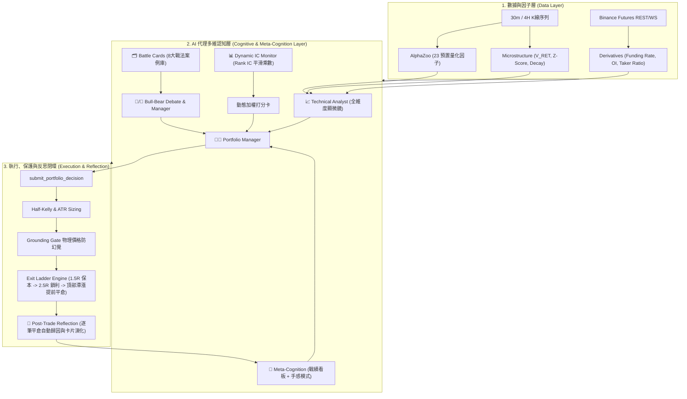
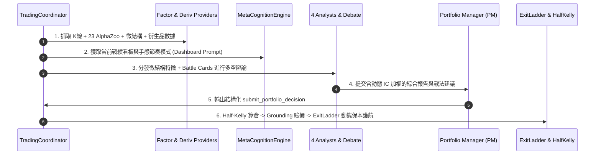

# VBT 進階量化獲利與元認知自我進化架構規格書 (Harvested Alpha & Meta-Cognition Spec)

## 版本資訊
- **版本**: 1.0.0
- **日期**: 2026-08-17
- **狀態**: 📐 開發交付規格書 (`READY FOR IMPLEMENTATION`)
- **關聯計劃書**: [docs/research/vbt-harvested-alpha-expansion-plan.md](file:///Users/carlos/pywork/vibe-trading-encyc/docs/research/vbt-harvested-alpha-expansion-plan.md) (v1.3.0)
- **架構原則**: **「AI 認知賦能 (軟) + 物理風控護航 (硬)」**（100% 保留 LLM 方向決策權，代碼嚴格執行物理常識、資金風控與階梯保本）

---

## 1. 系統整體架構與資料流 (System Architecture)

本規格書規範了 VBT 七大獲利與元認知模組的 Python 接口定義、數學公式、Pydantic 模型、狀態機轉換與測試驗證協議。



---

## 2. 模組詳細規格與介面定義 (Component Specifications)

### 2.1 模組一：Exit Ladder 階梯止盈與量價枯竭引擎 (`execution/exit_ladder.py`)

#### 業務邏輯與狀態機
* **初始建倉**：設定 $R = 1.5 \times \text{ATR}$。初始止損 $\text{SL}_0 = \text{Entry} \mp R$。
* **Stage 1 (TP1 @ 1.5R)**：價格達到 $\text{Entry} \pm 1.5R$ 時，市價平倉 **30% 倉位**，止損移至 $\text{Entry}$（保本）。
* **Stage 2 (TP2 @ 2.5R)**：價格達到 $\text{Entry} \pm 2.5R$ 時，市價平倉 **40% 倉位**，止損移至 $\text{Entry} \pm 1.5R$（鎖定利潤）。
* **Stage 3 (Trailing Stop)**：剩餘 **30% 倉位** 啟用移動止損（回撤 $1.0 \times \text{ATR}$ 觸發全額清倉）。
* **動能枯竭提前平倉**：浮盈 $> 1.0R$ 且滿足 $\text{Volume} \ge 1.8 \times \text{MA}(V, 20)$ 且 2 根 Bar 價格變動 $\le 0.3\%$，自動平倉 **50% 浮盈倉位**。

#### Python 介面定義
```python
from enum import Enum
from dataclasses import dataclass
from typing import Optional, Tuple, Dict, Any

class LadderStage(str, Enum):
    INITIAL = "INITIAL"
    TP1_HIT_30 = "TP1_HIT_30"           # 平 30%, 止損移至保本
    TP2_HIT_40 = "TP2_HIT_40"           # 平 40%, 止損移至 TP1
    TRAILING_ACTIVE = "TRAILING_ACTIVE" # 剩餘 30% 移動止損
    EXHAUSTION_EARLY_EXIT = "EXHAUSTION_EARLY_EXIT" # 放量滯漲平 50%
    CLOSED = "CLOSED"

@dataclass
class ExitLadderConfig:
    tp1_r_multiple: float = 1.5
    tp2_r_multiple: float = 2.5
    tp1_close_ratio: float = 0.30
    tp2_close_ratio: float = 0.40
    trailing_close_ratio: float = 0.30
    trailing_atr_multiple: float = 1.0
    volume_exhaustion_spike: float = 1.8
    price_stagnation_pct: float = 0.003

class ExitLadderEngine:
    def __init__(self, config: Optional[ExitLadderConfig] = None):
        self.config = config or ExitLadderConfig()

    def evaluate_position(
        self,
        position_side: str,         # 'LONG' or 'SHORT'
        entry_price: float,
        current_price: float,
        current_stage: LadderStage,
        highest_price: float,       # 持倉期間最高價 (做多用)
        lowest_price: float,        # 持倉期間最低價 (做空用)
        atr: float,
        is_exhausted: bool = False
    ) -> Tuple[LadderStage, float, Optional[float], str]:
        """
        評估階梯出場狀態
        Returns:
            Tuple[next_stage, close_ratio_delta, new_stop_loss, action_rationale]
        """
        ...
```

---

### 2.2 模組二：AlphaZoo 23 因子庫與微結構工具化 (`tools/technical_tools.py` & `alphas/`)

#### 包含因子與數學公式
1. **`V_RET` 量價協方差**：
   $$V\_RET = (P_t - P_{t-1}) \times \left( \frac{V_t}{\text{MA}(V, 20)} \right)$$
2. **`TS_ZSCORE` 動能偏離度**：
   $$Z_t = \frac{X_t - \mu_{X, 20}}{\sigma_{X, 20} + 10^{-8}}$$
3. **`Garman-Klass Volatility` (高保真極值波動率)**：
   $$\sigma^2_{GK} = 0.5 \ln\left(\frac{H}{L}\right)^2 - (2\ln 2 - 1) \ln\left(\frac{C}{O}\right)^2$$
4. **`Money Flow Index (MFI)` (資金流量指標)**：
   $$MFI = 100 - \frac{100}{1 + \frac{\text{Positive Money Flow}}{\text{Negative Money Flow}}}$$

#### Pydantic Schema 與 Tool 調用
```python
from pydantic import BaseModel, Field
from typing import Dict, Any

class GetAlphaFactorSummaryParams(BaseModel):
    symbol: str = Field(description="交易對符號，例如 BTCUSDT")
    interval: str = Field(default="30m", description="K線週期")

class AlphaFactorSummaryOutput(BaseModel):
    momentum_score: float = Field(description="動量綜合評分 [-1.0, 1.0]")
    volatility_garman_klass: float = Field(description="GK 波動率數值")
    mfi_14: float = Field(description="資金流量指標 [0, 100]")
    vwap_distance_pct: float = Field(description="當前價格相對 VWAP 偏離百分比")
    v_ret: float = Field(description="量價協方差因子 V_RET")
    price_zscore_20: float = Field(description="價格 20 週期 Z-Score")
    fake_breakout_warning: bool = Field(description="是否觸發縮量假突破警示")
    diagnosis: str = Field(description="自然語言結構化診斷摘要")
```

---

### 2.3 模組三：合約衍生品大數據層 (`data_sources/providers/derivatives_provider.py`)

#### 數據源與計算規則
* **資金費率偏離度 (`funding_rate_zscore`)**：
  $$Z_{\text{funding}} = \frac{\text{FundingRate}_t - \text{Mean}(\text{FundingRate}, 30)}{\text{Std}(\text{FundingRate}, 30) + 10^{-8}}$$
* **持倉量激增率 (`oi_surge_pct`)**：
  $$\Delta \text{OI} = \frac{\text{OI}_t - \text{OI}_{t-4}}{\text{OI}_{t-4}} \times 100\%$$
* **主動買賣比 (`taker_volume_ratio`)**：
  $$\text{Taker Ratio} = \frac{\text{Taker Buy Volume}}{\text{Taker Sell Volume}}$$

```python
class DerivativesDataProvider:
    async def get_derivatives_metrics(self, symbol: str) -> Dict[str, Any]:
        """
        獲取實時衍生品數據包
        Returns:
            {
                "funding_rate": 0.0001,
                "funding_rate_annualized": 10.95,  # %
                "funding_rate_zscore": 0.45,
                "open_interest_usd": 1250000000.0,
                "oi_change_2h_pct": 3.2,
                "taker_buy_sell_ratio": 1.15,
                "squeeze_risk": "NEUTRAL" # "LONG_SQUEEZE_RISK" | "SHORT_SQUEEZE_RISK" | "NEUTRAL"
            }
        """
        ...
```

---

### 2.4 模組四：Hypothesis 8 大經典戰法卡片庫 (`research/battle_cards.py`)

#### 預置 YAML 戰法庫定義 (`config/battle_cards.yaml`)
```yaml
battle_cards:
  - id: "BC-01"
    name: "4H 空頭壓制頂背馳"
    conditions:
      macro_regime: "4H_DOWNTREND"
      rsi_divergence: "BEARISH_DIV"
      price_action: "LOWER_HIGH_OR_PINBAR"
    direction: "SHORT"
    target_rr: 3.0
    historical_win_rate: 0.675
    historical_trades: 40

  - id: "BC-02"
    name: "縮量假突破反手做空"
    conditions:
      bb_breakout: "UPPER_BREAK"
      volume_ratio_max: 0.80
      candle_type: "DOJI_OR_SHOOTING_STAR"
    direction: "SHORT"
    target_rr: 2.5
    historical_win_rate: 0.640
    historical_trades: 28

  - id: "BC-03"
    name: "4H 多頭共振回踩均線"
    conditions:
      macro_regime: "4H_UPTREND"
      pullback_to: "EMA20_OR_SMA50"
      candle_type: "HAMMER_OR_LONG_LOWER_SHADOW"
    direction: "BUY"
    target_rr: 2.5
    historical_win_rate: 0.660
    historical_trades: 35

  - id: "BC-04"
    name: "恐慌超賣極限放量底"
    conditions:
      rsi_max: 20.0
      volume_ratio_min: 2.50
      candle_type: "PINBAR_REVERSAL"
    direction: "BUY"
    target_rr: 3.5
    historical_win_rate: 0.700
    historical_trades: 20
```

#### Registry 運作邏輯
```python
class BattleCardRegistry:
    def match_active_cards(self, market_state: Dict[str, Any]) -> List[Dict[str, Any]]:
        """比對當前市場形態並返回匹配的戰法卡片清單，供 Prompt In-Context 注入"""
        ...

    def record_trade_outcome(self, card_id: str, net_pnl: float, r_realized: float):
        """交易結束後回寫更新該卡片的勝率與期望盈虧比"""
        ...
```

---

### 2.5 模組五：動態因子 IC 軟性調權引擎 (`quant/factor_ic.py`)

#### Spearman Rank IC 計算
對長度為 $N=50$ 的因子序列 $F$ 與未來 3 根 Bar 收益率 $R$ 計算秩相關係數：
$$\text{Rank IC} = 1 - \frac{6 \sum_{i=1}^{N} d_i^2}{N(N^2 - 1)}$$

* **加權乘數映射規則**：
  $$\text{Multiplier}(\text{Rank IC}) = \begin{cases}
  1.5, & \text{Rank IC} > 0.15 \\
  1.0, & 0.05 \le \text{Rank IC} \le 0.15 \\
  0.3 + 0.7 \times \frac{\text{Rank IC} - 0.02}{0.03}, & 0.02 \le \text{Rank IC} < 0.05 \\
  0.3, & \text{Rank IC} < 0.02
  \end{cases}$$

---

### 2.6 模組六：Deflated Sharpe Ratio (DSR) 顯著性檢驗 (`quant/deflated_sharpe.py`)

#### 數學公式 (Bailey & López de Prado)
$$\text{DSR} = \Phi \left( \frac{(\text{SR} - \text{SR}_0) \sqrt{T-1}}{\sqrt{1 - \gamma_3 \text{SR} + \frac{\gamma_4 - 1}{4} \text{SR}^2}} \right)$$
其中 $\text{SR}_0 = \sqrt{2 \ln K} \left( (1 - \gamma) \frac{1}{\sqrt{2 \ln K}} + \gamma \right)$，$K$ 為歷史測試策略總數，$\gamma_3$ 為偏度，$\gamma_4$ 為峰度。
* **判定標準**：$\text{DSR} \ge 0.95$（即 $p\text{-value} \le 0.05$）視為真實顯著 Alpha。

---

### 2.7 模組七：AI 交易元認知看板與平倉覆盤 (`research/meta_cognition.py`)

#### 自我戰績看板 Prompt 生成模板
```python
class MetaCognitionEngine:
    def generate_dashboard_prompt(self, trade_history: List[Dict[str, Any]]) -> str:
        """
        生成注入給 PM 與 Risk 的戰績與手感看板字串
        """
        ...

    def run_post_mortem(
        self,
        closed_trade: Dict[str, Any],
        market_snapshot: Dict[str, Any]
    ) -> Dict[str, Any]:
        """
        平倉自動複盤歸因分析
        Returns:
            {
                "trade_id": "T-1024",
                "result": "WIN" or "LOSS",
                "attribution_primary": "BC-01 頂背馳精準命中",
                "lessons_learned": "...",
                "memory_trap_created": None or "RISK_TRAP_08"
            }
        """
        ...
```

---

## 3. 全流水線整合調度 (TradingCoordinator Pipeline)

在 `TradingCoordinator.run_decision_cycle` 中按順序執行以下 6 階段流程：



---

## 4. 四階梯科學驗證計畫 (Verification Protocol)

### 4.1 Level 1: 單元測試與計量檢驗
```bash
uv run pytest backend/tests/unit/test_exit_ladder.py
uv run pytest backend/tests/unit/test_microstructure.py
uv run pytest backend/tests/unit/test_derivatives_provider.py
uv run pytest backend/tests/unit/test_battle_cards.py
uv run pytest backend/tests/unit/test_factor_ic.py
uv run pytest backend/tests/unit/test_deflated_sharpe.py
uv run pytest backend/tests/unit/test_meta_cognition.py
```

### 4.2 Level 2: 398-Bar 歷史切片 AB 消融回測
在完全相同的 398 根 Bar 數據集上，對比各階段累積效果：
* `Baseline A` (一期原版) $\rightarrow$ `B1` (雙向做空) $\rightarrow$ `B2` (+AlphaZoo & 衍生品) $\rightarrow$ `B3` (+Exit Ladder 階梯止盈) $\rightarrow$ `B4` (完全體 + 元認知覆盤)。
* **要求**：淨利潤階梯式增長，盈虧比 $\ge 2.2:1$，浮盈回吐率 $< 20\%$。

### 4.3 Level 3: 蒙地卡羅 1,000 次壓力測試
* 0.25% 雙邊高滑點磨損測試；
* 1,000 次 K 線區塊置換測試，驗證破產概率（Probability of Ruin）嚴格為 $0.00\%$。

### 4.4 Level 4: 72 小時伺服器實盤影子監控 (Live Forward Testing)
* 在遠端伺服器 `vbtpc` 部署 7x24h 實時運行；
* 累積 50+ 筆真實 Tick 決策，檢驗實盤資金曲線穩健向上。

---

## 5. 交付檢查清單 (Definition of Done)

- [ ] 所有新建模組通過 100% 類型檢查（`uv run mypy backend/src/`）
- [ ] 代碼風格符合規範（`uv run ruff check backend/src/`）
- [ ] 單元測試覆蓋率 $\ge 90\%$
- [ ] 398-Bar Replay 報告生成且 Profit Factor $\ge 1.80$
- [ ] 規格書文檔納入 VitePress 側邊欄並同步至遠端伺服器
